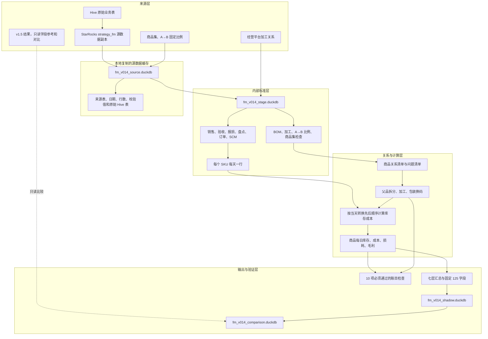
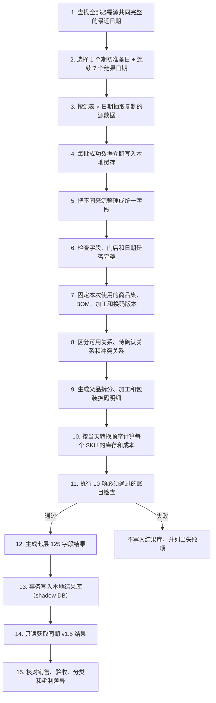
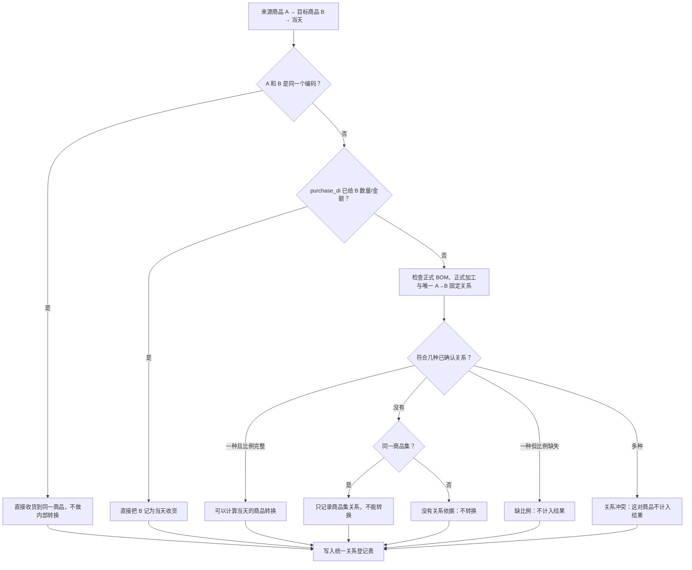
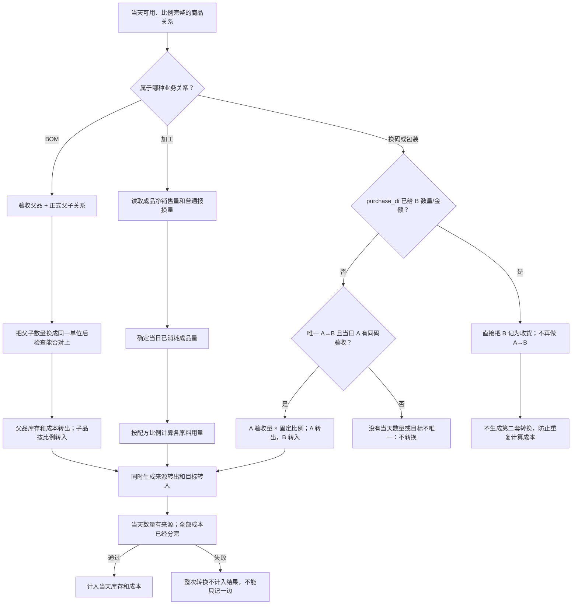
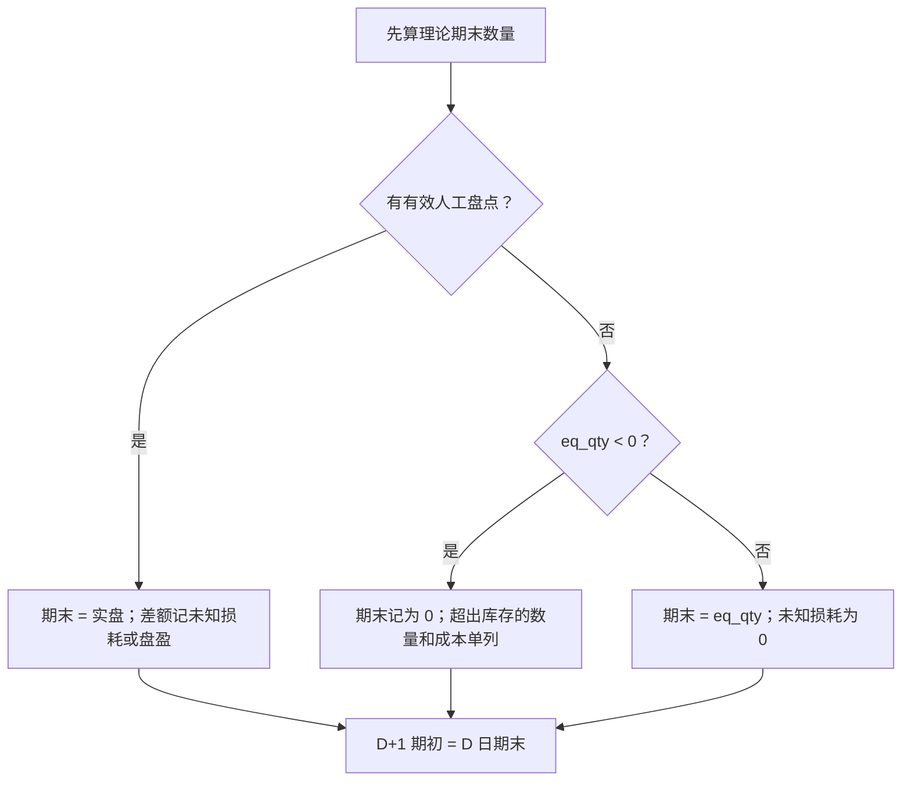
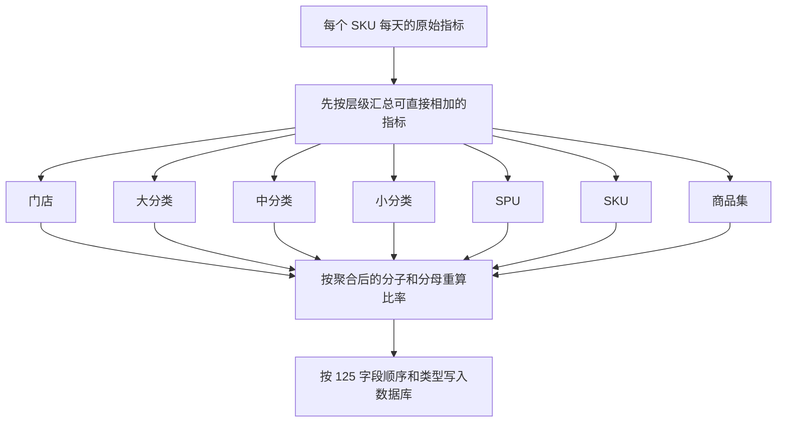
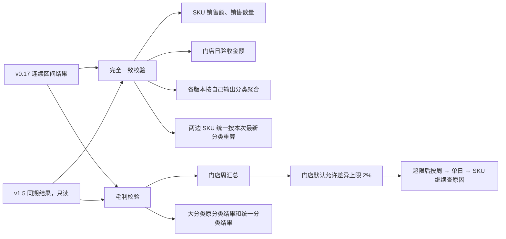

# fmetl v0.17：从门店原始数据计算库存、成本和毛利

项目作用：系统每天读取门店的销售、收货、报损和盘点；遇到父品拆分、原料加工或包装
换码时，把来源商品的数量和成本转到目标商品；然后计算每个商品的期末库存和门店毛利。

v0.17 目前只在本地试算。它读取 StarRocks 中的 Hive 数据副本，自己计算商品关系、库存、
成本、损耗和毛利。v1.5 只用于核对最终结果，不向 v0.17 提供成本、库存或毛利补值。

源码位于 `fmetl/`。数据库表名中的 `v014_*` 是为了兼容旧接口，不表示当前仍在运行 v0.14。

## 先说明本文用词

| 本文用词 | 准确含义 |
|---|---|
| 商品日期记录（代码中常写 SKU 日） | 一个商品在一个业务日期的一条计算记录 |
| 商品集（代码中常写 product group） | 把同一商品的不同编码或规格归在一组；并不自动表示当天发生转换 |
| 内部转移 | 同一门店内，把商品 A 的库存和成本转给商品 B |
| 计入结果 | 修改正式计算用的库存数量和金额 |
| 问题清单（表名仍为 quarantine） | 记录资料不足、关系冲突或缺成本；关系问题不生成转换，缺成本记录保留在本地结果并阻止发布 |
| 待确认关系（代码中常写 candidate） | 只能说明两个商品可能有关系；确认关系类型和当天数量前不生成转换 |
| 快照 | 某一日保存的整张数据表；如果只有最新快照，就不能还原历史当日属性 |
| 根据销量反算原料 | 成品已销售或普通报损，据此按配方计算已消耗多少原料；代码旧称“反冲” |
| 转出金额等于转入金额 | 商品转换前后成本总额不变；代码和旧文档常称“金额守恒” |
| 必须通过的账目检查 | 数量、金额、跨日库存和重复扣减等检查；代码旧称 `hard gate` |
| 发布条件检查 | 决定本次结果能否作为正式数据发布；代码旧称 `publish gate` |

表名、字段名和程序中的固定状态码保留英文，业务说明不依赖这些英文才能读懂。

## 1. 目标与边界

### 1.1 目标

- 使用商品集确认订购码、验收码和销售码是否可能属于同一商品。
- 分开处理父品拆分、原料加工和包装换码，避免同一数量被重复使用。
- 门店不再填写加工量；成品消耗量仅由当日净销售量和普通已知报损量确定。
- 每次商品转换同时记录来源商品转出和目标商品转入，转出金额必须等于转入金额。
- 错误盘点、冲突关系和缺失比例不计入结果，只写入问题清单，避免错误库存带到下一天。
- 输出 v1.5 兼容的 123 个字段，并追加商品集编码和名称。

### 1.2 当前边界

- 第一版仅运行门店 `A3XV`。
- 当前只写本地 DuckDB，不修改服务器生产 DuckDB、v1.5 表或调度任务。
- 对外结果表只有 `t_v014_levels_result`；运行明细和问题清单保留在同一本地试算库。
- 商品集可以确认商品身份，并结合商品重量计算重量换算参考比；但不能单独证明当天发生转换，
  也不能提供当天实际转换数量。
- 未确认的蔬菜固定转码、乳品包装比例和牛肉关系不自动推断。
- 加工与生熟联动原料报损二选一：同一配方原料当天符合生熟联动时，保留生熟联动报损，
  该配方当天不再扣加工原料。
- 同一 A→B 已经以 B 的正数验收量入账时，直接收 B；加工关系只保留供检查，不再重复扣 A。
- 加工消耗不因原料账面余额不足而取消；期末库存数量最低记为 0，超出可用库存的成本单独记录并从毛利中扣除。
- 系统记录的库存数量只供检查，不作为人工盘点。
- A3XV 当前使用 `area_name IS NULL` 的全区域商品集数据；正式发布前需确认这份数据适用于该门店。

## 2. 核心设计原则

1. **业务记录和商品关系分开**：销售、验收、盘点、报损回答“当天发生了什么”；BOM、加工
   配方和商品集回答“商品之间是什么关系”。
2. **收货和门店内部转换分开**：一笔验收只记一次；商品 A 转成 B 时，单独记录 A 转出和 B 转入。
3. **长期规则和当天数量分开**：固定关系说明“可以怎样转”；验收、销售或报损说明“当天有
   多少”。系统不生成一张实际不存在的当日转换明细表。
4. **数量能对上、金额也能对上**：A 和 B 按各自单位记录数量；每次转换中，转出金额必须等于
   转入金额。
5. **单次定价**：单位成本只在每日商品库存和成本计算中确定一次；报表只汇总，不重新定价。
6. **跨日精确滚动**：D+1 期初数量和金额直接复制 D 日期末。
7. **资料有问题就停止该笔计算**：缺关系、缺比例、关系冲突或盘点无效时，该笔数据不进入库存和
   成本，只写入问题清单。
8. **报表展示调整不能改每日库存和成本**：为了兼容 v1.5 所做的报表展示调整，不能反向修改库存、成本和
   商品内部转移。

## 3. 总体架构



**图解**

- StarRocks 提供 Hive 数据的数据副本；每个字段最初来自哪张 Hive 表，以字段手册为准。
- 商品集、固定换码关系和加工配方只说明商品之间的关系，不能替代当天销售、验收、盘点和
  报损记录。
- v1.5 只参与最终结果对比，不参与商品关系、库存或成本计算。
- `source`、`stage`、`shadow` 三个 DuckDB 文件必须分开，防止原始缓存被计算结果覆盖。

## 4. 数据层级

| 层级 | 主要内容 | 物理位置 | 约束 |
|---|---|---|---|
| 原始数据缓存 | Hive 数据副本记录、商品集和固定换码关系 | `fm_v014_source.duckdb` | 只读抽取，记录数据来源、行数和校验值 |
| 标准化数据 | 把不同来源统一成相同字段、日期、商品和正负号 | `fm_v014_stage.duckdb` | 只由程序生成，不接受人工改表 |
| 商品关系清单 | 可用关系、待确认关系、冲突关系和问题原因 | `v014_relation_registry` | 同一来源码→目标码→业务日最多选择一种处理方式 |
| 商品转换明细 | 来源商品转出、目标商品转入及当天数量依据 | `v014_internal_posting` | 每次转换两边必须齐全，转出金额必须等于转入金额 |
| 每日库存和成本记录 | 每个 SKU 每天的数量、成本、库存、损耗和毛利 | `v014_sku_daily` | 每天都有一行；今天期末原样成为明天期初 |
| 输出层 | 门店至 SKU、商品集七层结果 | `t_v014_levels_result` | 123 个兼容字段 + 2 个商品集字段 |
| 检查记录 | 问题清单、运行清单和检查结果 | `v014_quarantine` 等 | 每条问题记录原因和处理结果；是否参与本地计算由原因决定 |

## 5. 完整运行流程



**图解**

- `--end auto` 从前一业务日向前寻找所有必需来源都完整的“1 天期初准备 + 连续 7 天正式
  结果”；准备日只用于计算第一天的期初库存。
- 显式 `--end YYYY-MM-DD` 严格使用该日期作为第 7 个结果日期，不自动改用较早日期；缺少必需源时
  运行失败并标明具体源表和日期。
- 显式 `--start YYYY-MM-DD --end YYYY-MM-DD` 发布完整连续区间，并额外抽取开始日前一日
  作为期初准备；适用于连续重刷超过 7 天的数据。
- 任一必需源缺失时，整段日期一起向前选择，不拼接不同来源的不同日期。
- 源数据副本按“源表 × 日期”分批读取；成功的日期立即保存，中断后只重读未完成日期。
- `source` 和 `stage` 保存期初准备日；正式结果、SKU 每日库存账、商品关系、商品转换明细
  和问题清单只保存正式日期。新日期区间会完整替换旧结果，不会混入上一次运行。
- 关系、来源、阶段表和输出字段结构都生成校验值，用于复现同一次运行。
- 10 项账目检查在保存输出前执行；任一项失败，运行立即终止并给出失败原因。

## 6. 来源与标准化

### 6.1 当天实际发生的业务记录

| 业务域 | 主要源数据副本 | v0.17 用途 |
|---|---|---|
| 销售 | `strategy_fm_sales_di`、`strategy_fm_article_sale_di` | 销售、退回、渠道、客数和折扣 |
| 门店验收 | `strategy_fm_purchase_di` | 唯一正式外部净进货数量和金额；采购退回保留负号 |
| 供应链 | `strategy_fm_scm_di`、`strategy_fm_scm_adjust_di` | 订货、出库成本、结算和供应链毛利 |
| 报损 | `strategy_fm_loss_di` | 已知报损数量；上游未知损耗字段只供检查 |
| 盘点 | `strategy_fm_store_article_inventory_detail_di` | 仅有明确人工创建人或更新人的非负记录覆盖期末；系统快照只供检查 |
| 订单 | `strategy_fm_order_offline_di`、`strategy_fm_order_online_di` | 订单键、渠道客数、新老客 |
| 商品 | `strategy_fm_dim_goods` | SKU、SPU、单位和分类维度 |
| 分类 | 经营监控平台最新有效映射 | 全部计算日期统一使用最新分类；平台未找到的 SKU 改用最新 `dim_goods` |
| 日清 | `strategy_fm_dim_day_clear`、`strategy_fm_chdj_article_di`、销售日清标签 | 正式名单优先，其次销售标签，最后默认非日清 |

完整表、字段和对应的原始 Hive 表见
[字段手册](docs/references/strategy_fm_v1_5_字段手册.md)。

### 6.2 商品之间的关系从哪里来

| 数据来源 | 能说明什么 | 不能说明什么 |
|---|---|---|
| 商品集数据 + 商品重量 | 两个商品可能是同一商品的不同编码或规格；可以计算重量换算参考比 | 当天是否转换、当天实际转换多少；重量参考比不能替代已确认关系比例 |
| 已确认 BOM 拆分关系 | 哪个父品可以拆成哪些子品，以及建议比例 | 门店当天实际拆了多少 |
| 加工关系 | 哪些原料组成哪个成品、配方比例和有效日期 | 当天消耗了多少成品；要由销售和普通报损确定 |
| 固定换码关系（`article_convert`） | 商品 A 可以按什么比例换成商品 B | 当天有多少 A；要由 A 的验收记录提供 |
| 跨码验收（`purchase_di`） | 验收数据已经直接给出 B 的当天数量和采购金额 | A→B 属于拆分、加工还是包装换码 |
| 验收分配（`receive_sale`） | 父品/子品或验收码/销售码之间的数量分配 | 原始订货和验收流水的全部细节 |

### 6.3 标准层输出

`v014_stage.py` 把不同来源整理成以下统一数据表：

- `v014_stage_source_manifest`：来源表、对应的原始 Hive 表、日期、行数和校验值。
- `v014_stage_source_completeness`：门店×日期×必需源完整性。
- `v014_stage_activities`：每个商品每天的销售、退回、验收、报损、盘点和日清记录。
- `v014_stage_openings`：本地试算首日的期初库存。
- `v014_stage_bom`、`v014_stage_processing`、`v014_stage_explicit_convert`：已确认关系输入。
- `v014_stage_conversion_events`：当天父品拆分和固定换码的数量明细。验收已经写成 B 时直接
  收 B；否则只有唯一 A→B 固定关系，才按当天 A 验收量生成换码。
- `v014_stage_finished_processing_daily`：用于计算加工原料的成品净销售量和普通报损量；不含
  盘点，也不把原料账面余额当成停算条件。
- `v014_stage_reporting_metrics`：输出报表需要的原始销售、订单、SCM 和商品维度指标。

## 7. 系统如何决定一对商品该走哪条路



**图解**

- 正式 BOM 和正式加工没有默认优先级；同一对商品同一天同时符合多种关系时，不选择其中
  一种，这对商品不计入当天转换。
- 只有状态为可用、比例完整的关系才可以生成来源转出和目标转入。
- 商品重量可以计算重量换算参考比，也可以检查正式比例是否合理；它不能证明当天发生了
  转换，也不能提供当天实际转换数量。
- `purchase_di` 每天包含大量数量和金额均为 0 的商品行；只有验收数量或金额非 0 的行才进入商品关系判定。
- 固定换码关系（`article_convert`）不是当日流水表。验收已经写成 B 时直接收 B；验收仍写
  在 A 时，只有唯一 A→B 目标才按 A 当天验收量和固定比例换成 B。两条路径只走一条。
- 每条关系记录都保存版本、数据来源、有效日期、数量比例和成本分配比例，可以查到当时使用的具体记录。

关系类型：

| 程序中的关系类型 | 业务含义 | 系统实际做什么 |
|---|---|---|
| `SAME_SKU` | 验收码和销售码相同 | 外部验收直接进入同一 SKU |
| `BOM` | 猪肉、牛肉一个父品拆成多个子品 | 父品转出，子品转入 |
| `PROCESSING` | 一种或多种原料加工为成品 | 根据已消耗成品量扣原料，并把原料成本转给成品 |
| `ALLOCATED_RECEIPT` | A 的验收已在 `purchase_di` 分配到 B | B 外部验收直接入账；无内部流 |
| `EXPLICIT_CONVERT` | A 只有一个有效目标 B，且当天验收仍写在 A | 按固定比例把 A 数量和成本转给 B；若验收已写成 B 则不重复转换 |
| `PRODUCT_GROUP_CANDIDATE` | 只能确认属于同一商品集 | 只记录供检查，不改变库存和成本 |
| `UNRESOLVED` / `CONFLICT` | 没有关系依据，或同时符合多种关系 | 不计入转换，写入问题清单 |

## 8. 三类商品转换怎样计算



**图解**

- 每次转换必须同时有来源商品转出和目标商品转入，不能只记一边。
- BOM 先把父子数量换到可比较的公共单位，再检查数量；父品成本必须全部分给子品。
- 加工不读取 `compose_di` 作为正式加工量；该表只供检查。
- 包装换码不依赖不存在的当日明细表。验收已经写成 B 时，直接使用 B 的数量和采购金额；
  验收仍写在 A 时，用唯一固定关系和 A 的当天验收量计算。通过盘点推断换码的旧代码已经删除。

### 8.1 根据成品消耗反算原料用量

```text
已消耗成品量
= max(0, 成品净销售量 + 成品普通已知报损量)
```

```text
原料转出量
= 已消耗成品量 × raw_qty ÷ yield_qty
```

正式加工还要求：

- 关系在业务日有效；
- 缺有效日期、未批准或已经失效的关系只停这一行，不连带停掉整张关系表；
- 同一成品当天只能有一组含义明确的有效配方；
- 配方中的每个原料→成品关系都已经批准并在当天有效；
- 配方原料当天没有生熟联动报损；若有，保留生熟联动，这组加工不再计算；
- 同一 A→B 没有已经以 B 的正数验收量入账；若有，直接收 B，不再重复扣 A。

任一条件不满足，这组加工不计入库存和成本，并写入问题清单。

## 9. 每个商品每天怎样计算库存和成本

### 9.1 当天有多次商品转换时的计算顺序


**图解**

- 系统先确定当天商品转换的先后顺序。例如 A 转 B、B 再转 C 时，必须先算 A→B。
- 来源商品先计算当天单位成本，再用这个成本计算转出金额。
- 同一次转换先汇总全部来源成本，再分给目标商品，确保转出金额等于转入金额。
- 如果关系形成 A→B→A 的循环，系统无法确定谁先计算，会直接报错，不自动选择顺序。

### 9.2 当日成本

```text
可用数量
= 期初数量
 + 外部验收数量
 + BOM／包装／加工／残余内部转入数量
 + 销售退回数量
 + 盘盈数量
```

```text
可用金额
= 期初金额
 + 外部验收金额
 + BOM／包装／加工／残余内部转入金额
 + 销售退回成本
 + 盘盈金额
```

```text
当日出库单位成本 = 可用金额 ÷ 可用数量
```

销售、已知报损和全部内部转出使用同一个当日出库单位成本。

当天没有可用于计算成本的数量和金额，但又发生销售、报损或商品转出时，不能默认成本为 0。
v0.17 按以下顺序寻找已有成本：

1. 该 SKU 最近一次有效的正出库成本；
2. 同门店、同日、同 SKU 的 `inventory_pool.cost_price` 参考成本；
3. 两者均不存在时记录 `MISSING_COST_EVIDENCE`，该结果不得发布。

找到的历史或参考成本只用于计算单位成本，不补库存数量，也不会覆盖当天已经算出的正数成本。
字段 `fallback_cost_source` 和 `issue_cost_source` 记录最终用了哪一种来源。

### 9.3 如何决定期末库存



**图解**

- 负数盘点或疑似小数点错误的盘点不能覆盖期末，只写入问题清单。同一商品集的验收码和
  销售码同时盘点时，只忽略验收码盘点，保留销售码盘点。
- 负库存不带到下一天：期末数量和金额记为 0，超出库存的成本单独记录，并继续从毛利中扣除。
- `day_clear` 只保留为业务标签，不改变库存方程，也不凭标签生成未知损耗。
- `purchase_di` 普通期末快照只供检查，不覆盖计算期末；只有能确认来自人工盘点的非负数量
  可以覆盖期末数量，期末金额仍按当日单位成本重算。
- 前一天期末库存转为当天期初库存直接复制数量和金额，不用四舍五入后的单位成本反算。

基础数量方程：

```text
eq_qty
= 可用数量
 - 内部转出数量
 - 毛销售数量
 - 已知报损数量
```

## 10. 门店毛利怎样计算

### 10.1 不含报表特殊调整的基础毛利

```text
门店会计毛利
= 净销售额
 - 外部验收金额
 - BOM 转入金额 + BOM 转出金额
 - 包装转入金额 + 包装转出金额
 - 加工转入金额 + 加工转出金额
 - 残余转入金额 + 残余转出金额
 + 期末库存金额
 - 期初库存金额
 - 超出可用库存的成本
```

供应链毛利独立计算：

```text
供应链毛利 = 未税出库结算金额 - 未税出库成本金额
```

```text
全链路毛利 = 门店毛利 + 供应链毛利
```

SCM 退货金额保留在独立退货指标中，不在供应链毛利中重复扣减。

### 10.2 为兼容 v1.5 所做的报表展示调整

`v014_sku_daily` 保存 v0.17 每个 SKU 每天的原始计算结果。生成对外报表时：

- 每个商品每天的期初、期末和会计毛利都使用 v0.17 的商品转换及库存计算结果；Hive 普通库存记录只供检查；
- 为匹配 v1.5 报表，炒菜机报损从展示损耗中扣除，并按同额加回各汇总层级的展示毛利；
- 生熟联动从损耗扣除，只在大分类执行来源类加回、熟食类扣减，门店、SPU 和 SKU 毛利不增加；
- 这些展示调整不修改库存、单位成本和商品内部转换明细（`v014_internal_posting`）。

商品关系产生的真实成本变化保留在 v0.17 每日库存和成本记录中；报表展示规则不能反过来修改它们。

## 11. 分类与聚合

### 11.1 大分类使用哪一天的映射

按已确认规则，v0.17 每次运行都读取经营监控平台最新的可用分类，并把这一份分类统一
应用到本次计算的全部日期。它不是“按历史当天分类”，而是“按最新日期分类”。

2026-08-06～11 这次运行使用平台 2026-08-12 的分类：

- 1,449 个活动 SKU 直接在平台快照中找到；
- 11 个平台未找到的 SKU 改用同次运行最新商品主数据（`dim_goods`）；
- 运行清单保存平台地址、日期、版本、行数和校验值，保证以后能知道本次具体用了哪一份分类。

这意味着：如果商品后来改过分类，重算 08-06～11 时也会使用 08-12 的最新分类。
这是业务已确认的分类规则，不是历史当日分类。

系统检查项 `CATEGORY_SNAPSHOT_EVIDENCE` 会确认分类来源可读取、SKU 不重复、快照日期和
校验值齐全。对比库同时保留“两个版本各自原分类”和“双方统一按这份最新分类重算”两种结果。

### 11.2 七层输出



**图解**

- 每层分别生成日清、非日清和合计三种结果，合计由最细的商品每日记录重新汇总。
- 金额、数量和客数先求和；毛利率、损耗率、客单价等比率在汇总后重新计算。
- 商品集是平行分析层，不替换 SKU 或 SPU。
- 加工原料保留金额和数量，但从上架 SKU 数、动销 SKU 数等分母中排除。

### 11.3 输出字段结构

- 前 123 个字段与 v1.5 字段名、顺序和 DuckDB 类型一致。
- 最后追加 `article_group_id`、`article_group_name`。
- 输出不允许缺列或空值；缺少某项原始指标会直接报错。
- 字段定义见 [`fmetl/contracts/v014.py`](contracts/v014.py)。

## 12. 哪些数据暂时不计入结果

以下情况不进入正式库存和成本，只保留在问题清单中：

| 问题 | 处理 |
|---|---|
| 同一对商品同一天符合多种关系 | 整对标记 `CONFLICT`，不设置默认优先级 |
| 已确认关系缺数量比例或成本比例 | 不计算，不补一个默认比例 |
| 只有同商品集信息，没有当天数量 | 只记录为待确认关系，不改变库存和成本 |
| BOM 父子数量在公共单位下对不上 | 整次拆分不计入结果 |
| 加工关系缺比例、比例不为正数，或同一成品同一天有多组含义不清的配方 | 整组成品加工不计入结果 |
| 同一原料同日已有生熟联动报损 | 生熟联动优先，整组加工不扣原料，也不给成品转入成本 |
| 同一 A→B 已经以 B 的正数验收量入账 | 直接收 B；保留关系供检查，不再重复扣 A |
| 加工原料账面余额不足 | 加工继续计算；期末记为 0，超出库存的成本单列并从毛利扣除 |
| 加工原料码和成品码相同 | 标记 `PROCESSING_SELF_RELATION_NOOP`，不产生无意义的自进自出 |
| 另一张同码验收表能证明缺失的采购数量 | 只补数量，保留原采购金额；两表金额不一致时不补数量 |
| 负盘点 | 保留原值供检查，期末按库存方程计算 |
| 盘点疑似小数点错位 | 该盘点不能覆盖期末，写入问题清单 |
| 验收码与销售码重复盘点 | 忽略验收码盘点并写入问题清单，保留销售码盘点 |
| 库存方程为负 | 期末记为 0，超出可用库存的成本单独记录 |

问题清单保存门店、日期、SKU 或商品关系、原因码和原始数据说明，便于从大分类继续查到 SKU。

问题分为两类：

- **计算前停止**：无效盘点不覆盖期末；冲突或资料不足的商品关系不生成转出和转入；只有
  金额没有数量、且无法补数量的验收不进入成本计算。其他合法记录继续计算。
- **计算完成但禁止发布**：`MISSING_COST_EVIDENCE` 仍保留 SKU 每日结果供查错，但会让
  `ISSUE_COST_EVIDENCE` 检查失败。运行状态记为 `DIAGNOSTIC_ONLY_PUBLISH_BLOCKED`，不能把
  零成本毛利当成正式结果。

问题清单每次本地运行重新生成，目前供检查规则和数据使用；尚无责任人、处理状态或关闭时间字段。
完整执行分支和本次 2026-08-06～11 的 402 条原因明细见
[`V0.17_RELEASE_REVIEW.md`](docs/reviews/V0.17_RELEASE_REVIEW.md)。

## 13. 系统怎样检查结果是否可信

### 13.1 10 项必须通过的账目检查

`v014_validation_result` 固定执行以下检查。左边是程序状态码，右边是准确含义：

1. `NO_NEGATIVE_END_QTY`：没有负数期末库存数量；
2. `NO_NEGATIVE_END_AMT`：没有负数期末库存金额；
3. `SKU_QTY_BALANCE`：每个 SKU 的数量加减能对平；
4. `SKU_AMOUNT_BALANCE`：每个 SKU 的金额加减能对平；
5. `EXTERNAL_OBSERVATION_CONSERVATION`：销售、退货、收货和报损没有被内部计算改写；
6. `D1_EXACT_ROLL_FORWARD`：今天期末数量和金额原样成为明天期初；
7. `INTERNAL_AMOUNT_CONSERVATION`：每次商品转换的转出金额等于转入金额；
8. `PROCESSING_RAW_LOSS_PRIORITY`：同一原料同一天不会同时走生熟联动报损和加工扣减；
9. `PROCESSING_EXTERNAL_RECEIPT_PRIORITY`：同一 A→B 不会同时走 B 收货和加工扣 A；
10. `BOM_PARENT_FULLY_TRANSFERRED`：已拆分父品的期末数量为 0，成本已全部转给子品。

任一项失败，本地试算立即失败。

另有一项发布条件检查 `ISSUE_COST_EVIDENCE`：每笔销售、报损或商品转出必须有正数单位成本。
它失败时仍保留本地数据库供查错，但 `publish_eligible=false`，不得发布正式结果。

### 13.2 与 v1.5 做只读核对



**图解**

- 两个版本的销售和验收来自同一业务记录，因此数量和金额必须完全一致。
- 门店毛利默认要求与 v1.5 相差不超过 2%；SKU 毛利允许因父品拆分、库存和损耗算法不同而
  出现差异，但必须能继续查到具体原因。
- 大分类同时保留“两个版本各自原分类”和“双方统一使用本次最新分类”两种结果；同一份最新
  分类应用到全部运行日期。
- v1.5 原大分类行与其 SKU 重聚合结果的差额单列为父层展示桥，不作为成本或库存依据。
- 如果某个分类差异能由正式商品转换完整解释，记录为 `EXPECTED_RELATION_DELTA`，并保留
  对应的转出和转入金额。
- 约定的 123 个兼容字段全部进入字段对照表；v1.5 查询接口没有返回的字段标记
  `REFERENCE_UNAVAILABLE`，不按 0 比较。

## 14. 本地运行

### 14.1 环境

```bash
python3 -m venv .venv
source .venv/bin/activate
pip install duckdb pandas numpy python-dotenv requests
```

### 14.2 运行前基础检查

```bash
.venv/bin/python -m fmetl.cli preflight
```

该命令检查包版本、源数据副本字段结构、分类规则，以及同步脚本所需字段和命令；不读取或写入生产结果。

### 14.3 完整七天本地试算

```bash
.venv/bin/python -m fmetl.cli v014-shadow-week \
  --store A3XV \
  --end auto \
  --source-db data/fm_v014_source.duckdb \
  --stage-db data/fm_v014_stage.duckdb \
  --db data/fm_v014_shadow.duckdb
```

### 14.4 分阶段运行

```bash
# 只刷新 Hive 镜像本地缓存
.venv/bin/python -m fmetl.cli v014-fetch-mirrors \
  --store A3XV \
  --end auto \
  --source-db data/fm_v014_source.duckdb

# 只重建标准层
.venv/bin/python -m fmetl.cli v014-build-stage \
  --store A3XV \
  --source-db data/fm_v014_source.duckdb \
  --stage-db data/fm_v014_stage.duckdb

# 复用本地镜像缓存，重算标准层和每日库存、成本
.venv/bin/python -m fmetl.cli v014-shadow-week \
  --store A3XV \
  --end auto \
  --reuse-source-cache
```

连续区间重刷示例：

```bash
.venv/bin/python -m fmetl.cli v014-shadow-week \
  --store A3XV \
  --start 2026-07-27 \
  --end 2026-08-04 \
  --source-db data/fm_v014_source.duckdb \
  --stage-db data/fm_v014_stage.duckdb \
  --db data/fm_v014_shadow.duckdb
```

### 14.5 与 v1.5 对比

```bash
.venv/bin/python -m fmetl.cli v014-compare-v15 \
  --db data/fm_v014_shadow.duckdb \
  --comparison-db data/fm_v014_comparison.duckdb
```

该命令使用本地结果库内的完整连续日期区间，只读 v1.5 同期参考表，并将差异写入
本地 comparison DB。区间可为 1 天或多天；日期断档时拒绝运行。

### 14.6 测试

```bash
.venv/bin/python -m unittest discover -s fmetl/tests -p 'test_*.py'
```

## 15. 本地数据库

| 文件 | 内容 |
|---|---|
| `data/fm_v014_source.duckdb` | 源数据副本缓存和来源清单 |
| `data/fm_v014_stage.duckdb` | 程序整理后的统一字段和业务记录 |
| `data/fm_v014_shadow.duckdb` | 125 字段结果、每日库存和成本记录、商品关系、商品转换明细、问题和检查结果 |
| `data/fm_v014_comparison.duckdb` | 当前引擎与 v1.5 的只读差异结果 |

`data/` 不提交 Git；服务器生产库不由上述命令写入。

## 16. 代码结构

```text
fmetl/
├── cli.py                              当前命令入口
├── mirror/
│   ├── registry.py                    源数据副本表、字段和原始 Hive 表的对应关系
│   ├── v014_source.py                 七日发现、抽取和源缓存
│   └── v014_stage.py                  标准层构建
├── relations/
│   ├── registry.py                    决定每对商品当天走哪条处理路径
│   └── graph.py                       决定当天多次商品转换的计算顺序
├── facts/
│   ├── formal_events.py               BOM 和显式转换的固定数据结构
│   ├── processing_inference.py        根据成品销售/普通报损反算原料用量
│   └── inventory_inputs.py            盘点校验
├── calculations/
│   ├── ledger.py                      计算每天的加权成本和商品内部转换
│   ├── daily_cost_stock.py            单个商品每天的库存分支计算
│   └── profit.py                      会计毛利
├── outputs/
│   ├── levels_result.py               七层聚合和展示调整
│   └── persistence.py                 本地事务写入数据库
├── contracts/
│   ├── staging.py                     标准层字段结构
│   └── v014.py                        关系类型和 125 字段结构
└── validation/
    ├── run_v014.py                    七日运行编排
    ├── v014.py                        10 项必须通过的账目检查
    ├── compare_v014_v15.py            v1.5 只读对比
    └── preflight.py                   发布前基础检查
```

## 17. 当前验证状态

本次代码验证使用本地数据，未使用服务器生产 DuckDB 作为结果来源。

| 项目 | 结果 |
|---|---:|
| 完整重跑 | A3XV，2026-08-05 准备期初，08-06～11 生成本地结果 |
| 单元与集成测试 | 以当前完整测试结果为准 |
| 输出行数 | 88,996 |
| 必须通过的账目检查 | 10/10 通过 |
| v1.5 商品日期记录的销售额、销售量 | 完全一致 |
| v1.5 门店日验收金额 | 完全一致 |
| 门店周毛利 | v0.17 25,611.95；v1.5 27,346.50；差 -1,734.55（-6.34%） |
| 缺成本 | 193 条商品日期记录、52 个商品；这些记录发生了销售、报损或内部转出，但找不到正数单位成本，因此不能发布 |
| 分类来源 | 经营监控平台最新 2026-08-12；1,449 SKU 匹配，11 SKU 使用最新 `dim_goods`，检查通过 |
| 服务器写入 | 0 |

本次使用本地保存的 Hive 源数据副本、当前经营平台加工关系和只读 v1.5 参照，从期初准备日开始完整重算。
结果通过全部账目检查和分类来源检查；193 条商品日期记录仍缺成本，因此本次结果不能发布，
也不能作为正式生产结果。

当前业务规则、修复内容和运行核对见
[DESIGN-008](docs/designs/DESIGN-008-v0.17-processing-evidence-and-profit-correction.md)、
[FIX-027](docs/fixes/FIX-027-v017-processing-backflush-and-receipt-bridge.md) 和
[v0.17 发布审核](docs/reviews/V0.17_RELEASE_REVIEW.md)。v0.14 历史架构快照保留在
[V0.14_IMPLEMENTED_ARCHITECTURE](docs/architecture/V0.14_IMPLEMENTED_ARCHITECTURE.md)。

## 18. 正式发布前必须解决的事项

- 为 193 条缺成本商品日期记录补充可靠成本，或由业务明确批准“可以向前找历史成本”以及最多找
  多少天。
- 确认 4 个“一成品对应多个关系编号”的商品究竟是共同原料还是互斥替代配方；确认前不计算。
- 处理经营平台 27 条加工来源码和目标码相同关系；当前安全地视为无动作，不参与成本。
- 系统记录的库存数量已确认不能作为人工盘点；继续只供检查，不覆盖期末。
- 分类已按经营监控平台最新日期统一映射；每次运行要保存当时使用的完整分类，保证以后能
  复现同一结果。
- 确认 A3XV 商品集通用区域快照的生产权威性；对只有商品重量参考比、没有已确认关系类型或
  当天数量的待确认关系，补充可执行规则。
- 完成生产并行、回滚演练和单独发布审批。

当前状态为 `DIAGNOSTIC_ONLY_PUBLISH_BLOCKED`，不得直接切换生产 executor 或服务器 cron。
