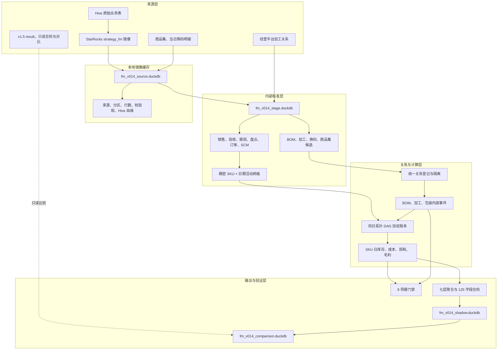
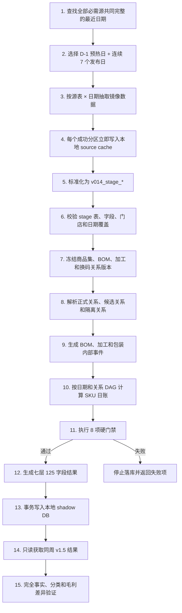
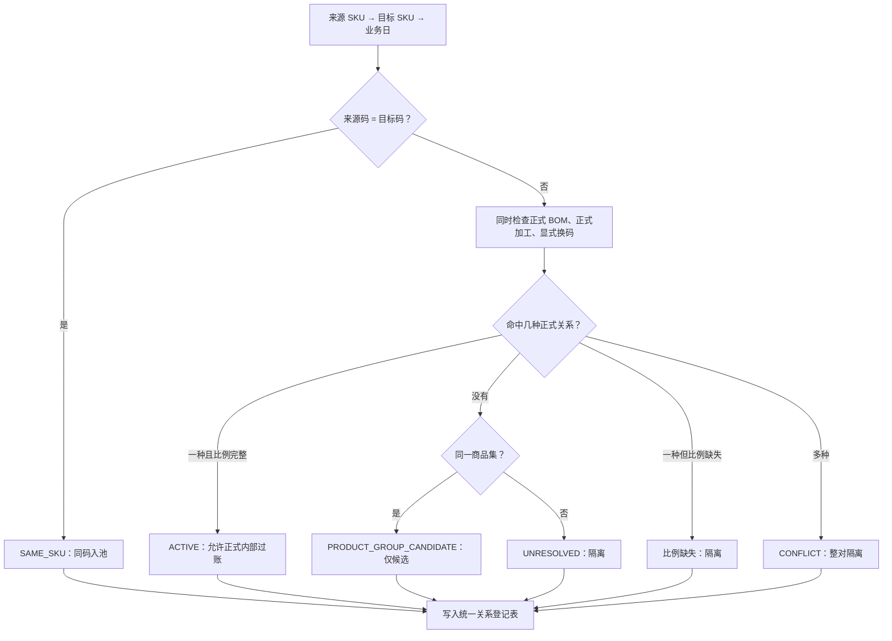
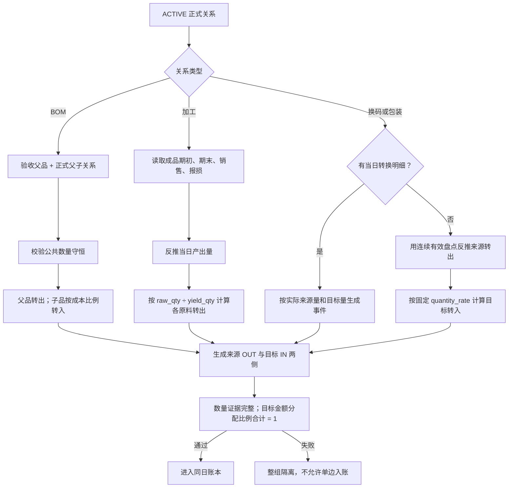
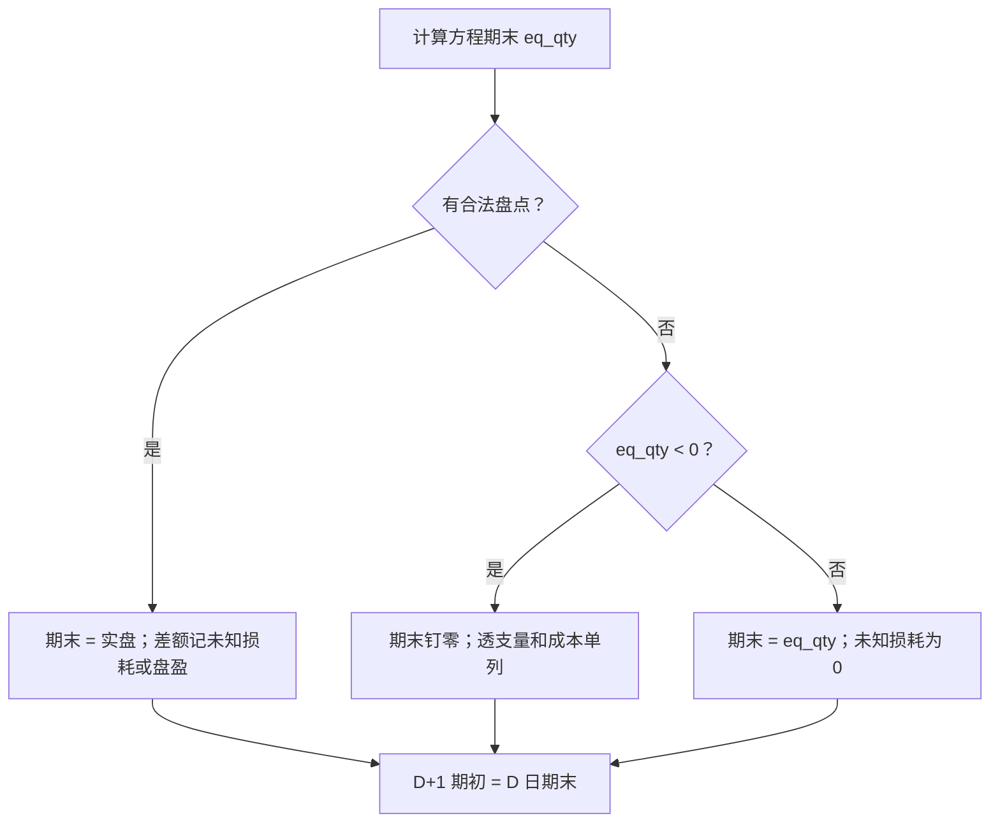
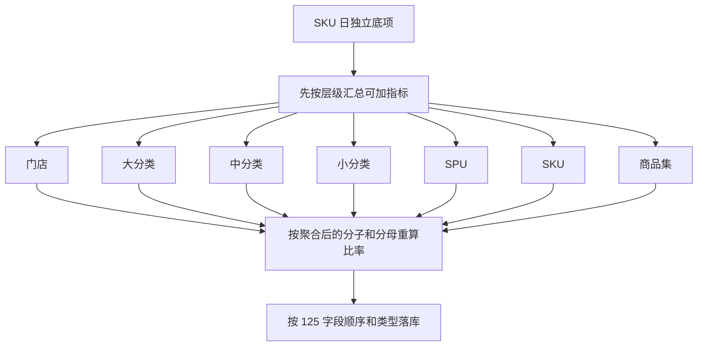
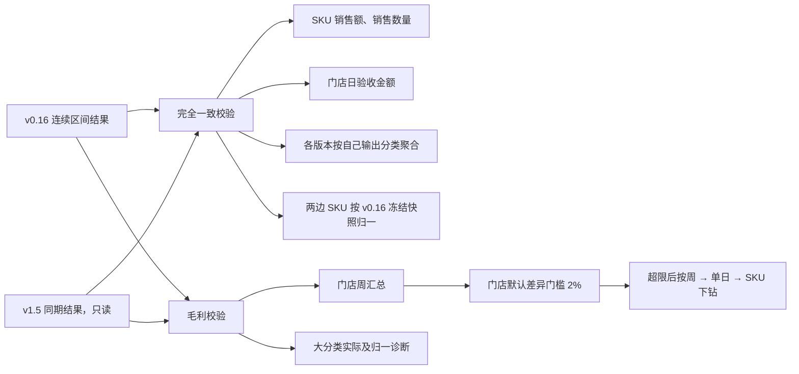

# fmetl v0.16 架构与处理链路

fmetl v0.16 是花家市集商品关系、库存、成本和门店毛利的本地影子 ETL。
源码直接位于现有 `fmetl/`，没有单独建立 v014 代码目录。

v0.16 从 Hive 对应的 StarRocks 镜像读取业务事实，自行完成商品关系判定、内部转移、
加权成本、库存滚动、损耗和毛利计算。v1.5 只提供输出字段、维度和聚合合同，并用于
只读差异验证；v1.5 的库存、成本、损耗和毛利结果不进入 v0.16 计算。

`t_v014_levels_result` 和 `v014_*` 保留为兼容物理表名，运行清单中的
`engine_version` 和 `run_id` 记录实际引擎版本。

## 1. 目标与边界

### 1.1 目标

- 使用商品集连接大部分订购码、验收码和销售码的商品身份。
- 猪肉、牛肉 BOM、加工关系、包装换码分别建模。
- 门店不再填写加工量；加工量由成品库存方程反推。
- 每个内部事件同时生成转出和转入，数量有依据，金额必须守恒。
- 错误盘点、冲突关系和缺失比例进入隔离，不让错误库存跨日。
- 输出 v1.5 兼容的 123 个字段，并追加商品集编码和名称。

### 1.2 当前边界

- 第一版仅运行门店 `A3XV`。
- 当前只写本地 DuckDB，不修改服务器生产 DuckDB、v1.5 表或调度任务。
- 外部正式结果表只有 `t_v014_levels_result`；审计表保留在同一本地影子库。
- 商品集仅证明商品身份相近，不能单独证明当天发生转换，也不能提供转换比例。
- 未确认的蔬菜固定转码、乳品包装比例和牛肉关系不自动推断。
- A3XV 商品集当前使用 `area_name IS NULL` 通用快照，生产发布前仍需业务确认。

## 2. 核心设计原则

1. **事实与关系分离**：销售、验收、盘点、报损是事实；BOM、加工、商品集是关系。
2. **外部流与内部流分离**：验收只记一次；SKU 间变化用内部转出和转入表达。
3. **关系与事件分离**：静态关系说明“可以怎样转”，当日事件说明“实际转了多少”。
4. **数量与金额同时守恒**：数量按各自单位记录并用公共单位校验，金额按同日成本完整转移。
5. **单次定价**：单位成本只在 SKU 日账计算；报告层只汇总，不重新定价。
6. **跨日精确滚动**：D+1 期初数量和金额直接复制 D 日期末。
7. **异常先隔离**：缺关系、缺比例、关系冲突、盘点异常不进入正式成本池。
8. **输出与会计底项分离**：v1.5 兼容展示调整不反向修改库存和内部过账。

## 3. 总体架构



**图解**

- StarRocks 提供 Hive 数据的访问镜像；源字段语义以字段手册登记的 Hive 血缘为准。
- 商品集、换码明细和加工关系只提供关系证据，不替代销售、验收、盘点和报损事实。
- v1.5 不连接关系、账本或成本模块，只连接最终对比模块。
- `source`、`stage`、`shadow` 三个 DuckDB 文件必须分开，防止原始缓存被计算结果覆盖。

## 4. 数据层级

| 层级 | 主要内容 | 物理位置 | 约束 |
|---|---|---|---|
| 镜像源层 | Hive 镜像事实、商品集、换码明细 | `fm_v014_source.duckdb` | 只读抽取，保存来源清单和校验和 |
| 标准层 | 统一字段、粒度、符号、日期和角色 | `fm_v014_stage.duckdb` | 仅由程序生成，不接受人工业务表 |
| 关系层 | 正式关系、候选关系、冲突和隔离 | `v014_relation_registry` | 每个来源码→目标码→业务日最多一种正式关系 |
| 事件层 | 内部转出、转入及数量证据 | `v014_internal_posting` | 每个事件两侧齐全，金额守恒 |
| 日账层 | SKU 日数量、成本、库存、损耗、毛利 | `v014_sku_daily` | 稠密日网格，D+1 精确滚动 |
| 输出层 | 门店至 SKU、商品集七层结果 | `t_v014_levels_result` | 123 个兼容字段 + 2 个商品集字段 |
| 审计层 | 异常、运行清单、校验结果 | `v014_quarantine` 等 | 不允许异常静默进入正式账 |

## 5. 端到端运行链路



**图解**

- `--end auto` 从前一业务日向前寻找所有必需源共同完整的 `D-1 + 连续 7 天`；D-1 只用于
  计算首个发布日的正确期初。
- 显式 `--end YYYY-MM-DD` 严格使用该日期作为第 7 个发布日，不自动回退；缺少必需源时
  运行失败并标明具体源表和日期。
- 显式 `--start YYYY-MM-DD --end YYYY-MM-DD` 发布完整连续区间，并额外抽取开始日前一日
  作为期初预热；适用于连续重刷超过 7 天的数据。
- 任一必需源缺失时，整个窗口一起回退，不拼接不同来源的不同日期。
- 镜像按“源表 × 日期”断点续拉；成功分区立即提交，重跑时跳过，超时不会丢失已完成数据。
- `source` 和 `stage` 保存 D-1；正式结果、SKU 日账、关系登记、正式内部过账
  和异常表只保存发布区间。新窗口事务替换旧 v0.14 表，因此不会混入上一次窗口。
- 关系、来源、阶段表和输出合同都生成校验和，便于复现同一次运行。
- 硬门禁在输出落库前执行；任一硬门禁失败，运行立即终止。

## 6. 来源与标准化

### 6.1 正式事实

| 业务域 | 主要镜像 | v0.14 用途 |
|---|---|---|
| 销售 | `strategy_fm_sales_di`、`strategy_fm_article_sale_di` | 销售、退回、渠道、客数和折扣 |
| 门店验收 | `strategy_fm_purchase_di` | 唯一正式外部净进货数量和金额；采购退回保留负号 |
| 供应链 | `strategy_fm_scm_di`、`strategy_fm_scm_adjust_di` | 订货、出库成本、结算和供应链毛利 |
| 报损 | `strategy_fm_loss_di` | 已知报损数量；上游未知损耗仅审计 |
| 盘点 | `strategy_fm_store_article_inventory_detail_di` | 仅有明确人工创建人或更新人的非负记录覆盖期末；系统快照只审计 |
| 订单 | `strategy_fm_order_offline_di`、`strategy_fm_order_online_di` | 订单键、渠道客数、新老客 |
| 商品 | `strategy_fm_dim_goods` | SKU、SPU、单位和分类维度 |
| 日清 | `strategy_fm_dim_day_clear`、`strategy_fm_chdj_article_di`、销售日清标签 | 正式名单优先，其次销售标签，最后默认非日清 |

完整表、字段和 Hive 血缘见
[字段手册](docs/references/strategy_fm_v1_5_字段手册.md)。

### 6.2 关系证据

| 证据 | 作用 | 不能证明 |
|---|---|---|
| 商品集快照 | 判断两个 SKU 是否属于同一商品身份 | 当天发生转换、转换数量和比例 |
| 正式 BOM | 判断父品和子品、出成率和成本率 | 门店当天实际拆分量，需事件证据 |
| 加工关系 | 判断原料、成品、配方比例和生效日 | 当日产出量，需库存方程反推 |
| `article_convert` | 固定单位或包装比例 | 当天发生转换 |
| 当日换码明细 | 提供实际来源码、目标码和数量 | 关系类型，仍由关系登记表确认 |
| `receive_sale` | 提供兼容的验收→销售分配计划 | 原始订验流水 |

### 6.3 标准层输出

`v014_stage.py` 将来源统一为以下计算边界：

- `v014_stage_source_manifest`：来源、Hive 血缘、分区、行数、校验和。
- `v014_stage_source_completeness`：门店×日期×必需源完整性。
- `v014_stage_activities`：SKU 日销售、退回、验收、报损、盘点和日清。
- `v014_stage_openings`：影子窗口首日期初库存种子。
- `v014_stage_bom`、`v014_stage_processing`、`v014_stage_explicit_convert`：正式关系输入。
- `v014_stage_conversion_events`：当日 BOM 或换码数量事件。
- `v014_stage_finished_processing_daily`：加工成品库存方程输入。
- `v014_stage_reporting_metrics`：输出字段需要的独立销售、订单、SCM 和维度底项。

## 7. 关系判定链路



**图解**

- 正式 BOM、正式加工和显式换码没有静默优先级；同日同关系对命中多个正式类型时直接隔离。
- 只有 `status=ACTIVE` 且 `formal_flow_allowed=true` 的关系可以生成内部流。
- 商品集只生成候选关系。没有当日数量或获批固定规则时，不产生库存和成本。
- `purchase_di` 是稠密日快照；只有当日验收数量或金额非零的行才生成订验候选。
- 静态 `article_convert` 只证明单位兼容；只有当日转换事件或获批固定规则才进入当日关系登记。
- 每条登记记录保存关系版本、证据来源、生效日期、数量比例和成本比例。

关系类型：

| 关系类型 | 业务含义 | 正式过账 |
|---|---|---|
| `SAME_SKU` | 验收码和销售码相同 | 外部验收直接进入同一 SKU |
| `BOM` | 猪肉、牛肉一父多子拆分 | `DISASSEMBLY_BOM` |
| `PROCESSING` | 多原料加工为成品 | `RECIPE_COMPOSE` |
| `EXPLICIT_CONVERT` | 一对一换码或包装转换 | `PACK_CONVERT` |
| `PRODUCT_GROUP_CANDIDATE` | 仅能确认同一商品集 | 不过账 |
| `UNRESOLVED` / `CONFLICT` | 无关系或关系冲突 | 隔离 |

## 8. 三类内部事件



**图解**

- 所有正式事件必须同时存在来源转出和目标转入，禁止只补一侧。
- BOM 在公共单位下校验父子数量，父品成本按目标成本比例完整分配。
- 加工不读取 `compose_di` 作为正式加工量；该表只作过程审计。
- 包装关系本身不能造流。无当日明细时，只有连续有效盘点产生可解释的来源减少，才允许反推。

### 8.1 加工产出公式

```text
成品产出量
= 成品期末库存
 - 成品期初库存
 - 成品外部验收
 + 成品净销售
 + 成品已知报损
 + 成品其他内部转出
 - 成品其他内部转入
```

```text
原料转出量
= 成品产出量 × raw_qty ÷ yield_qty
```

正式加工还要求：

- 成品有合法盘点；
- 关系在业务日有效；
- 同日没有成品外部验收；
- 所有原料库存充足；
- 同一成品当日只有一组有效配方。

任一条件不满足，整组加工进入隔离。

### 8.2 固定包装反推公式

```text
来源转出量
= 上次有效库存
 + 当日验收
 + 销售退回
 - 毛销售
 - 已知报损
 - 本次有效库存
```

```text
目标转入量 = 来源转出量 × quantity_rate
```

来源转出量为负、关系多目标、盘点缺失或比例无效时不生成事件。

## 9. 同日加权库存账本

### 9.1 同日 DAG


**图解**

- 每个业务日先根据关系边生成有向图，再进行拓扑排序。
- 上游 SKU 先计算当日加权成本，内部转出按该成本计价。
- 同一事件全部来源金额汇总后再分配给目标 SKU，保证转出金额等于转入金额。
- 环关系无法拓扑排序，运行失败，不以任意顺序定价。

### 9.2 当日成本

```text
可用数量
= 期初数量
 + 外部验收数量
 + BOM／包装／加工／残余内部转入数量
 + 销售退回数量
 + 盘盈数量
```

```text
可用金额
= 期初金额
 + 外部验收金额
 + BOM／包装／加工／残余内部转入金额
 + 销售退回成本
 + 盘盈金额
```

```text
当日出库单位成本 = 可用金额 ÷ 可用数量
```

销售、已知报损和全部内部转出使用同一个当日出库单位成本。

当日成本池为空但发生销售、报损或内部转出时，不允许默认 0 成本。v0.16 按以下证据顺序回退：

1. 该 SKU 最近一次有效的正出库成本；
2. 同门店、同日、同 SKU 的 `inventory_pool.cost_price` 参考成本；
3. 两者均不存在时保留 `MISSING_COST_EVIDENCE` 并阻断发布。

回退只补单位成本，不补库存数量，也不覆盖任何正的当日加权成本池。审计列
`fallback_cost_source` 与 `issue_cost_source` 记录实际取值路径。

### 9.3 库存方程与分支



**图解**

- 负盘点、小数点疑似错位、验收码与销售码重复盘点会先被移出正式盘点并进入隔离。
- 负库存不跨日：期末数量和金额钉零，透支成本单列并在毛利中扣回。
- `day_clear` 只保留为业务标签，不改变库存方程，也不凭标签生成未知损耗。
- `purchase_di` 普通期末快照只作审计，不覆盖计算期末；只有具备可靠盘点证据的非负数量
  可以覆盖期末数量，期末金额仍按当日单位成本重算。
- 跨日滚动直接复制数量和金额，不用四舍五入后的单位成本反算。

基础数量方程：

```text
eq_qty
= 可用数量
 - 内部转出数量
 - 毛销售数量
 - 已知报损数量
```

## 10. 毛利与展示层

### 10.1 会计毛利

```text
门店会计毛利
= 净销售额
 - 外部验收金额
 - BOM 转入金额 + BOM 转出金额
 - 包装转入金额 + 包装转出金额
 - 加工转入金额 + 加工转出金额
 - 残余转入金额 + 残余转出金额
 + 期末库存金额
 - 期初库存金额
 - 负库存透支成本
```

供应链毛利独立计算：

```text
供应链毛利 = 未税出库结算金额 - 未税出库成本金额
```

```text
全链路毛利 = 门店毛利 + 供应链毛利
```

SCM 退货金额保留在独立退货指标中，不在供应链毛利中重复扣减。

### 10.2 输出兼容层

`v014_sku_daily` 是兼容物理表名，保留 v0.16 内部账本真值。生成公共结果时：

- 同码且没有内部流的 SKU 日，可使用 Hive 库存观察量形成兼容展示毛利；
- 有 BOM、加工或包装内部流的 SKU 日，继续使用 v0.16 关系账本结果；
- 炒菜机金额从损耗扣除并加回各层兼容展示毛利；
- 生熟联动从损耗扣除，只在大分类执行来源类加回、熟食类扣减，门店、SPU 和 SKU 毛利不增加；
- 展示调整不修改内部库存、单位成本和 `v014_internal_posting`。

关系修正保留在 v0.16 账本，兼容展示调整不反向修改会计底项。

## 11. 分类与聚合

### 11.1 大分类口径与证据

v0.16 当前保留冻结的 v1.5 基线规则：

```text
配置：fmetl/config/v1_5_category_rules.json
版本：v1_5-v2.5-20260720
来源：v1.5 flag_sku SQL + 熟食 SKU 生效日覆盖
```

经营监控平台当前 `/api/sku-category/overrides` 为 v1.5 提供熟食大类覆盖；
`/api/sku-category/effective-mapping` 尚未接入 v1.5。本地静态熟食名单有 4 个 SKU，平台当前接口有
47 个 SKU。当前接口缺少 `effective_from`，历史快照生效方式待业务确认。

规则校验和、来源、证据状态和快照日期写入 `v014_run_manifest`。快照未覆盖运行窗口时，
`CATEGORY_SNAPSHOT_EVIDENCE` 阻止发布。对比库同时保留各自实际分类和 v0.16 归一分类两种视图。

### 11.2 七层输出



**图解**

- 每层分别生成日清、非日清和合计三种结果，合计由原子行重新汇总。
- 金额、数量和客数底项先求和；毛利率、损耗率、客单价等比率在聚合后重算。
- 商品集是平行分析层，不替换 SKU 或 SPU。
- 加工原料保留金额和数量，但从上架 SKU 数、动销 SKU 数等分母中排除。

### 11.3 输出合同

- 前 123 个字段与 v1.5 字段名、顺序和 DuckDB 类型一致。
- 最后追加 `article_group_id`、`article_group_name`。
- 输出不允许缺列或 NULL；缺少独立底项会直接报错。
- 字段定义见 [`fmetl/contracts/v014.py`](contracts/v014.py)。

## 12. 异常隔离

以下情况不进入正式库存和成本池：

| 异常 | 处理 |
|---|---|
| 同一关系对命中多个正式类型 | 整对标记 `CONFLICT` |
| 正式关系缺数量比例或成本比例 | 隔离，不补默认比例 |
| 仅同商品集但无数量证据 | 保留候选关系，不造流 |
| BOM 公共数量不守恒 | 整个事件隔离 |
| 加工缺成品盘点、原料不足或成品有外部验收 | 整组加工隔离 |
| 固定包装缺连续有效盘点 | 不生成包装事件 |
| 负盘点 | 保留原值审计，期末按库存方程计算 |
| 盘点疑似小数点错位 | 盘点失效并隔离 |
| 验收码与销售码重复盘点 | 两个盘点同时失效并隔离 |
| 库存方程为负 | 期末钉零，透支成本单列 |

隔离表保存门店、日期、SKU 或关系对、原因码和证据明细，便于从大分类下钻到 SKU。

隔离按执行时机分为两类：

- **阻断型**：发生在日账前。无效盘点不覆盖期末；冲突或缺证据的关系不生成内部转出、转入腿；
  有金额无数量的验收行不进入加权成本池。其他合法外部事实继续记账。
- **发布阻断型**：发生在日账后。`MISSING_COST_EVIDENCE` 保留 SKU 日账和诊断输出，同时使
  `ISSUE_COST_EVIDENCE` 发布门禁失败。运行状态标记为 `DIAGNOSTIC_ONLY_PUBLISH_BLOCKED`，禁止将
  零成本毛利作为正式结果发布。

隔离表每次影子运行重新生成，当前用于技术审计和差异下钻，未包含责任人、处理状态或关闭时间。
完整执行分支和当前 1,583 条原因明细见
[`V0.14_IMPLEMENTED_ARCHITECTURE.md`](docs/architecture/V0.14_IMPLEMENTED_ARCHITECTURE.md#111-异常隔离的执行语义)。

## 13. 校验体系

### 13.1 账本硬门禁

`v014_validation_result` 固定执行：

1. `NO_NEGATIVE_END_QTY`
2. `NO_NEGATIVE_END_AMT`
3. `SKU_QTY_BALANCE`
4. `SKU_AMOUNT_BALANCE`
5. `EXTERNAL_OBSERVATION_CONSERVATION`
6. `D1_EXACT_ROLL_FORWARD`
7. `INTERNAL_AMOUNT_CONSERVATION`
8. `BOM_PARENT_FULLY_TRANSFERRED`

任一校验失败，影子运行失败。

另有发布门禁 `ISSUE_COST_EVIDENCE`：销售、损耗或内部转出必须具有正的支出单位成本。该门禁
失败时仍保留本地诊断库，`v014_run_manifest.publish_eligible=false`，不得发布正式结果。

### 13.2 v1.5 只读对比



**图解**

- 销售和验收属于同一事实，要求完全一致。
- 门店毛利默认按 2% 执行对比门禁；SKU 毛利允许因 BOM、库存和损耗逻辑修正产生差异。
- 大分类同时保留“各自实际分类”和“v0.16 快照归一”视图；分类快照证据闭合前只作诊断。
- v1.5 原大分类行与其 SKU 重聚合结果的差额单列为父层展示桥，不作为成本或库存依据。
- 能由正式关系过账完整解释的分类差异标记为 `EXPECTED_RELATION_DELTA`，必须保留金额证据。
- 冻结的 123 个字段全部进入字段矩阵；v1.5 查询接口未返回的字段标记
  `REFERENCE_UNAVAILABLE`，不按 0 比较。

## 14. 本地运行

### 14.1 环境

```bash
python3 -m venv .venv
source .venv/bin/activate
pip install duckdb pandas numpy python-dotenv requests
```

### 14.2 基础门禁

```bash
.venv/bin/python -m fmetl.cli preflight
```

该命令检查包版本、镜像合同、分类规则和同步脚本合同，不读取或写入生产结果。

### 14.3 完整七日影子运行

```bash
.venv/bin/python -m fmetl.cli v014-shadow-week \
  --store A3XV \
  --end auto \
  --source-db data/fm_v014_source.duckdb \
  --stage-db data/fm_v014_stage.duckdb \
  --db data/fm_v014_shadow.duckdb
```

### 14.4 分阶段运行

```bash
# 只刷新 Hive 镜像本地缓存
.venv/bin/python -m fmetl.cli v014-fetch-mirrors \
  --store A3XV \
  --end auto \
  --source-db data/fm_v014_source.duckdb

# 只重建标准层
.venv/bin/python -m fmetl.cli v014-build-stage \
  --store A3XV \
  --source-db data/fm_v014_source.duckdb \
  --stage-db data/fm_v014_stage.duckdb

# 复用本地镜像缓存，重算标准层和影子账本
.venv/bin/python -m fmetl.cli v014-shadow-week \
  --store A3XV \
  --end auto \
  --reuse-source-cache
```

连续区间重刷示例：

```bash
.venv/bin/python -m fmetl.cli v014-shadow-week \
  --store A3XV \
  --start 2026-07-27 \
  --end 2026-08-04 \
  --source-db data/fm_v014_source.duckdb \
  --stage-db data/fm_v014_stage.duckdb \
  --db data/fm_v014_shadow.duckdb
```

### 14.5 与 v1.5 对比

```bash
.venv/bin/python -m fmetl.cli v014-compare-v15 \
  --db data/fm_v014_shadow.duckdb \
  --comparison-db data/fm_v014_comparison.duckdb
```

该命令使用影子库内的完整连续日期区间，只读 v1.5 同期参考表，并将差异写入
本地 comparison DB。区间可为 1 天或多天；日期断档时拒绝运行。

### 14.6 测试

```bash
.venv/bin/python -m unittest discover -s fmetl/tests -p 'test_*.py'
```

## 15. 本地数据库

| 文件 | 内容 |
|---|---|
| `data/fm_v014_source.duckdb` | 镜像源缓存和来源清单 |
| `data/fm_v014_stage.duckdb` | 程序生成的标准计算边界 |
| `data/fm_v014_shadow.duckdb` | 125 字段结果、日账、关系、过账、异常和校验 |
| `data/fm_v014_comparison.duckdb` | v0.14 与 v1.5 的只读差异结果 |

`data/` 不提交 Git；服务器生产库不由上述命令写入。

## 16. 代码结构

```text
fmetl/
├── cli.py                              v0.14 命令入口
├── mirror/
│   ├── registry.py                    镜像合同、字段和 Hive 血缘
│   ├── v014_source.py                 七日发现、抽取和源缓存
│   └── v014_stage.py                  标准层构建
├── relations/
│   ├── registry.py                    关系判定、版本和隔离
│   └── graph.py                       同日关系拓扑排序
├── facts/
│   ├── formal_events.py               BOM 和当日换码事件
│   ├── processing_inference.py        加工产出反推
│   ├── pack_inference.py              固定包装反推
│   └── inventory_inputs.py            盘点校验
├── calculations/
│   ├── ledger.py                      同日加权账本
│   ├── daily_cost_stock.py            单 SKU 日库存状态机
│   └── profit.py                      会计毛利
├── outputs/
│   ├── levels_result.py               七层聚合和展示调整
│   └── persistence.py                 本地事务落库
├── contracts/
│   ├── staging.py                     标准层合同
│   └── v014.py                        关系类型和 125 字段合同
└── validation/
    ├── run_v014.py                    七日运行编排
    ├── v014.py                        8 项硬门禁
    ├── compare_v014_v15.py            v1.5 只读对比
    └── preflight.py                   发布前基础检查
```

## 17. 当前验证状态

本次代码验证使用本地数据，未使用服务器生产 DuckDB 作为结果来源。

| 项目 | 结果 |
|---|---:|
| 单元与集成测试 | 159 个通过 |
| 比较层样本 | A3XV，2026-08-03 至 2026-08-04 |
| v1.5 SKU 销售事实校验 | 通过 |
| 各自实际分类差异 | 16 个在售 SKU 日，诊断项 |
| 门店日验收金额 | 1 行差异，未通过 |
| 门店周毛利 2% 门禁 | 2 个指标未通过 |
| 新鲜 v0.16 账本重算 | 被 2026-08-02 SKU `20000158` 销售退回缺成本证据阻断 |
| 服务器写入 | 0 |

比较层验证读取已冻结的 08-03～04 本地影子账本，只证明新对比口径能正确分离实际分类和归一分类。新鲜账本重算未完成，不据此声称 v0.16 数据已通过发布验收。

当前设计和修复证据见
[DESIGN-007](docs/designs/DESIGN-007-v0.16-invariant-led-correction.md) 和
[FIX-025](docs/fixes/FIX-025-v016-category-lineage-and-comparison.md)。v0.14 历史架构快照保留在
[V0.14_IMPLEMENTED_ARCHITECTURE](docs/architecture/V0.14_IMPLEMENTED_ARCHITECTURE.md)。

## 18. 发布前阻塞项

- 确认 A3XV 商品集通用区域快照的生产权威性。
- 补齐未确认牛肉 BOM、蔬菜固定转码和乳品包装比例。
- 对高金额隔离关系补齐方向、数量、比例和生效日期。
- 补齐 SKU `20000158` 在 2026-08-02 销售退回的合法成本证据，重跑 08-03～04 账本。
- 核对 1 行门店日验收金额差异和 2 个门店周毛利超限指标。
- 确认经营监控平台分类规则的历史生效日口径，再生成覆盖 08-03～04 的不可变快照。
- 完成生产并行、回滚演练和单独发布审批。

当前状态为 `DIAGNOSTIC_ONLY_PUBLISH_BLOCKED`，不得直接切换生产 executor 或服务器 cron。
