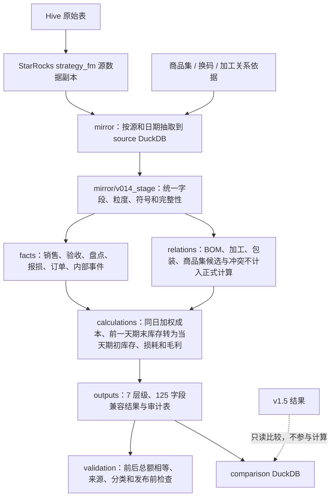
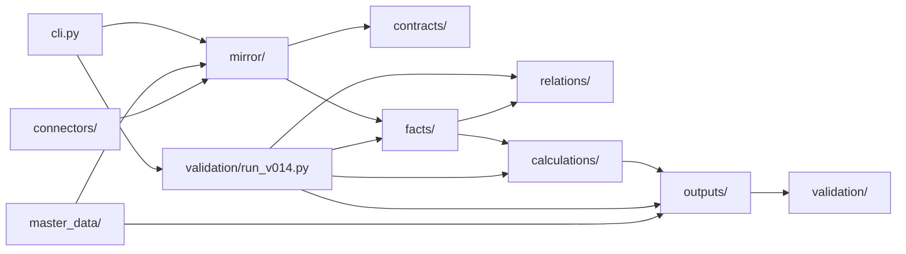

# 翠花门店 ETL 项目全文件与架构梳理（v0.16 历史快照）

> 状态说明：本文记录 2026-08-12、v0.17 改动前的 v0.16 工作区快照。文中的“当前”、
> `pack_inference.py`、`v014_stage_raw_available`、159 项测试和 v0.16 版本号只描述该次盘点，
> 不代表 v0.17 活跃实现。当前公式与运行状态以
> [`fmetl/README.md`](../../README.md)、[DESIGN-008](../designs/DESIGN-008-v0.17-processing-evidence-and-profit-correction.md)
> 和 [v0.17 发布审核](../reviews/V0.17_RELEASE_REVIEW.md) 为准。

> 盘点日期：2026-08-12
> 盘点范围：`/Users/zhukate/Desktop/Projects/qdm/fm/翠花数据` 本地工作区（含隐藏文件、忽略文件和未跟踪文件；不含 `.git` 内部对象的逐项解释）
> 数据边界：本报告只读取本地代码、文档、文件元数据和本地测试；未查询服务器 `/opt/fm/data/fm.duckdb`，未写服务器、StarRocks、v1.5 表或调度。
> 清理边界：本次只做梳理并新增本文档，没有删除、移动或改写现有项目文件。

## 1. 结论先行

当前项目“看起来臃肿”的主要原因不是活跃源码，而是本地运行资产与历史资产混放：

| 区域 | 文件数（约） | 磁盘占用 | 判断 |
|---|---:|---:|---|
| `.venv/` | 8,421 | 199 MB | 可重建的第三方环境，不属于项目源码 |
| `data/` | 42 | 743 MB | 21 个 DuckDB 快照及历史报告，需建立保留策略 |
| `outputs/` | 105 | 508 MB | 一次性分析产物，最大单个检查文件约 210 MB |
| `_archived/` | 317 | 3.4 MB | v2、v3、v0.11 和旧工具的历史快照，代码量多但体积小 |
| `fmetl/` | 232（含缓存/报告） | 5.4 MB | 当前 v0.16 活跃代码、测试和文档 |
| `.cursor/` | 35 | 0.25 MB | 项目操作技能和规则，本地开发辅助 |
| 根目录其他文件 | 10 | 0.17 MB | 其中 4 个旧分析脚本已不兼容当前包接口 |

排除 `.git`、`.venv`、数据、报表、缓存和归档后，当前真正的 ETL 主体约为：

- 活跃 Python 源码与测试共 15,203 行；
- 159 个本地测试全部通过，运行 15.5 秒；
- 当前版本是 `fmetl/__init__.py` 声明的 **v0.16**；
- 当前架构是 `mirror → facts/relations → calculations → outputs → validation`；
- 不是根 `AGENTS.md` 描述的 v0.11 `atomic → calculated → fm_tables` 14 步架构。

最优先处理的不是“删核心代码”，而是：

1. 修正文档单一信源：`AGENTS.md`、`CLAUDE.md`、`fmetl/README.md` 三者版本和运行方式不一致。
2. 把 `data/`、`outputs/`、`.venv/`、`_archived/` 与活跃源码在物理目录上分离。
3. 删除或归档 4 个已引用不存在接口的根目录旧脚本。
4. 拆分 `mirror/v014_stage.py`（1,257 行）和 `validation/run_v014.py`（645 行）两个编排热点。
5. 把仍叫 `v014_*` 的兼容物理名与当前 v0.16 引擎名分开，减少认知负担。

## 2. 当前真实架构

### 2.1 端到端逻辑图



### 2.2 运行入口

当前唯一正式 CLI 入口是：

```bash
python -m fmetl.cli preflight
python -m fmetl.cli v014-fetch-mirrors
python -m fmetl.cli v014-build-stage
python -m fmetl.cli v014-shadow-week
python -m fmetl.cli v014-compare-v15
```

命令名和物理表仍保留 `v014`，但 `fmetl.__version__`、运行清单和 README 声明实际引擎为 v0.16。这是兼容策略，不代表仍运行 v0.14 算法。

### 2.3 核心依赖方向



建议持续保持单向依赖；不要让 `outputs` 反向修改每日库存和成本记录，也不要让 v1.5 比较结果进入计算层。

## 3. 根目录逐文件说明

| 文件/目录 | 用途 | 重要性 | 建议 |
|---|---|---|---|
| `.git/` | Git 对象、分支、索引和历史 | 必须保留 | 不手工清理；不纳入业务文件说明 |
| `.gitignore` | 忽略凭证、数据、虚拟环境、输出、缓存 | 重要 | 保留；补充报告目录和临时 Excel 锁文件规则 |
| `.env` | QDM/API/数据库配置凭证 | 必须本地保留 | 绝不提交；建议补 `.env.example` 只列变量名 |
| `.claude/` | 当前为空的工具配置目录 | 低 | 可直接删空目录 |
| `.cursor/` | 项目技能和 Cursor 规则 | 辅助重要 | 若团队不用 Cursor，可迁到 `tools/skills/` 或个人配置；否则保留 |
| `.pytest_cache/` | pytest 运行缓存 | 无业务价值 | 可直接删除，可自动重建 |
| `.venv/` | Python 3.9 虚拟环境和第三方包 | 可重建 | 建议放仓库外或保留本地；不可提交；不要逐个维护其 8,421 个文件 |
| `.DS_Store` | macOS Finder 元数据 | 无 | 可直接删除 |
| `AGENTS.md` | Codex 项目指引 | 高，但已失真 | P0 重写：当前仍称 v0.11，并引用已归档/不存在路径 |
| `CLAUDE.md` | Claude/开发说明，前段 v0.14、后段 v0.11 | 高，但混杂 | P0 精简为当前 v0.16 指引；旧生产链只链接归档文档 |
| `compare_may.py` | 2026 年 5 月旧 v0.11/QDM 对比脚本 | 历史 | 引用已不存在的 `ApiConnector`、旧 `t_calc_*` 表；移入归档或删除 |
| `deep_compare.py` | 旧 QDM 逐日/SKU 深度对比 | 历史 | 同上；还使用已废弃的对比基准表，移入归档或删除 |
| `generate_comparison_html.py` | 生成 v0.10 对比 HTML | 历史 | 引用不存在的 `connectors.api_connector`；归档或删除 |
| `sku_drill.py` | v0.11 本地 DuckDB SKU 查看明细 | 历史 | 只读旧 `t_calc_stock/t_fm_sku_dim`；归档或删除 |
| `matnr_merge/` | 旧输出表按 `matnr` 再聚合工具 | 历史实验 | 当前 v0.16 已有 `relations/matnr.py`；确认无人工使用后归档 |
| `tests/` | 空目录 | 无 | 可直接删除；正式测试在 `fmetl/tests/` |
| `data/` | 本地 DuckDB、同步脚本、关系缓存和旧报告 | 运行资产 | 与源码分离；见第 8 节 |
| `outputs/` | Excel/JSON/PNG/HTML 一次性分析产物 | 交付资产 | 迁到仓库外按日期归档；见第 9 节 |
| `_archived/` | 历史代码和资料 | 历史资产 | 迁到单独 archive 分支或压缩包；见第 10 节 |
| `fmetl/` | 当前 v0.16 活跃源码、测试和文档 | 核心 | 必须保留，建议按第 12 节拆分 |

## 4. `fmetl/` 活跃源码逐文件说明

### 4.1 包入口与命令

| 文件 | 用途 | 重要性 | 建议 |
|---|---|---|---|
| `fmetl/__init__.py` | 包说明和 `__version__ = "0.16"` | 必须 | 保留；版本最好改由单一构建配置管理 |
| `fmetl/cli.py` | 四阶段本地试算运行、预检、对比的命令行编排 | 必须 | 保留；拆出参数定义和 command handler，避免继续膨胀 |
| `fmetl/README.md` | 当前 v0.16 架构、公式、运行和物理表总说明 | 必须 | 作为当前架构单一信源；修正所有仍叫 v0.14 的叙述歧义 |

### 4.2 `config/`：配置

| 文件 | 用途 | 重要性 | 建议 |
|---|---|---|---|
| `config/__init__.py` | 导出 `Settings/get_settings` | 重要 | 保留 |
| `config/settings.py` | 从环境变量读取 QDM、DuckDB、加工关系 API 配置 | 必须 | 保留；补启动时非敏感配置摘要 |
| `config/v1_5_category_rules.json` | v1.5 分类规则、固定分类 SKU 和规则版本 | 必须 | 保留；它是运行输入，应有字段结构定义和变更记录 |

### 4.3 `connectors/`：外部连接和本地持久化

| 文件 | 用途 | 重要性 | 建议 |
|---|---|---|---|
| `connectors/__init__.py` | 统一导出连接器类型 | 重要 | 保留 |
| `connectors/qdm_api.py` | QDM API 查询、分页、重试、列名 snake_case 化 | 必须 | 保留；这是 StarRocks 源数据副本读取边界 |
| `connectors/duckdb_store.py` | DuckDB 分区替换和事务写入 | 必须 | 保留；避免与 `outputs/persistence.py` 的事务职责重复扩张 |
| `connectors/processing_relations.py` | 加工关系 API 一次性快照、日期依据和校验 | 必须 | 保留；历史运行必须使用带日期依据的快照 |

### 4.4 `contracts/`：跨层数据合同

| 文件 | 用途 | 重要性 | 建议 |
|---|---|---|---|
| `contracts/__init__.py` | 导出源数据副本合同和旧 `RunManifest` | 重要 | 保留；若归档 v0.13 runner，可移除 `RunManifest` 导出 |
| `contracts/grains.py` | 门店限定和 DataFrame 唯一粒度断言 | 必须 | 保留 |
| `contracts/mirror.py` | 源数据副本权威来源、分区模式、抽取合同结构 | 必须 | 保留 |
| `contracts/staging.py` | 15 张 stage 表的字段/主键/空表合同与数据库验证 | 必须 | 保留 |
| `contracts/v014.py` | 关系类型、123+2 输出字段合同 | 必须 | 保留；建议未来改名 `engine_output.py`，物理兼容名另设映射 |
| `contracts/quality.py` | `CheckResult/QualityReport` 通用质量结果 | 疑似未使用 | 当前活跃代码无调用；确认后删除或接入统一检查 |
| `contracts/run.py` | v0.13 `RunManifest` 数据类 | 兼容旧链 | 仅 `run_shadow_week.py` 使用；随 v0.13 runner 一起归档 |

### 4.5 `mirror/`：源数据副本抽取与标准层

| 文件 | 用途 | 重要性 | 建议 |
|---|---|---|---|
| `mirror/__init__.py` | 导出源数据副本清单和抽取合同 | 重要 | 保留 |
| `mirror/registry.py` | 28 张同步源数据副本、辅助表、Hive 来源、字段投影和粒度合同 | 必须 | 保留；670 行可拆为 registry 数据与 projection 定义 |
| `mirror/extract.py` | 通用单源抽取器，处理分页、精确去重、粒度和门店校验 | 必须 | 保留 |
| `mirror/v014_source.py` | 确定完整日期范围；逐表逐日读取；失败后从未完成日期继续；保存并加载本地源数据副本 | 必须 | 保留；建议改中性名 `source_cache.py` |
| `mirror/v014_stage.py` | 将全部源数据副本整理成统一业务记录；包括日清、BOM、加工、换码和报表基础指标 | 必须但过大 | 1,257 行，是第一拆分目标；建议拆成 `stage/activities.py`、`relations.py`、`reporting.py`、`persistence.py` |

### 4.6 `master_data/`：业务主数据规则

| 文件 | 用途 | 重要性 | 建议 |
|---|---|---|---|
| `master_data/__init__.py` | 导出分类和可订可售标准化 | 重要 | 保留 |
| `master_data/category.py` | 加载分类 JSON、应用日期/SKU 优先级并生成分类依据 | 必须 | 保留；与 `.cursor/skills/master-data` 文档保持一致 |
| `master_data/day_clear.py` | 权威日清标签解析 | 必须 | 保留 |
| `master_data/saleability.py` | 可订/可售独立标志标准化 | 重要 | 保留 |
| `master_data/valid_business_day.py` | 按日历规则筛选有效营业日 | 重要 | 保留 |

### 4.7 `facts/`：业务事实与事件计划

| 文件 | 用途 | 重要性 | 建议 |
|---|---|---|---|
| `facts/__init__.py` | 导出事实标准化和 v0.13/v0.16 计划函数 | 重要 | 精简；当前导出混合两代 API |
| `facts/sku_day.py` | 规范销售、退回、损耗、盘点、日清 SKU日期记录事实 | 必须 | 保留 |
| `facts/store_receipts.py` | 验收事实去重、父品桥接、同码缺口补齐、退货符号校验 | 必须 | 保留 |
| `facts/orders.py` | 订单事件标准化、交易身份关联和扩行防护 | 必须 | 保留 |
| `facts/inventory_inputs.py` | 人工盘点治理：负数、小数点错位、双码重复不计入正式计算 | 必须 | 保留 |
| `facts/formal_events.py` | 根据已确认的 BOM 或换码关系，同时生成来源转出和目标转入 | 必须 | 保留 |
| `facts/processing_inference.py` | 根据成品库存方程计算加工产出和原料转出 | 必须 | 保留 |
| `facts/pack_inference.py` | 根据连续有效盘点和固定比例计算包装换码数量 | 必须 | 保留 |
| `facts/shadow_assembly.py` | 稠密活动网格、启动期初、内部事件拼装和成本资金过滤 | 必须但偏大 | 425 行；可按 opening/activity/event 拆分 |
| `facts/_resolution.py` | v0.13 计划层已确认关系对断言 | 旧兼容 | 只被旧 `bom_plan/pack_plan` 使用；随旧链归档 |
| `facts/bom_plan.py` | v0.13 BOM 拆解与定价计划 | 旧兼容 | 当前 v0.16 用 `formal_events.py`；随 v0.13 runner 归档 |
| `facts/pack_plan.py` | v0.13 有实际事件的包装转换计划 | 旧兼容 | 当前 v0.16 用 `pack_inference.py/formal_events.py`；归档候选 |
| `facts/processing_plan.py` | v0.13 配方计划及关系有向图检查 | 旧兼容/测试基线 | 当前 v0.16 主要计算流程不用；确认后归档，把必要检查移到新模块 |

### 4.8 `relations/`：关系依据、快照和图

| 文件 | 用途 | 重要性 | 建议 |
|---|---|---|---|
| `relations/__init__.py` | 导出旧 resolver、快照和 matnr | 重要 | 精简两代 API 混用 |
| `relations/registry.py` | v0.16 按业务日保存的商品集、待确认关系、已确认关系、冲突和不参与计算的原因 | 必须 | 保留；当前已确认关系入口 |
| `relations/graph.py` | 连通分量与拓扑排序，防止内部转换环 | 必须 | 保留 |
| `relations/snapshots.py` | 稳定 CSV、校验和和不可变关系快照 | 必须 | 保留 |
| `relations/matnr.py` | 生成物料号成员快照，仅做身份分析、不自动计入每日库存和成本 | 重要 | 保留 |
| `relations/resolver.py` | v0.13 BOM/加工/换码关系解析 | 旧兼容 | 当前 v0.16 用 `registry.py`；随旧 runner 归档 |

### 4.9 `calculations/`：库存、成本、客户和毛利

| 文件 | 用途 | 重要性 | 建议 |
|---|---|---|---|
| `calculations/__init__.py` | 导出计算层公共 API | 重要 | 保留，精简旧接口后同步 |
| `calculations/daily_cost_stock.py` | 单 SKU 单日处理规则、库存方程、前一天期末库存转为当天期初库存 | 必须 | 保留；这是核心会计状态定义 |
| `calculations/ledger.py` | 同日拓扑加权账本、内部金额传递、SKU日期记录结果 | 必须 | 516 行，是核心计算热点；可拆校验、拓扑执行、结果装配 |
| `calculations/profit.py` | 只基于已定价金额流计算会计毛利 | 必须 | 保留；保持纯函数和单一职责 |
| `calculations/customers.py` | 首单、周新老客、订单客数聚合 | 重要 | 保留 |
| `calculations/special_wastage.py` | 炒菜机/生熟联动特殊报损 trace 和展示层分类转移 | 重要且高风险 | 保留；明确“展示调整不回写每日库存和成本记录” |

### 4.10 `outputs/`：公开结果与写入数据库

| 文件 | 用途 | 重要性 | 建议 |
|---|---|---|---|
| `outputs/__init__.py` | 当前只导出 v0.13 `build_shadow_levels_daily` | 失真 | 改为导出当前 `build_v014_levels_result`，或取消聚合导出 |
| `outputs/levels_result.py` | SKU 到门店/分类/SPU/商品集七层聚合和 125 字段结果 | 必须 | 保留；展示调整和聚合可拆分 |
| `outputs/persistence.py` | 结果、每日库存和成本记录、关系、计入每日库存和成本、不计入正式计算、清单事务写入数据库 | 必须 | 保留 |
| `outputs/shadow_levels.py` | v0.13 旧本地试算层级结果 | 旧兼容 | 仅旧 runner/旧测试用；归档候选 |

### 4.11 `validation/`：检查与比较

| 文件 | 用途 | 重要性 | 建议 |
|---|---|---|---|
| `validation/__init__.py` | 导出基础校验和旧比较 API | 重要 | 精简为当前公开接口 |
| `validation/preflight.py` | 源数据副本清单/来源校验和同步脚本 SHA256 校验 | 必须 | 保留 |
| `validation/manifest.py` | 来源清单和与行序无关但保留重复度的校验和 | 必须 | 保留 |
| `validation/v014.py` | 每日库存和成本记录、发布、分类依据和必须通过的检查 | 必须 | 保留；未来改中性名 |
| `validation/run_v014.py` | 选窗口、读 stage、解析关系、跑账本、检查、写入数据库总编排 | 必须但过大 | 645 行，第二拆分目标；改为小型 pipeline orchestrator |
| `validation/compare_v014_v15.py` | 当前 v0.16 与 v1.5 全字段、分类、关系影响只读对比 | 必须 | 保留；名称未来中性化 |
| `validation/balances.py` | v0.13 简单每日账目平衡检查 | 旧兼容 | 当前主要计算流程由 `v014.py` 检查；归档候选 |
| `validation/comparison.py` | v0.13 毛利对比 | 旧兼容 | 已被新比较器替代；归档候选 |
| `validation/compare_shadow_v15.py` | 固定 2026-07-08～14 的 v0.13 比较脚本 | 历史 | 归档；不是当前通用命令 |
| `validation/run_shadow_week.py` | 固定 A3XV 2026-07-08～14 的 v0.13 顶层执行脚本；导入即执行 | 历史高风险 | 必须移出包或加 `main` 防护；建议整体归档 |

## 5. `fmetl/tests/` 逐文件说明

测试共 159 项，当前全部通过。下面所有测试文件都应保留，除非对应旧兼容模块整体归档；不能先删测试再宣称代码无用。

| 文件 | 覆盖职责 | 建议 |
|---|---|---|
| `tests/__init__.py` | 标记测试包（空文件） | 可保留，也可在现代 unittest/pytest 下删除 |
| `test_category_and_mirror.py` | 分类优先级、源数据副本权威清单、字段来源、可订可售 | 必须保留 |
| `test_mirror_extractor.py` | 分页抽取、精确重复去重、空分区、粒度冲突 | 必须保留 |
| `test_sku_day_facts.py` | 销售/退回/盘点/报损/日清事实合同 | 必须保留 |
| `test_store_receipts.py` | 验收唯一进入单位成本计算、父品桥接、符号和重复校验 | 必须保留 |
| `test_orders_and_customers.py` | 订单保真、客数、新老客和 join 防扩行 | 必须保留 |
| `test_processing_relation_source.py` | 加工 API 单次快照、日期和非法数据 | 必须保留 |
| `test_relations_and_plans.py` | 旧 resolver、加工/包装计划和冲突关系 | 随旧兼容链重构；保留可迁移的业务断言 |
| `test_disassembly_plan.py` | v0.13 BOM 计划和转出金额等于转入金额 | 随旧模块归档或迁移断言到 formal events |
| `test_shadow_assembly.py` | 稠密活动、启动库存和内部成本资金 | 必须保留 |
| `test_daily_state_and_wastage.py` | 处理规则、负库存、退回、成本和特殊损耗 | 必须保留 |
| `test_shadow_ledger.py` | DAG 账本、跨日、转出金额等于转入金额、分类发布依据 | 必须保留 |
| `test_matnr_snapshot.py` | matnr 身份快照和跨分类不计入正式计算 | 保留 |
| `test_store_and_validation.py` | DuckDB 原子发布和基础余额异常 | 保留；旧 balance 测试可迁移 |
| `test_comparison.py` | v0.13 旧比较器 | 随旧比较器归档 |
| `test_compare_v014_v15.py` | 当前 v0.16/v1.5 差异检查和分类桥 | 必须保留 |
| `test_validation_manifest.py` | 来源校验和与清单 | 必须保留 |
| `test_v014.py` | 1,189 行综合合同、源数据副本、关系、加工、输出、runner 集成 | 必须但过大 | 按领域拆为 6～8 个文件，减少冲突和定位成本 |

## 6. `fmetl/docs/` 逐文件说明

### 6.1 文档入口与架构

| 文件 | 用途 | 状态/建议 |
|---|---|---|
| `docs/README.md` | v0.13～v0.16 文档索引 | 保留；补齐未跟踪的 3 篇审查和本文链接 |
| `architecture/V0.13_ARCHITECTURE.md` | v0.13 架构和完成度 | 历史主干，保留但标“非当前” |
| `architecture/V0.14_IMPLEMENTED_ARCHITECTURE.md` | v0.14 已实现完整流程 | 历史实现，保留；其中部分 CLI 参数已与当前代码不一致，需标明已过期 |
| `architecture/PROJECT_FULL_FILE_AUDIT_2026-08-12.md` | 本次全文件、架构和精简审计 | 新增，作为清理执行依据 |

### 6.2 设计文档

| 文件 | 用途 | 状态/建议 |
|---|---|---|
| `designs/DESIGN-003-v0.13-clean-rebuild.md` | 从 v0.11 清洁重建的总设计 | 保留，历史基础 |
| `designs/DESIGN-004-v0.13-multilevel-bom-iteration-plan.md` | 多级 BOM/SPU/损耗迭代 | 保留，部分未完成项需在索引标状态 |
| `designs/DESIGN-005-v0.14-product-group-etl-plan.md` | 商品集关系和本地试算 ETL 设计 | 保留，v0.14 边界 |
| `designs/DESIGN-006-v0.15-evidence-led-iteration-method.md` | 依据驱动准入和检查 | 保留，当前方法基础 |
| `designs/DESIGN-007-v0.16-invariant-led-correction.md` | v0.16 前后总额相等驱动修正 | 当前设计，必须保留 |

### 6.3 修复记录

| 文件 | 用途 | 状态/建议 |
|---|---|---|
| `fixes/README.md` | v0.12～v0.16 修复索引 | 保留并持续更新 |
| `fixes/V0.14_FROM_V0.13.md` | v0.14 相比 v0.13 的能力差异 | 保留 |
| `FIX-021-mirror-exact-duplicate-dedup.md` | 源数据副本完全重复行去重 | 保留 |
| `FIX-022-explicit-operator-count-gate.md` | 人工盘点账号检查 | 保留 |
| `FIX-023-explicit-window-and-safe-rates.md` | 连续重刷和安全比率 | 保留 |
| `FIX-024-v015-evidence-led-release-gates.md` | v0.15 缺成本和来源检查 | 保留 |
| `FIX-025-v016-category-lineage-and-comparison.md` | v0.16 分类来源/比较计算规则 | 当前修复，必须保留 |

### 6.4 参考手册

| 文件 | 用途 | 状态/建议 |
|---|---|---|
| `references/strategy_fm_v1_5_字段手册.md` | 28 张源数据副本、字段、粒度和 Hive 来源 | 必须保留；同步脚本变化时更新 |
| `references/strategy_fm_v1_5_实时列名快照_2026-07-22.md` | 当日 StarRocks 列名实测快照 | 历史依据，保留并标日期 |

### 6.5 审查记录

| 文件 | 用途 | 状态/建议 |
|---|---|---|
| `reviews/V0.13_INCREMENTAL_BUILD_LOG.md` | v0.13 分块构建与验证日志 | 历史，保留 |
| `reviews/V0.14_CATEGORY_SPU_UNIT_PRICE_CHAIN_REVIEW.md` | 大分类—SPU 单价计算过程审核 | 保留 |
| `reviews/V0.14_SHADOW_VALIDATION.md` | v0.14 七天本地试算检查与差异 | 保留 |
| `reviews/V0.16_RELEASE_REVIEW.md` | v0.16 发布审核和不能发布的原因 | 当前，必须保留 |
| `reviews/V0.14_POST_RELEASE_CHANGE_AUDIT_AND_NEXT_VERSION_PLAN.md` | v0.14 后提交审计和下一版计划 | 有价值但未跟踪；审核后提交 |
| `reviews/V0.14_V0.16_CHAIN_COMPARISON.md` | v0.14/v0.16 全链合理性对比 | 有价值但未跟踪；审核后提交 |
| `reviews/V0.16_PROCESSING_SSLS_CHAIN_REVIEW.md` | 加工、生熟联动、特殊报损审查 | 有价值但未跟踪；审核后提交 |

### 6.6 报告产物

| 文件/目录 | 用途 | 建议 |
|---|---|---|
| `reports/v0.14-etl-weekly-report.md` | v0.14 ETL 周报 | 已跟踪，保留 |
| `reports/v1.5-v0.13-frontline-weekly-report.md` | 门店流程/产品/ETL 周报正文 | 已跟踪，保留一个主副本 |
| `reports/v0.16-non-pork-beef-relation-unit-price-weekly-report.md` | v0.16 单价计算过程周报 | 未跟踪；确认后提交或移交付目录 |
| `reports/v0.13-last-week-sku-processing.csv` | 周报数据附件 | 忽略生成物，移到 `outputs/` |
| `reports/v0.13-sku-store-profit-chain.html` | 交互过程报告 | 忽略生成物，移到 `outputs/`，不应混在源码文档 |
| `reports/v0.13-store-frontline-weekly-report.html` | 门店周报 HTML | 同上 |
| `reports/v1.5-v0.13-frontline-weekly-report.html` | 周报 HTML | 同上 |
| `reports/v1.5-v0.13-trees.html` | ETL 树图 HTML | 同上 |
| `reports/assets/v0.14-core-changes-xkcd.png` | 报告插图 | 若 Markdown 引用则保留，否则移交付目录 |
| `reports/fmetl/docs/reports/` | 错误打包时复制出的完整重复路径 | 可直接删除；5 个文件与上级逐字相同 |
| `reports/逻辑图与周报整理-20260810.zip` | 一次性交付压缩包 | 移到仓库外交付归档 |
| `reports/门店流程-ETL与产品改造梳理.zip` | 一次性交付压缩包 | 移到仓库外交付归档 |
| `reports/逻辑图与周报文件清单.md` | 两个压缩包/报告的人工清单 | 若压缩包移走则一起移走；不属于核心架构文档 |

## 7. `.cursor/` 逐文件/目录说明

这些文件全部被 `.gitignore` 忽略，是本机工具能力，不参与 ETL 运行。

| 路径 | 用途 | 建议 |
|---|---|---|
| `.cursor/rules/core-standards.mdc` | 本地编码规范 | 保留或合并到精简后的 `AGENTS.md` |
| `skills/master-data/SKILL.md` | 分类映射唯一权威操作说明 | 重要；保留并与代码/JSON 同步 |
| `skills/etl-check/SKILL.md` | 负库存、BOM、成本、损耗健康检查 | 保留 |
| `skills/qdm-compare/SKILL.md` | FM 与 QDM 全指标比较流程 | 保留并更新到 v0.16 表名 |
| `skills/server-query/SKILL.md` | 服务器 DuckDB 只读查询流程 | 保留 |
| `skills/fm-data-query/{SKILL,README,REFERENCE}.md` | FM 取数说明 | 可合并为 SKILL + 一份参考 |
| `skills/fm-data-query/query_api.py` | FM 查询 API 客户端 | 工具脚本，保留 |
| `skills/fm-data-query/excel_export.py` | 查询结果导出 Excel | 工具脚本，保留 |
| `skills/fm-platform/{SKILL,REFERENCE}.md` | FM 平台操作说明 | 保留 |
| `skills/fm-platform/src/fetch_template.py` | 拉取平台模板 | 保留 |
| `skills/qdm-bi-api/{SKILL,REFERENCE}.md` | QDM API 用法和字段边界 | 保留 |
| `skills/qdm-bi-api/src/qdm_api.py` | 独立 QDM API 工具 | 与 `fmetl/connectors/qdm_api.py` 重复；建议改为复用核心连接器 |
| `skills/monthly-report/monthly_report.py` | 月报生成脚本 | 报表工具，保留或迁独立 reporting 项目 |
| `skills/sync-schema-fix/SKILL.md` | 同步表 schema 修复流程 | 保留 |
| `skills/webapp-testing/` | 通用 Web 测试技能、示例和服务脚本 | 与 ETL 无直接关系；可移个人 skills |
| `skills/xlsx/` | Excel 技能、许可证和重算脚本 | 与 ETL 无直接关系；可移个人 skills |
| `skills/skill-creator/` | 创建技能的模板、脚本、参考和许可证 | 通用工具；移个人 skills，避免项目臃肿 |
| 各级 `.DS_Store` | Finder 元数据 | 删除 |

## 8. `data/` 全文件说明与保留策略

### 8.1 当前运行链需要的命名槽位

| 文件 | 用途 | 建议 |
|---|---|---|
| `fm_v014_source.duckdb` | 当前 CLI 默认 source 源数据副本缓存 | 保留一个当前副本；可重拉但耗时 |
| `fm_v014_stage.duckdb` | 当前 CLI 默认标准层 | 可从 source 重建；空间紧张时删除 |
| `fm_v014_shadow.duckdb` | 当前 CLI 默认正式本地试算结果与审计表 | 本地当前结果，保留 |
| `fm_v014_comparison_*.duckdb` | v0.14/v0.16 与 v1.5 比较结果 | 每个发布窗口只保留最终一个 |
| `processing_relations.json` | 本地加工关系缓存/人工导出 | 仅作输入快照时保留；必须带日期和来源说明 |
| `sync_strategy_fm.sh` | 公司 IDE 手工同步脚本，预检以固定 SHA 校验 | 重要；建议移到 `ops/` 并纳入版本控制的脱敏模板 |
| `sync_strategy_fm.sql` | 同步 SQL 版本/副本 | 与 `.sh` 比较后只留一个权威版本 |

### 8.2 历史/实验 DuckDB

| 文件组 | 用途 | 建议 |
|---|---|---|
| `fm.duckdb` | v0.11 旧 ETL 本地库 | 当前 v0.16 不读；压缩归档或删除本地副本 |
| `fm_v011_cost_scope_*.duckdb` | v0.11 成本范围实验 | 历史实验，删除或冷归档 |
| `fm_v013.duckdb` | 固定周 v0.13 本地试算库 | 旧 runner 依据，冷归档 |
| `fm_v013_cost_scope_*.duckdb` | v0.13 20 SKU 成本实验 | 冷归档 |
| `fm_v014_source_1d*.duckdb` | v0.14 单日 source 实验 | 已有更完整 source 时删除 |
| `fm_v014_source_20260723_20260730.duckdb` | 特定窗口 source 快照 | 若报告可复现需要则冷归档，否则删除 |
| `fm_v014_stage_1d*.duckdb` | 单日 stage 实验 | 可重建，删除 |
| `fm_v014_stage_20260723_20260730*.duckdb` | 特定窗口 stage/修正版 | 只保留最终结果或全部冷归档，不放工作区 |
| `fm_v014_shadow_20260724_20260730_final.duckdb` | v0.14 最终本地试算依据 | 发布依据可冷归档 |
| `fm_v014_shadow_20260803_20260804.duckdb` | 两日本地试算实验 | 与报告绑定，冷归档 |
| `fm_v015_comparison_*.duckdb` | v0.15 比较依据 | 冷归档 |
| `fm_v016_comparison_*.duckdb` | v0.16 两日比较依据 | 保留最新发布依据或冷归档 |
| `fm_v016_source_*.duckdb` | v0.16 命名的 source 快照 | 当前 CLI 默认仍用 v014 名；确认唯一最新后只留一个 |
| `fm_v016_source_20260805_20260811.duckdb.wal` | 未 checkpoint 的 DuckDB WAL | **不可直接删**；先确认数据库无进程占用并用 DuckDB 正常打开/checkpoint |
| `fm_v016_source_latest_20260812.duckdb` | 最新 source 副本 | 与默认 source 内容比对后选一个权威副本 |

### 8.3 CSV/HTML 报告

| 文件 | 用途 | 建议 |
|---|---|---|
| `5月逐日对比_fm_vs_qdm.csv` | v0.11 五月对比 | 历史输出，移 `outputs/archive/` |
| `daily_cat_comparison.csv` | 旧逐日分类比较 | 同上 |
| `daily_profit_compare_category.csv` | 旧分类利润比较 | 同上 |
| `daily_profit_compare_store.csv` | 旧门店利润比较 | 同上 |
| `output/fmetl_vs_qdm_20260501_20260524.csv` | 旧 QDM 对比结果 | 同上 |
| `output/v0.10_vs_QDM_*.html` | v0.10 对比 HTML 2 份 | 历史输出，移走/删除 |
| `output/v4_vs_QDM_*.html` | v4 对比 HTML 6 份 | 历史输出，移走/删除 |
| `output/毛利结算明细_*.csv` | 猪肉/水产/熟食/烘焙旧明细 4 份 | 历史输出，移走/删除 |

## 9. `outputs/` 文件组说明

`outputs/` 下 105 个文件均被 Git 忽略，不参与 ETL 运行。它们应按“交付成品 / 可重建中间件 / 临时锁文件”处理：

| 目录 | 主要内容 | 建议 |
|---|---|---|
| `019f83a2-.../` | v1.5 SKU 关系分类 Excel、浏览器、JSON、预览、构建脚本 | 只留最终 Excel/HTML + 可复现脚本；删除 4 个 38～55 MB inspect 文件、`__pycache__`、`~| `019f83a2-.../` | v1.5 SKU 关系分类 Excel、浏览器、JSON、预览、构建脚本 | 只留最终 Excel/HTML + 可复现脚本；删除 4 个 38～55 MB inspect 文件、`__pycache__`、 锁文件和重复样式版 |
| `019f8deb-.../` | 商品集拆分与 v1.5 双体系对比 | 只留最终 xlsx + 构建/采集脚本；210 MB `.inspect.ndjson` 优先删 |
| `019fa28a-.../` | SKU 临时成本测算 | 只留最终 xlsx；两个 inspect 文件可重建 |
| `019f7e3e-.../` | 门店毛利差异矩阵 | 保留最终 xlsx；删 `~| `019f7e3e-.../` | 门店毛利差异矩阵 | 保留最终 xlsx；删  和 inspect |
| `v013_v15_inventory_audit_20260716/` | v0.13 库存损耗审核成品 | 冷归档最终 xlsx |
| `v013_v15_trend_20260716/` | v0.13/v1.5 趋势 Excel | 冷归档最终 xlsx |
| `v014_missing_cost_sku_audit_20260804/` | 缺成本 SKU 审核 | 留 xlsx，删 14 MB inspect |
| `20260803-v014-v15-compare-*/` | v0.14 经营趋势对比、预览、构建脚本 | 留 xlsx + mjs；预览按需，inspect/锁文件删 |
| `20260805-v014-compare-*/` | 两日 v0.14 对比 | 留 xlsx，删 inspect |
| `20260805-v016-v15-audit-*/` | v0.16 两日审核和缺成本明细 | 留两个 xlsx；inspect 可删 |
| `20260805-v016-v15-relation-unit-price-*/` | 非猪牛关系单价计算过程报告、脚本、payload、预览 | 留 xlsx + 源脚本；11 MB inspect 和 formula scan 可重建 |
| `outputs/.DS_Store`、各级 `__pycache__` | 系统/解释器缓存 | 直接删除 |

建议为输出建立保留规则：

- `deliverables/`：最终 xlsx/html/pdf，按 `YYYY-MM-DD/主题/` 保存；
- `artifacts/`：JSON、NDJSON、PNG、检查日志，默认 14～30 天过期；
- `scripts/analysis/`：值得复用的采集/构建脚本进入版本控制；
- 每次任务结束删除 `~$*`、`.DS_Store`、`__pycache__`、`*.inspect.ndjson`。

## 10. `_archived/` 每个子目录说明

归档内文件已不参与当前导入链；无需再按活跃模块维护。子目录即其文件用途边界：

| 子目录 | 文件数 | 用途 | 建议 |
|---|---:|---|---|
| `_archived/fm_etl_v2/` | 39 | 第二代 extractor/BOM/calculator 完整代码 | 压缩成一个带 README 的版本包或只留 Git tag |
| `_archived/fm_etl_v3/` | 124 | v3 源数据层、计算层、输出表、API、部署、脚本和文档 | 与 v0.11 大量重复；Git 已保存，工作树可移除 |
| `_archived/fmetl_v0_11_20260715/` | 111 | v0.11 最终代码、20 个 FIX、审查和架构快照 | 历史价值最高；建议压缩/打 tag 后移出主工作树 |
| `_archived/legacy_scripts/` | 13 | 老 5 层 ETL 独立脚本 | 仅参考，归档包 |
| `_archived/bom_debug_logs/` | 8 | 2026-04-23 BOM 分摊日志/CSV | 历史调试依据，压缩或删除 |
| `_archived/docs/` | 3 | 老架构/输出表设计文档 | 与版本归档合并 |
| `_archived/monitoring/` | 3 | 老监控脚本 | 当前未部署，归档 |
| `_archived/scripts/` | 4 | 老辅助脚本 | 归档 |
| `_archived/tests/` | 1 | 老测试文件 | 与对应版本代码合并 |
| `_archived/upstream/` | 4 | 上游 SQL/shell 资料，其中一个为空文件 | 有来源价值的保留，空文件删除 |
| `_archived/底表/` | 5 | 老输出表 SQL/说明 | 归档 |
| `_archived/AGENTS.md` | 1 | 老代理说明 | 无需三份并存；随 v0.11 归档 |
| `_archived/data/`、`deploy/` | 0 | 空目录 | 可直接删除 |

逐个历史 Python 文件的用途可由目录和文件名直接确定：`atomic/*_extractor.py` 为旧源表抽取，`calculated/*.py` 为旧计算，`fm_tables/*.py` 为旧输出，`scripts/check/query/probe/verify/*.py` 为一次性诊断。它们不应再被当前代码 import；如需复用，应复制业务断言到当前模块并补测试，而不是直接恢复旧文件。

## 11. 可删除/归档矩阵

### 11.1 A 级：可直接删除，不影响业务

- 所有 `.DS_Store`；
- 所有 `__pycache__/` 和 `*.pyc`；
- `.pytest_cache/`；
- 根空目录 `.claude/`、`tests/`、`_archived/data/`、`_archived/deploy/`；
- 所有 `~$*.xlsx` Excel 临时锁文件；
- `fmetl/docs/reports/fmetl/` 整个错误重复目录；
- `outputs/` 中可重建的 `*.inspect.ndjson`、formula scan、预览缓存（先确认最终成品已保留）。

预计仅删除输出检查文件即可释放约 400 MB；清理所有可重建输出和缓存可释放更多。

### 11.2 B 级：确认后归档/删除

- 根目录 `compare_may.py`、`deep_compare.py`、`generate_comparison_html.py`、`sku_drill.py`；
- `matnr_merge/`；
- `_archived/` 全部旧版本（用 Git tag/压缩包保留）；
- `data/` 中非当前窗口的 18+ 个 DuckDB 快照；
- `data/output/` 全部 v4/v0.10 报告；
- `fmetl/docs/reports/` 的 HTML、CSV、ZIP 交付物；
- `.cursor/skills/` 中通用的 skill-creator、webapp-testing、xlsx。

### 11.3 C 级：代码兼容岛，需先做依赖迁移

以下是一组 v0.13 历史链，当前 v0.16 正式 CLI 不调用，但测试和固定周 runner 互相依赖：

```text
contracts/run.py
facts/_resolution.py
facts/bom_plan.py
facts/pack_plan.py
facts/processing_plan.py
relations/resolver.py
outputs/shadow_levels.py
validation/balances.py
validation/comparison.py
validation/compare_shadow_v15.py
validation/run_shadow_week.py
对应旧测试
```

建议一次性迁到 `_archived/v013_runner/`，不要零散删除。迁移前把仍有价值的业务不变量测试移到 v0.16 模块。

### 11.4 D 级：必须保留

- `fmetl/cli.py`；
- `config/` 中当前配置和分类规则；
- `connectors/`；
- 当前 contracts（grains/mirror/staging/v014）；
- `mirror/registry.py`、`extract.py`、`v014_source.py`、`v014_stage.py`；
- 当前 facts：sku_day、store_receipts、orders、inventory_inputs、formal_events、processing_inference、pack_inference、shadow_assembly；
- `relations/registry.py`、graph、snapshots、matnr；
- 全部当前 calculations；
- `outputs/levels_result.py`、persistence；
- 当前 validation：preflight、manifest、v014、run_v014、compare_v014_v15；
- 对应测试、字段手册、当前设计/修复/发布审核。

## 12. 推荐目标目录

```text
翠花数据/
├── AGENTS.md                    # 只写当前 v0.16 开发规则，控制在 150 行内
├── README.md                    # 项目入口：目标、状态、快速运行、文档链接
├── pyproject.toml               # 依赖、测试、版本、CLI entry point
├── .env.example                 # 变量名，不含密钥
├── ops/
│   └── sync_strategy_fm.sh      # 经脱敏和审核的上游同步合同
├── fmetl/
│   ├── cli.py
│   ├── config/
│   ├── connectors/
│   ├── contracts/
│   ├── mirror/
│   ├── stage/                   # 从 1,257 行 v014_stage.py 拆出
│   ├── facts/
│   ├── relations/
│   ├── calculations/
│   ├── outputs/
│   └── validation/
├── tests/                       # 从 fmetl/tests 移到标准位置
├── docs/
│   ├── architecture/current.md  # 当前唯一架构
│   ├── decisions/               # DESIGN/ADR
│   ├── references/
│   ├── fixes/
│   └── reviews/
├── scripts/
│   └── analysis/                # 仍可复用的一次性分析脚本
└── var/                         # .gitignore，或直接放仓库外
    ├── data/
    ├── outputs/
    └── cache/
```

历史代码建议只存在于 Git tag/branch 和一个仓库外冷归档，不要继续占用主目录树。

## 13. 分阶段精简方案

### 阶段 0：固定当前结果并备份（不改计算行为）

1. 给当前分支打只读基线 tag；
2. 记录当前 `git status`，现有未跟踪报告属于用户文件，不覆盖；
3. 保存当前测试依据：159/159 通过；
4. 对要保留的 DuckDB 和最终交付文件生成 SHA256 清单。

### 阶段 1：零风险卫生清理

删除缓存、Finder 文件、Excel 锁文件、重复报告目录和 inspect 中间件。预计可立即显著降低 1.5 GB 工作区体积。

### 阶段 2：资料分仓

- 把 `outputs/` 和旧 `data/output/` 移到交付归档；
- 只保留当前 source/stage/shadow/comparison 四个逻辑槽位；
- `_archived/` 打包后从主工作树移除；
- `.venv` 用依赖文件重建，不作为项目内容理解。

### 阶段 3：文档纠偏

- 重写根 `AGENTS.md` 和 `CLAUDE.md`；
- 新建根 `README.md`；
- `fmetl/README.md` 作为当前架构单一信源；
- 旧 v0.11/v0.13/v0.14 文档顶部统一加“历史，非当前运行链”标识；
- 修正文档中已不存在的 CLI 参数（如 `--source-cache`/`--shadow-db`）。

### 阶段 4：移除 v0.13 兼容岛

先迁移业务不变量测试，再整体移出第 11.3 节文件。每一步运行 159 项基线测试和 import smoke test。

### 阶段 5：拆分热点，不改变公式

- `v014_stage.py` 按事实、关系、报告、持久化拆分；
- `run_v014.py` 按 window/source/relation/ledger/publish 拆分；
- `test_v014.py` 按相同领域拆分；
- `v014` 兼容表名留在 persistence/contract 映射中，业务模块改用 `engine` 中性命名。

## 14. 验收标准

精简完成后至少满足：

- `python -m unittest discover -s fmetl/tests -v` 全部通过（当前基线 159 项）；
- `python -m fmetl.cli preflight` 通过；
- `python -c "import fmetl; print(fmetl.__version__)"` 输出 `0.16`；
- 活跃源码中不再引用旧 `ApiConnector`、`t_calc_stock`、`t_fm_sku_dim`；
- 根目录不再有报告、数据库、一次性分析脚本；
- 当前架构文档、CLI help、代码版本一致；
- 本地 source/stage/shadow 是不同 DuckDB 文件；
- 不触碰生产服务器、生产 DuckDB、v1.5 表和 cron，除非另有明确授权。

## 15. 本次核查依据

- 全工作区文件枚举：约 9,165 个（主要为 `.venv`）；
- Git 跟踪文件：400 个，其中 `_archived` 约 284 个、当前 `fmetl` 约 107 个；
- 当前包声明版本：v0.16；
- 本地测试：159 项全部通过；
- Git 工作区原本已有多个未跟踪报告/审查文件，本次未修改；
- 未运行 ETL、未查询本地 DuckDB 内容、未进行生产或服务器读写。

---

### 最终判断

项目不需要再次整体重写。当前 v0.16 的分层方向清楚，核心业务规则也有测试保护。下一步是有限范围的工程整理：把历史文件、数据、输出和工具移出源码目录，纠正文档版本，再拆分两个过大的流程编排模块。按上述顺序执行，可以在不改变计算规则的前提下降低代码体积和理解成本。
