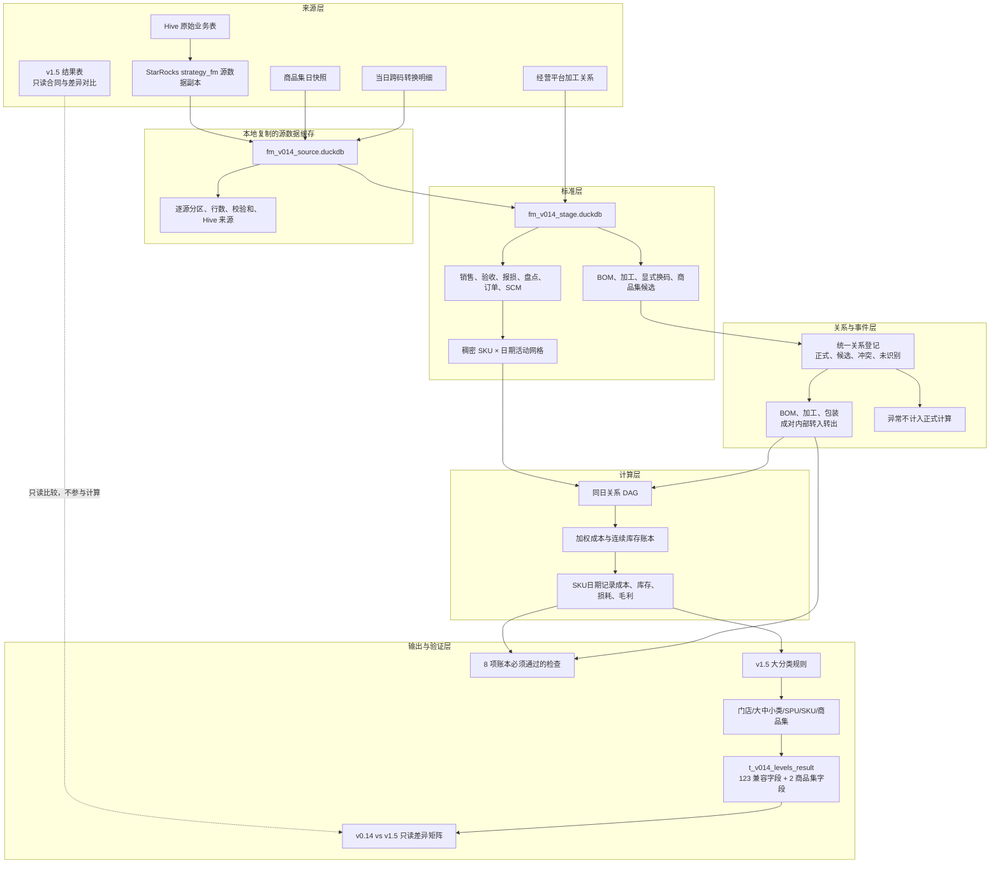
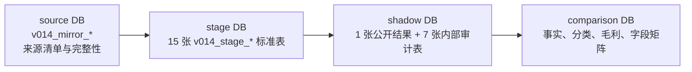
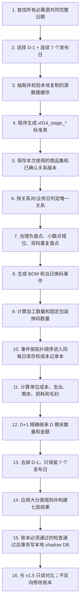
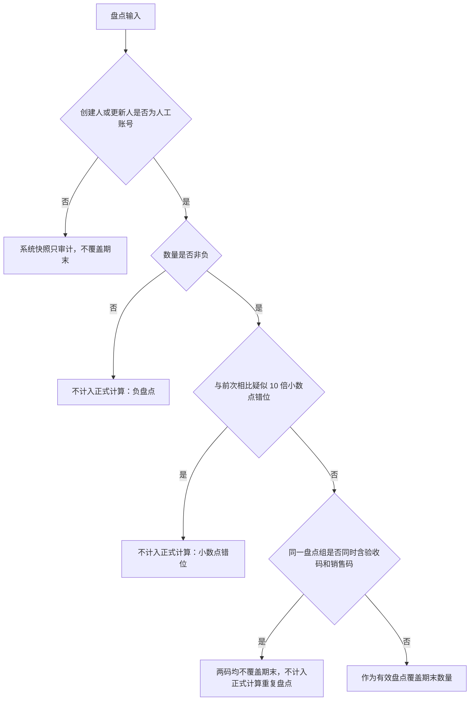
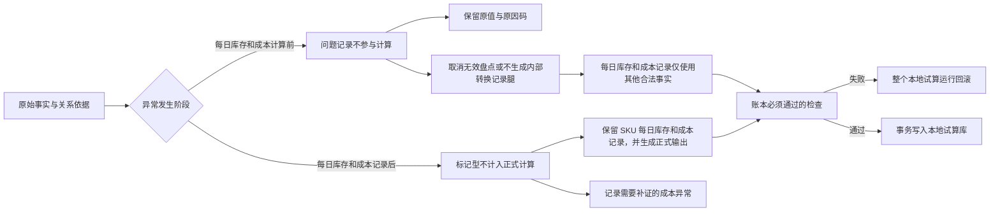

# fmetl v0.14 已实现架构与完整处理流程

> 文档计算规则：以当前 `fmetl/` 代码和本地 DuckDB 运行结果为准。
> 当前范围：A3XV，2026-07-27 至 2026-08-04，本地试算运行。
> 发布状态：内部账本检查通过；v1.5 差异检查未通过；未写服务器生产表。

## 1. 一句话架构

v0.14 将 Hive 业务事实经 StarRocks 源数据副本无损落到本地，先标准化事实与关系依据，再按
“来源码 → 目标码 → 业务日”生成唯一已确认关系和内部事件，最后用同日加权成本账本连续计算
SKU 库存、损耗和毛利，并按 125 字段合同输出七个分析层级。

## 2. 总体架构



### 架构边界

| 层 | 负责 | 明确不负责 |
|---|---|---|
| 来源层 | 保存业务事实和关系依据 | 读取 v1.5 库存、成本、损耗或毛利结果 |
| 标准层 | 统一字段、符号、粒度、日期和 SKU 角色 | 生成成本和毛利 |
| 关系层 | 判定关系类型、比例、版本和是否允许计入每日库存和成本 | 仅凭同商品集或同物料码生成数量流 |
| 事件层 | 生成有数量依据的转出、转入 | 用未知损耗承接缺失关系 |
| 每日库存和成本记录层 | 计算一次单位成本、期末库存、损耗和毛利 | 重新解释分类或报表计算规则 |
| 输出层 | 汇总基础指标并重新计算比率 | 读取源表库存覆盖计算结果，或用 v1.5 补字段 |

## 3. 代码模块

| 模块 | 主要文件 | 职责 |
|---|---|---|
| 运行入口 | `cli.py` | 分阶段执行源数据副本、标准层、本地试算结果和 v1.5 对比 |
| 源数据副本定义 | `mirror/registry.py` | 固定记录源表、字段、数据层级、日期分区和对应的 Hive 表 |
| 源数据副本抽取 | `mirror/extract.py`、`mirror/v014_source.py` | 按源、日期分片抽取并幂等写入本地缓存 |
| 标准层 | `mirror/v014_stage.py`、`contracts/staging.py` | 生成并校验全部 `v014_stage_*` 表 |
| 关系登记 | `relations/registry.py` | 生成按日关系、版本、依据、状态和未计入正式计算的记录 |
| 内部转换 | `facts/formal_events.py` | 根据已确认的 BOM 或实际换码记录，同时生成来源转出和目标转入 |
| 加工数量计算 | `facts/processing_inference.py` | 根据成品库存方程计算产出和原料转出 |
| 包装换码计算 | `facts/pack_inference.py` | 根据连续有效盘点和固定比例计算换码数量 |
| 盘点治理 | `facts/inventory_inputs.py` | 不计入正式计算负盘点、小数点错位和双码重复盘点 |
| 每日库存和成本记录 | `calculations/daily_cost_stock.py`、`calculations/ledger.py` | 同日加权计价、内部金额转移、前一天期末库存转为当天期初库存 |
| 毛利 | `calculations/profit.py` | 只消费已定价金额流，不重复计算成本 |
| 展示调整 | `calculations/special_wastage.py` | 不计入正式计算处理炒菜机、生熟联动的 v1.5 兼容展示 |
| 输出 | `outputs/levels_result.py`、`outputs/persistence.py` | 七层聚合、125 字段合同、本地事务写入数据库 |
| 校验 | `validation/v014.py`、`validation/run_v014.py` | 完整窗口选择、必须通过的检查、运行清单 |
| 差异诊断 | `validation/compare_v014_v15.py` | 本地结果与 v1.5 只读逐层对比 |

## 4. 物理数据分层



三个数据库必须是不同文件。本地试算运行器只读标准层，只写本地 shadow DB；比较器只读 shadow
和 v1.5 参考数据。

### 4.1 必需来源

每日来源共 22 组：销售、门店验收、SCM、SCM 调整、已知损耗、盘点明细、日清、门店日指标、
线上订单、线下订单、加工观察、验收销售关系、BOM、商品换算、可订可售、商品销售、让利、
促销、价格、库存成本参考、商品集和跨码转换明细。

最新快照来源共 3 组：商品、门店属性、炒菜机／生熟联动特殊损耗。

其中商品集和跨码明细是辅助关系依据；库存和成本正式入口仍是销售、验收、盘点、报损等
业务事实。源清单必须保存字段手册中的 Hive 原表来源。

### 4.2 标准层表

| 表 | 作用 |
|---|---|
| `v014_stage_activities` | SKU日期记录销售、退回、验收、报损、盘点和日清活动 |
| `v014_stage_openings` | D-1 启动期初种子 |
| `v014_stage_relation_candidates` | 当日来源码与目标码候选 |
| `v014_stage_bom` | 正式 BOM 依据与比例 |
| `v014_stage_processing` | 有生效日和审批状态的加工关系 |
| `v014_stage_explicit_convert` | 实际换码或固定换码规则 |
| `v014_stage_conversion_events` | 有明确数量的 BOM／换码事件 |
| `v014_stage_finished_processing_daily` | 加工成品库存方程输入 |
| `v014_stage_raw_available` | 加工原料可用量 |
| `v014_stage_product_group` | 按业务日保存的商品集归属 |
| `v014_stage_customer_events` | 订单去重客数和渠道事件 |
| `v014_stage_reporting_metrics` | 独立报表分子、分母和维度 |
| `v014_stage_quarantine` | 标准化阶段的问题记录；这些记录不进入后续计算 |
| `v014_stage_source_manifest` | 来源表、来源、分区、校验和 |
| `v014_stage_source_completeness` | 共同完整窗口判断 |

## 5. 端到端执行流程



任何账本必须通过的检查失败都会在写正式本地试算结果前终止。v1.5 差异仅用于发布判断，不参与账本计算。

## 6. 关系判定与内部事件

### 6.1 判定粒度

关系键为：

```text
门店 + 业务日 + 来源 SKU + 目标 SKU
```

同一 SKU 可以参与多种关系，但同一关系键当天只能有一种正式转换记录类型。

### 6.2 判定结果

| 结果 | 成立条件 | 是否生成内部流 |
|---|---|---:|
| `SAME_SKU` | 来源码等于目标码 | 否，直接进入同一用于计算单位成本的数量和金额 |
| `BOM` | 符合正式猪肉／牛肉 BOM 或明确允许拆分 | 是 |
| `PROCESSING` | 符合已审批且当日有效的加工关系 | 满足加工数量计算条件后生成 |
| `EXPLICIT_CONVERT` | 有实际转换记录或已确认固定转换规则 | 有实际记录或可计算数量时生成 |
| `PRODUCT_GROUP_CANDIDATE` | 只有同商品集依据 | 否，进入候选清单 |
| `CONFLICT` | 同日符合多个正式类型 | 否，整组不计入正式计算 |
| `UNRESOLVED` | 没有正式依据 | 否，不计入正式计算 |

缺数量比例、成本比例或生效依据时，不降级为未知损耗。

### 6.3 BOM

- 只允许正式猪肉、牛肉 BOM，或源关系明确标记可拆分。
- 转换事件必须同时提供来源量、目标量、公共单位量和成本分配比例。
- 公共单位数量平衡差必须在容差内为 0。
- 目标成本分配比例之和必须为 1。
- 父品在正式 BOM拆分记录后期末必须为 0。

### 6.4 加工

`compose_di` 不作为正式加工量。成品产出按库存方程计算：

```text
加工产出
= 成品期末盘点 - 成品期初 - 成品外部验收
  + 成品净销售 + 成品已知报损
  + 成品其他内部转出 - 成品其他内部转入
```

原料转出：

```text
原料转出 = 加工产出 × raw_qty ÷ yield_qty
```

只有同时满足以下条件才计入每日库存和成本：成品有有效盘点、关系唯一且有效、成品无外部验收、全部原料
库存充足、全部原料关系正式。否则整组不计入正式计算。

### 6.5 固定包装／换码

有明确当日转换流水时，直接使用事件量。没有事件量但存在正式固定比例时，仅在来源 SKU 有
连续两次有效盘点时，按来源商品的库存方程计算换码数量：

```text
来源转出
= 上次实盘 + 当日验收 + 销售退回
  - 毛销售 - 已知报损 - 当日实盘

目标转入 = 来源转出 × quantity_rate
```

同商品集、同 SPU 或同物料码本身都不能触发换码。

## 7. 盘点与库存输入治理



有效盘点要求 `created_by` 或 `updated_by` 存在明确人工账号，并且数量非负。盘点只覆盖数量；
盘点金额统一按“实际盘点数量 × 当日单位成本”计算，禁止直接读取源表期末金额。系统快照
保留源数量、创建人和更新时间供审计，不覆盖期末。

## 8. 同日加权账本

### 8.1 处理顺序

```text
期初
→ 外部验收
→ 内部转入
→ 销售退回／已确认盘盈
→ 计算当日支出单位成本
→ 内部转出、销售、已知报损
→ 盘点前理论期末
→ 有效盘点覆盖或负库存强制设为0
→ 计算期末金额
→ 次日精确继承
```

关系事件按拓扑序处理。来源 SKU 先用自己的当日加权成本完成转出定价，目标 SKU 再接收同一
金额，因此内部事件不会凭空产生毛利。

### 8.2 成本公式

```text
可用数量
= 期初 + 外部验收 + BOM/包装/加工/残余转入
  + 销售退回 + 已确认盘盈

可用金额
= 上述各项对应金额

当日支出单位成本 = 可用金额 ÷ 可用数量
```

销售、已知报损和所有内部转出使用同一支出单位成本。

### 8.3 期末分支

```text
理论期末
= 可用数量 - 内部转出 - 毛销售 - 已知报损
```

| 分支 | 期末数量 | 未知损耗 | 说明 |
|---|---:|---:|---|
| 有效盘点 | 实盘数量 | 理论期末－实盘 | 正数为损耗，负数为盘盈 |
| 理论期末为负 | 0 | 0 | 透支量和成本单列，不改记损耗 |
| 有已知报损 | 理论期末 | 0 | 已知损耗已单独计价 |
| 正常 | 理论期末 | 0 | `day_clear` 不生成额外损耗 |

期末金额为正式期末数量按当日成本形成的金额。D+1 期初数量和金额直接复制 D 期末；仅 D-1
预热日允许使用一次经校验的源期初种子。

## 9. 毛利与特殊展示

### 9.1 会计毛利

```text
门店毛利
= 销售额 - 外部验收额
  - BOM转入 + BOM转出
  - 包装转入 + 包装转出
  - 加工转入 + 加工转出
  - 残余转入 + 残余转出
  + 期末库存额 - 期初库存额
  - 负库存库存不足但已发出商品的成本
```

损耗已通过期末库存变化进入毛利，不重复扣减。

### 9.2 v1.5 兼容展示

炒菜机和生熟联动仅在输出层调整展示损耗与毛利。它们不修改 `v014_sku_daily` 的库存、成本
和内部转换记录；库存、成本和毛利的基础计算值始终保留。炒菜机金额加回各层兼容展示毛利；生熟联动只在大分类执行
来源类加回和熟食类扣减，门店、SPU、SKU 毛利不增加，确保各层加总回到同一门店结果。

## 10. 分类、聚合与输出

### 10.1 大分类

当前代码使用 `fmetl/config/v1_5_category_rules.json`，版本为
`v1_5-v2.5-20260720`。规则按业务日处理 119 个冷冻 SKU、熟食覆盖及其余分类重映射，输出
大分类与 v1.5 比较时使用同一套代码规则。

项目分析的品类权威来源仍是 master-data。生产发布前必须再次与服务器权威主数据同步核对，
不能仅因本地规则文件存在就视为永久权威。

### 10.2 七层输出

```text
门店 → 大分类 → 中分类 → 小分类 → SPU → SKU
                                      └→ 商品集（平行层）
```

- 金额、数量和分子分母先在 SKU日期记录形成，再按层级求和。
- 毛利率、客单价、折扣率、损耗率等均在聚合后重算，不平均 SKU 比率。
- 客数按各层级 `order_id` 去重，不累加 SKU 客数。
- 加工原料保留在库存和金额账中，但从上架 SKU、动销 SKU 和品效计算规则排除。
- 日清、非日清和合计均由 SKU 每日最细记录重新汇总。

公开表 `t_v014_levels_result` 固定为 125 列：v1.5 的 123 列字段名、顺序和类型，加末尾
`article_group_id`、`article_group_name`。缺少输入字段就停止运行；不把 v1.5 结果写入新计算，也不自动补 0。

## 11. 本地试算库

| 表 | 可见性 | 内容 |
|---|---|---|
| `t_v014_levels_result` | 对外 | 125 字段、七层聚合结果 |
| `v014_relation_registry` | 内部 | 正式、候选和冲突关系 |
| `v014_relation_resolution` | 内部 | 商品集关系解析依据 |
| `v014_internal_posting` | 内部 | 每个内部事件的转入、转出数量和金额 |
| `v014_sku_daily` | 内部 | SKU每日库存和成本记录、成本、库存、损耗和毛利 |
| `v014_quarantine` | 内部 | 关系、盘点、加工和成本问题明细；表名沿用代码命名 |
| `v014_run_manifest` | 内部 | 日期、版本、来源校验和、字段合同和写入边界 |
| `v014_validation_result` | 内部 | 账本必须通过的检查结果 |

### 11.1 异常不计入正式计算的执行语义

“不计入正式计算”表示 ETL 将不满足记账条件的输入或事件从对应的正式转换记录路径移出，同时把原值、原因码和
关系问题及其来源保存到 `v014_quarantine`。其他合法业务记录继续计算；未计算的记录不会被自动补默认比例或猜测
单位或转入未知损耗。



当前实现分为两类：

| 类型 | 常见原因 | 代码实际处理 | 对每日库存和成本记录的影响 |
|---|---|---|---|
| 该记录不参与计算 | 负盘点、小数点疑似错位、验收码与销售码重复盘点 | 原盘点值写入问题明细表，`actual_stock_qty` 按缺失处理，`is_counted=false` | 该盘点不覆盖期末；期末由库存方程计算 |
| 该关系不计算 | 关系冲突、缺比例、缺加工成品盘点、原料不足、包装换码数量为负 | 不生成来源转出和目标转入 | 销售、合法验收、已知损耗等源表业务记录保留；不计算内部转换 |
| 该验收不参与成本计算 | 有验收金额但验收数量为 0 | 从验收数量和金额中同时移出该记录 | 金额不进入加权单位成本；原值保留供核对 |
| 结果不可发布 | 有销售、报损或内部转出，但 `issue_unit_cost` 为 0 | 每日库存和成本计算完成后记录 `MISSING_COST_EVIDENCE`，并使 `ISSUE_COST_EVIDENCE` 失败 | 保留 SKU 每日记录和问题明细；按零成本算出的毛利不得进入正式结果 |

不计入正式计算数据按以下路径统一生成：

```text
标准化异常
+ 关系解析异常
+ 盘点输入异常
+ 正式转换事件异常
+ 加工数量计算问题
+ 包装换码数量计算问题
+ 每日库存和成本记录后缺成本标记
→ 统一字段
→ 按发布七日窗口过滤
→ 在同一数据库事务中写入问题明细表 v014_quarantine
```

问题明细表 `v014_quarantine` 保存门店、日期、SKU 或关系对、原因码、原值和来源明细。每次本地试算运行
都会重新生成该表。当前表中没有责任人、处理状态和关闭时间，因此用于技术审计与差异查看明细，
尚未形成业务审批队列。

### 11.2 当前本地未计入正式计算的明细

以 A3XV、2026-07-27 至 2026-08-04 本地试算库为准：

| 原因码 | 记录数 | SKU 数 | 实际含义 |
|---|---:|---:|---|
| `RECEIPT_AND_SALE_CODE_DOUBLE_COUNT` | 1,092 | — | 同一组验收码与销售码同时盘点，两个盘点均失效 |
| `MISSING_COST_EVIDENCE` | 637 | — | 已发生销售、报损或内部转出，但当日支出单位成本为 0 |
| `PROCESSING_MISSING_FINISHED_COUNT` | 484 | — | 加工成品缺有效人工盘点，无法根据库存方程计算加工产出 |
| `PRODUCT_GROUP_CONVERSION_EVIDENCE_MISSING` | 76 | — | 只有同商品集依据，缺当日转换数量或固定全转规则 |
| `DIRECT_RECEIPT_AMOUNT_WITHOUT_QUANTITY` | 5 | — | 有验收金额、无验收数量，禁止猜测数量入账 |
| **合计** | **2,294** | **293** | 同一 SKU 可在多日或多个原因中出现；关系级异常可能无单一 SKU |

其中 76.83 元与 2026-07-28 v0.14 相比 v1.5 的验收额差异相等，可直接定位为“有金额、无数量”
的验收记录未进入成本计算。该差异有明确原因，不通过猜测数量消除。

所有表在一个本地事务内整体替换；失败时回滚。

## 12. 验证体系

### 12.1 账本必须通过的检查

1. 期末数量非负。
2. 期末金额非负。
3. SKU 数量方程平衡差为 0。
4. SKU 金额方程平衡差为 0。
5. 销售、退回、验收和已知损耗与标准层一致。
6. D+1 期初数量和金额精确等于 D 期末。
7. 每个内部事件转出金额等于转入金额。
8. 正式 BOM 父品期末数量为 0。

### 12.2 v1.5 只读对比

按“日期合计 → 日期 × 大分类 → 日期 × SPU → 日期 × SKU”查看明细，分别检查销售、验收、分类、
毛利和字段合同。v1.5 只用于查找差异；不能把 v1.5 结果写入 v0.14 来消除差异。

## 13. 当前已验证状态

本节仅描述本地文件，不代表服务器生产结果。

| 项目 | 当前结果 |
|---|---:|
| 本地试算窗口 | 2026-07-27 ～ 2026-08-04 |
| `t_v014_levels_result` | 133,659 行 |
| SKU每日库存和成本记录 | 29,376 行，3,264 个 SKU |
| 输出合同 | 125 字段 |
| 单元测试 | 155 项通过 |
| 账本必须通过的检查 | 8 项全部通过 |
| 异常不计入正式计算 | 2,294 行，293 个 SKU |
| 服务器写入 | 0 |

已生成内部转换：BOM 有 38 条父品转出和 575 条子品转入；加工有 16 组原料转出和 16 组成品转入；包装
152 组转出／转入；三类事件的转出金额与转入金额均相等。

### 当前未通过项

- v1.5 对比总状态为 `FAIL`，不能发布。
- 2026-07-28 门店验收额比 v1.5 少 76.83 元；已定位到 3 条有金额、无数量的验收记录未进入成本计算，
  仍需确认应修正源记录，或将该差异认定为合理不计入正式计算差异。
- 门店周门店毛利比 v1.5 高 1,272.30 元，差异率约 3.62%。
- 门店周全链路毛利比 v1.5 高 1,272.32 元，差异率约 2.81%。
- 多个大分类毛利差异超过 2%；需继续从日期 × 大分类查看明细到 SPU、SKU 和未计入正式计算的原因。
- 比较汇总中的分类失败计数与分类明细不一致，需要修复比较报告自身的汇总一致性。

因此当前状态是：**主要计算流程已实现，内部转出金额等于转入金额已经验证，但与生产结果的差异尚未验收完成。**

## 14. 运行入口

```bash
# 一次刷新源数据副本、生成标准化数据并完成本地七日试算
python -m fmetl.cli v014-shadow-week \
  --store A3XV \
  --end auto \
  --source-cache data/fm_v014_source.duckdb \
  --stage-db data/fm_v014_stage.duckdb \
  --db data/fm_v014_shadow.duckdb

# 分阶段刷新镜像
python -m fmetl.cli v014-fetch-mirrors --store A3XV --end auto \
  --source-cache data/fm_v014_source.duckdb

# 分阶段重建标准层
python -m fmetl.cli v014-build-stage --store A3XV \
  --source-cache data/fm_v014_source.duckdb \
  --stage-db data/fm_v014_stage.duckdb

# 只读对比 v1.5
python -m fmetl.cli v014-compare-v15 \
  --store A3XV \
  --shadow-db data/fm_v014_shadow.duckdb \
  --comparison-db data/fm_v014_comparison.duckdb
```

执行命令前应先确认公司 Hive 源数据副本同步完成。任何生产发布、服务器写入或调度切换都需要单独
审批，当前命令不包含这些动作。
