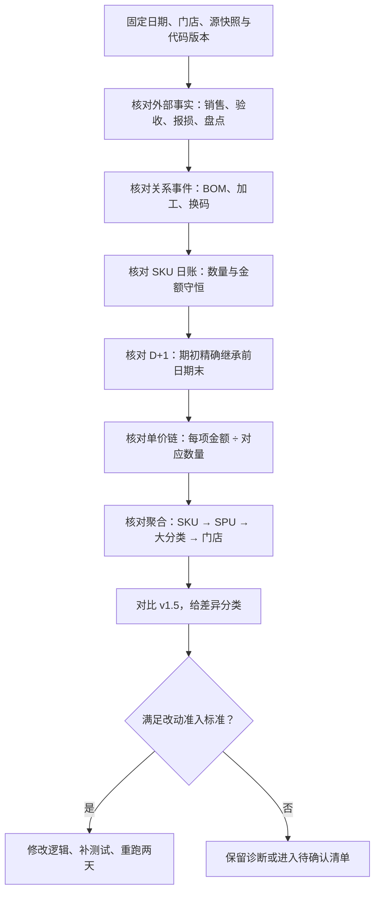
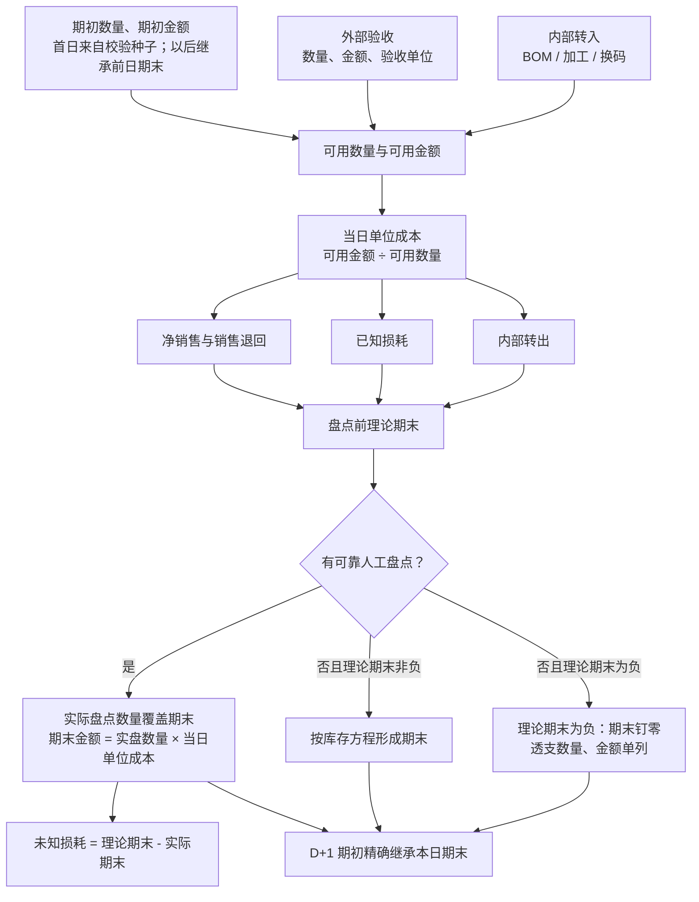
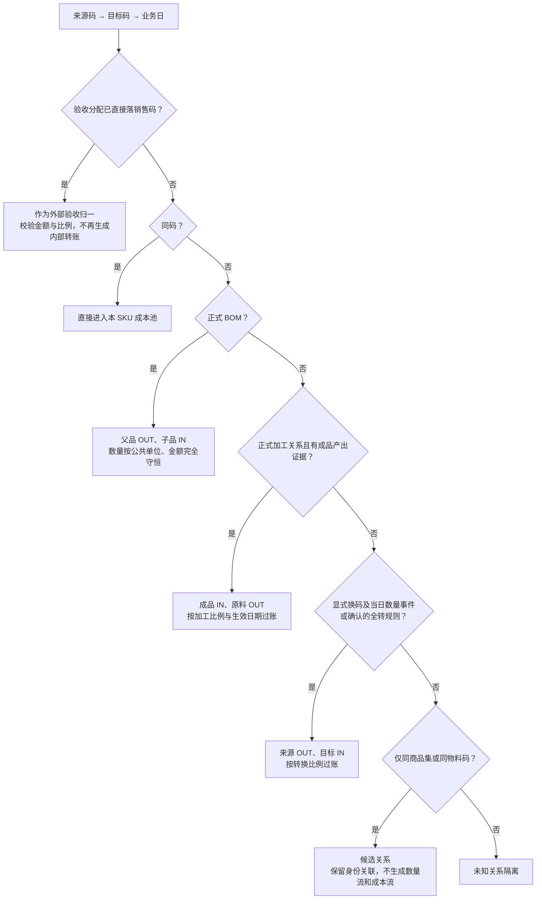

# DESIGN-006：v0.15 证据驱动迭代方法

## 1. 目标与样本

v0.15 用守恒规则审核完整链路，再借助 v1.5 定位差异。v1.5 提供对照线索，不承担成本、库存或损耗的真值角色。

本轮只使用本地快照：

- 门店：A3XV。
- 日期：2026-08-03、2026-08-04。
- v0.14：本地影子库。
- v1.5：本地只读参考快照。
- 边界：不读取 v1.5 结果补值，不写服务器或生产表。

## 2. 改动准入标准

一项差异只有同时满足以下条件，才能进入 v0.15 代码：

1. 可在固定样本中重复出现。
2. 能定位到源事实、关系事件、账本公式或输出聚合中的一个确定节点。
3. 违反明确业务语义、数量守恒、金额守恒、跨日连续或层级可加性。
4. 修复后可以新增自动化测试，且不依赖 v1.5 数值趋同。

下列情况保留为诊断，不直接改代码：

- 两边数量使用不同业务单位。
- v1.5 使用展示调整，v0.15 使用会计底项。
- 关系含义、比例或当日事件未确认。
- v1.5 自身存在残差口径或分类口径差异。

## 3. 审核顺序



下钻顺序固定为：

```text
日期合计 → 日期 × 大分类 → 日期 × SPU → 日期 × SKU → 源记录与关系事件
```

每层只比较可加指标；毛利率、损耗率和单价均在该层重新计算。

## 4. 主日账链路



核心公式：

```text
可用数量 = 期初 + 外部验收 + 内部转入 + 销售退回 + 已确认盘盈
可用金额 = 期初金额 + 外部验收金额 + 内部转入金额 + 销售退回金额 + 盘盈金额
当日单位成本 = 可用金额 ÷ 可用数量

盘点前理论期末 = 可用数量 - 毛销售 - 已知损耗 - 内部转出
期末金额 = 正式期末数量 × 当日单位成本
```

`day_clear` 只保留业务标签，不生成未知损耗。普通系统库存快照只用于审计。可靠人工盘点必须有明确操作人、提交事件或等价证据，且数量非负。

## 5. 关系处理树



### 5.1 验收分配与店内转换

验收分配发生在库存入口：验收父码的金额和数量按当日分配关系直接落到销售码。该处理只建立一次外部进货。

店内转换发生在验收后：来源 SKU 已经入库，随后发生拆分、加工或换包装。该处理必须生成一组金额相等的 OUT / IN 事件。

二者不能同时对同一笔数量过账，否则会重复入池或重复转出。

### 5.2 商品集证据

商品集或物料码只用于证明商品身份接近。正式换码仍需转换比例，以及当日数量事件或采购确认的固定全转规则。

## 6. 单价链审核

单价统一使用对应数量作为分母：

| 节点 | 单价公式 | 判断用途 |
|---|---|---|
| 期初 | 期初金额 ÷ 期初数量 | 检查跨日成本是否连续 |
| 进货 | 验收金额 ÷ 验收数量 | 检查进货单位、金额和分配关系 |
| 销售 | 净销售额 ÷ 净销售数量 | 核对销售事实；两版本应一致 |
| 销售成本 | 销售成本金额 ÷ 净销售数量 | 检查当日成本是否正确出库 |
| 已知损耗 | 已知损耗金额 ÷ 已知损耗数量 | 应等于同日出库单位成本 |
| 期末 | 期末金额 ÷ 期末数量 | 应等于同日单位成本；次日继续继承 |
| 未知损耗 | 未知损耗金额 ÷ 未知损耗数量 | 有盘点差额时应等于同日单位成本 |

同一日账中，销售成本、已知损耗、内部转出、期末库存和未知损耗使用同一个 `issue_unit_cost`。分类或 SPU 混合不同计量单位时，合计单价只用于定位，不能单独判定业务错误。

v1.5 的“销售成本单价”若由期初、进货和期末残差反推，会同时包含损耗和内部流影响。该值只用于发现差异，不能直接替换 v0.15 的销售出库成本。

## 7. 差异分类

| 类型 | 判定 | 处理 |
|---|---|---|
| 外部事实错误 | 销售额、销售量、验收金额未保真 | 修复提取或标准化 |
| 守恒错误 | 数量、金额、跨日或层级加总残差不为 0 | 阻断发布并修复 |
| 成本证据缺失 | 有销售、损耗或内部转出，单位成本为 0 | 隔离并标记不可发布，不猜成本 |
| 关系证据缺失 | 缺类型、比例、生效日或当日事件 | 隔离，不生成内部流 |
| 单位或角色差异 | 验收单位和销售单位不同，金额守恒 | 保留并解释；校验转换比例 |
| 展示口径差异 | 特殊报损或分类转移只影响报表展示 | 会计底项与兼容展示分列 |
| 分类口径差异 | 两边使用不同分类映射 | 两边 SKU 统一映射后重聚合 |
| 合理方法差异 | 两条链路均守恒，业务定义不同 | 保留差异并记录口径 |

## 8. 2026-08-03 至 2026-08-04 的发现

### 8.1 已通过

- 销售额和销售量与 v1.5 SKU 事实一致。
- 销售成本、已知损耗、期末金额和 BOM 转出均使用日账单位成本。
- 内部过账金额守恒。
- D+1 期初数量和金额精确继承 D 日期末。
- 会计底项毛利两日合计较 v1.5 高 235.97 元，约 2.7%；公开展示毛利高 2,768.37 元，主要由特殊报损展示口径造成。

### 8.2 必须进入 v0.15 的改动

1. **特殊报损层级一致性**
   - 炒菜机金额可以按 SKU 加回兼容展示毛利。
   - 生熟联动只在大分类执行来源类加回、熟食类扣减。
   - 门店、SKU、SPU 不增加生熟联动毛利。
   - 每个层级加总必须回到同一门店展示毛利。

2. **零成本发布门禁**
   - 两日共 141 条零成本出库记录，影响销售额 4,447.90 元。
   - 记录继续保留在隔离表，整次结果标记为仅诊断、不可发布。
   - 不使用分类均价、v1.5 成本或当前价格补值。

3. **同分类口径对比**
   - v0.15 先对齐 SKU 销售事实。
   - v0.15 历史实现用本地冻结分类重聚合两边 SKU。
   - v1.5 大分类原表与 SKU 重聚合的差额单列为展示桥接项。
   - v0.16 核实后确认：v1.5 当前只读取分类平台熟食大类 `/overrides`，
     完整 `/effective-mapping` 尚未接入。当前处理见 DESIGN-007 和 FIX-025。

4. **验收分配与内部转换分层**
   - `purchase_di` 已把验收金额和销售单位数量分配到目标码时，登记为外部验收归一。
   - 只有实际店内转换证据才能生成 OUT / IN 事件。

### 8.3 暂不修改

- 加工成品缺盘点 108 条：缺少可证明的成品产出量。
- 验收码与销售码重复盘点 238 条：尚未确认唯一盘点承接码，原码可能仍有实物库存。
- 商品集缺转换证据 18 条：只能确认身份关联。
- 牛奶包装比例、西红柿全转和阳光玫瑰全转：固定规则仍需采购或业务确认。
- 8 月 2 日存在退回 1 件、成本池为 0 的 SKU `20000158`。该记录阻断从更早日期重建 8 月 3 日期初；本轮继续使用已经生成的 8 月 3 日期初快照做两日审核。后续需要补充原销售成本、可靠前日期末成本或正式退回成本字段，任一证据成立后才能重新计算。

## 9. v0.15 交付节奏

每个模块执行同一闭环：

```text
固定证据 → 说明违反的规则 → 修改一个逻辑节点 → 新增测试
→ 重跑 8 月 3—4 日 → 核对守恒与分层差异 → 决定是否进入下一模块
```

阶段顺序：

1. 修复特殊报损的层级展示。
2. 增加零成本发布门禁。
3. 建立统一分类后的 v1.5 对比桥。
4. 把验收分配与内部转换拆成两类审计事件。
5. 等待加工产出证据、唯一盘点码和固定转换规则确认后，再处理对应关系。
