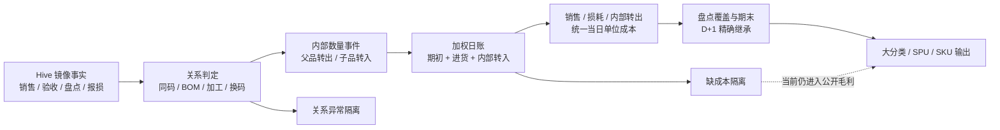

# v0.14 大分类—SPU 单价链路审核

> 范围：A3XV，2026-07-24 至 2026-07-30。  
> 数据：本地 v0.14 七日影子库、生产永洪 v1.5 的本地只读快照。  
> 口径：分类使用 master-data v2.3；所有审核单价均按“金额 ÷ 数量”重算。  
> 边界：本次未查询或写入服务器生产库。

## 1. 审核结论

1. **销售链路基本一致。** 七日仅 SKU `21374838` 在 7 月 30 日多出销售额 12 元、销售量 3；其余销售金额和数量一致。主要毛利差异来自库存成本、内部关系、损耗和 v1.5 父层展示调整。
2. **v0.14 主账算法成立。** D+1 期初精确继承 D 日期末；有效盘点覆盖期末数量；期末金额按当日加权成本重算；BOM、加工、换码内部转出金额等于转入金额。现有 8 项账本硬门禁全部通过。
3. **当前正式输出仍有阻塞项。** 隔离表共 1,583 条；其中 327 条缺成本记录仍参与公开结果，形成销售成本为 0、毛利等于销售额。涉及销售额 **7,459.68 元**，其中熟食 4,895.68 元、烘焙 981.74 元、猪肉 658.88 元。
4. **v1.5 的“销售成本单价”不能直接代表销售成本。** 邮件单价表使用 `(期初额 + 进货额 - 期末额) ÷ 销售量`，其中混入损耗和内部转移。v0.14 可直接取得销售成本，两个指标含义不同。
5. **大分类单价不能用于判定成本是否正确。** 16 个有实际业务数据的大分类全部含多种数量单位；661 个 SPU 中有 320 个包含多个单位。单价审核只能落到单位一致的 SKU 或 SPU。

综合判断：**账本结构可以继续使用；当前结果不满足正式发布条件。** 发布前必须阻断零成本出库，并完成加工、包装和单位证据补齐。

### 1.1 327 条缺成本记录的完整处理过程

#### 怎么识别

v0.14 先计算当日出库单位成本：

```text
可用数量 = 期初 + 验收 + 内部转入 + 销售退回 + 盘盈
可用金额 = 上述各项对应金额合计
出库单位成本 = 可用金额 ÷ 可用数量
```

日账完成后，同时满足以下两个条件的 SKU 日记录为
`MISSING_COST_EVIDENCE`：

```text
出库单位成本 <= 0.000001
且
销售 + 已知报损 + BOM转出 + 换码转出 + 加工转出 + 残余转出 > 0.001
```

#### 当前怎么处理


隔离发生在日账完成之后。它会留下异常记录，不会删除销售、报损和库存事实，
也不会中止运行。公开结果继续使用这批已按0成本完成的日账。

#### 为什么采用这种处理

- 销售和报损是已发生的外部事实，直接删除会造成销售数量、金额与源表不一致。
- 缺少成本证据时无法可靠补价；套用当前价格或同类平均价会改写历史成本。
- 影子阶段优先让全周链路跑完，通过软隔离暴露成本覆盖缺口。
- 这种方式适用于技术审计；正式发布需要增加成本完整性门禁。

#### 327 条记录的数据结构

| 直接原因 | 记录数 | SKU 数 | 受影响销售额 | 说明 |
|---|---:|---:|---:|---|
| 无可用入库数量 | 283 | 79 | 6,745.11 | 当日有销售或报损，期初、验收和内部转入都无法提供成本池。 |
| 期初有数量、无金额 | 30 | 14 | 478.06 | 数量可用，期初成本为0，加权后仍为0。 |
| 其他零成本入池 | 11 | 4 | 236.51 | 存在其他数量流，对应金额仍为0。 |
| 验收有数量、无金额 | 3 | 1 | 0.00 | 新验收数量进入库存，没有对应验收成本。 |
| **合计** | **327** | **89** | **7,459.68** | 其中 285 条存在销售。 |

这 327 条在发布窗口的 `opening_source` 全部为 `ROLL_FORWARD`，说明零成本已经由前一天
期末传到当日期初。89 个 SKU 中，25 个连续 7 天缺成本，问题具有跨日延续性。

#### 有什么影响

1. **销售成本偏低。** 327 条的销售成本合计为 0；对应销售额 7,459.68 元全部进入会计毛利。
2. **损耗金额偏低。** 这批记录已知损耗数量合计 124.506，对应损耗金额为 0。
3. **库存金额继续为 0。** 36 条有效盘点分支可以覆盖期末数量，期末金额仍按0成本计算，次日期初继续无成本。
4. **透支被钉零后仍能通过守恒校验。** 277 条进入负库存保护分支，理论透支数量合计 771.873；
   期末数量钉为0、透支成本也为0，数量和金额方程仍能平衡。
5. **内部转移可能延伸零成本。** 3 条 BOM 转出数量合计 3，转出金额为0；金额守恒表现为
   `0 = 0`，但子品没有获得真实成本。
6. **8 项硬校验仍会通过。** 当前校验覆盖数量平衡、金额平衡、跨日连续和内部守恒；
   它们没有校验“有出库时必须有成本”，因此平账不代表估值完整。

7,459.68 元是**受影响销售额**，不能直接记为毛利高估额。真实毛利影响等于补齐后的销售成本、
损耗成本、内部转移成本及其跨日库存影响，必须从最早受影响日期重算后才能确定。

#### 正式发布时应怎么处理

1. 保留销售、报损和盘点事实，不删除业务数据。
2. 按“上日有效期末成本 → 当日验收成本 → 正式 BOM/加工/换码转入成本”顺序补证。
3. 日账新增 `cost_evidence_valid`；有销售、报损或内部转出且该标记为假时，成本、损耗金额和毛利进入待定。
4. 影子运行可以继续生成异常明细；正式发布将“零成本出库条数”设为硬门禁，目标为 0。
5. 从最早受影响日期向后重算，同步更新期末金额、次日期初、损耗和毛利。

## 2. 完整链路与代码判断



| 链路 | 当前实现 | 判断 | 原因 |
|---|---|---|---|
| 源事实 | 销售、退回、验收、损耗原样进入稠密 SKU 日网格 | 符合 | 外部事实守恒校验通过；七日销售仅 1 个 SKU 日与 v1.5 不同。 |
| 关系判定 | 同码、BOM、加工、显式换码分别判定；多类型冲突隔离 | 符合 | 同一关系对不静默选优先级；商品集候选不自动造流。 |
| BOM | 父品只入池一次；按正式父子关系生成转出、转入 | 符合 | 575 个 BOM 转入日腿、38 个父品转出日腿；父品全部转出和金额守恒通过。 |
| 加工 | 按成品库存方程反推产出；缺有效成品盘点时隔离 | 部分符合 | 计算公式正确；299 条“加工成品缺盘点”未形成正式过账，成品成本仍可能缺失。 |
| 换码 | 有固定关系且存在连续有效盘点证据时反推数量 | 符合 | 同商品集和同物料码只作身份验证；无当日数量证据不生成转换。 |
| 当日成本 | `可用金额 ÷ 可用数量`；销售、损耗和内部转出共用同一成本 | 符合 | 金额方程和内部事件金额守恒通过。 |
| 盘点与跨日 | 有效非负盘点覆盖期末数量；期末金额重新计价；次日期初继承 | 符合 | 公开期初、期末直接取日账；七日数量和金额连续性断点为 0。 |
| 缺成本处理 | 记录 `MISSING_COST_EVIDENCE`，继续生成日账与公开结果 | **不符合** | 缺成本销售按 0 成本计价，隔离只提示、不阻断毛利。 |
| 输出单价 | 合同字段 `average_selling_price`、`inbound_price` 继续按重量口径 | 需区分 | 保留 v1.5 合同可以接受；本次数量单价审核必须从金额和数量重新计算。 |
| 输出聚合 | 金额、数量先加总，比率再重算 | 符合 | 加总指标成立；混合单位后的数量单价没有可解释性。 |

## 3. 六类单价口径

| 指标 | v0.14 审核公式 | v1.5 邮件单价表 | 判断 | 说明 |
|---|---|---|---|---|
| 销售单价 | `净销售额 ÷ 净销售量` | v1.5 直出；本次重算为同一公式 | 符合 | SKU 或同单位 SPU 可比。大分类混合千克、份、盒、袋后只反映数量结构。 |
| 销售成本单价 | `(销售成本额 - 退回成本额) ÷ 净销售量` | `(期初额 + 进货额 - 期末额) ÷ 销售量` | **口径不同** | v0.14 是直接销售成本；v1.5 是库存残差，包含损耗和内部转移影响。 |
| 期初库存单价 | 日账期初金额 ÷ 日账期初数量 | v1.5 期初额 ÷ 期初量 | v0.14 符合 | v0.14 从上日期末继承。猪肉、牛羊在 v1.5 七日汇总中期初量为 0，无法计算可比单价。 |
| 进货单价 | 验收金额 ÷ 验收数量 | 本次按进货额 ÷ 进货量重算 | 条件符合 | 仅限单位一致的 SKU/SPU。包装、公斤混合后必须先换算公共单位。 |
| 期末库存单价 | 日账期末金额 ÷ 日账期末数量 | v1.5 期末额 ÷ 期末量 | v0.14 符合 | 人工盘点只覆盖数量；v0.14 用当日成本重新计算期末金额。 |
| 损耗单价 | 会计损耗额 ÷ 会计损耗量 | 损耗额 ÷ 损耗量；已知/未知损耗量再由该单价反推 | 条件符合 | 单一 SKU、同符号损耗可用。盘盈和损耗相抵、多个单位混合时会出现负值或极端值，不能用于判断成本。 |

### v1.5 销售成本单价的边界

v1.5 邮件表公式可展开为：

```text
期初额 + 进货额 - 期末额
= 销售成本 + 损耗成本 + 内部净转出成本 + 其他库存调整
```

因此，v1.5 单价适合检查“库存减少额是否覆盖销售”，不适合作为纯销售成本单价。后续对比应同时保留：

- `直接销售成本单价`：来自 v0.14 日账。
- `库存残差成本单价`：沿用 v1.5 邮件表公式。

## 4. 大分类差异桥接

七日门店毛利：v0.14 为 36,383.92 元，v1.5 为 35,111.62 元，差 **+1,272.30 元（+3.62%）**。

| 大分类 | 正式大分类差异 | SKU/SPU 重汇总差异 | v1.5 父层调整桥 | 结论 |
|---|---:|---:|---:|---|
| 蔬菜类 | -744.78 | -452.75 | -292.03 | 七天持续为负；差异分散在多个 SPU，盘点残差和双码重复盘点是主线。 |
| 猪肉类 | +512.03 | +1,115.08 | -603.05 | BOM 成本已正式转移；v1.5 父层调整抵消部分 SKU 差异。 |
| 熟食类 | +489.35 | +489.35 | 0.00 | 父层调整两边相同；主要问题是缺成本和加工成品缺盘点。 |
| 牛羊类 | +367.77 | +735.02 | -367.25 | v0.14 有跨日库存；v1.5 期初、期末量为 0，且存在多包装单位。 |
| 冷藏乳品类 | +292.53 | +292.53 | 0.00 | 鲜牛奶和酸奶多包装单位、期初期末成本路径不同。 |
| 水产类 | +277.31 | +518.54 | -241.23 | 对虾贡献最大；箱、千克混合导致进货单价不可直接比较。 |
| 冷藏加工及预制菜类 | -38.50 | +1,260.82 | -1,299.32 | SPU 差异被 v1.5 父层调整基本抵消，不能直接用 SPU 毛利加总解释正式大分类结果。 |

`父层调整桥 = 正式大分类差异 - SKU/SPU 重汇总差异`。该桥反映 v1.5 大分类层的独立展示或特殊调整，不分摊给具体 SPU。

日期特征：蔬菜七天全部低于 v1.5；熟食差异主要集中在 7 月 26 日 `+398.58` 元；水产主要集中在 7 月 30 日 `+164.66` 元；猪肉 7 月 29 日差异最大，为 `+151.70` 元。

## 5. SPU 下钻结果

下表只列主要差异。多单位 SPU 的数量单价仅作定位，不作成本结论。

| 大分类 | SPU | 单位 | SKU/SPU 毛利差异 | 单价链证据 | 判断 |
|---|---|---|---:|---|---|
| 猪肉 | 肥膘 | 千克 | -873.72 | 销售价 3.14；v0.14 直接销售成本 18.06；正式 BOM | 低售价是真实销售事实；v0.14 将父品成本分配到肥膘，逻辑成立。 |
| 猪肉 | 上肉 | 千克 | +651.91 | 销售价 26.34；直接销售成本 21.54；正式 BOM | v0.14 有滚动期初、期末成本；v1.5 汇总期初和期末为 0，成本路径不可直接对照。 |
| 猪肉 | 排骨 | 千克 | +566.05 | 销售价 48.93；直接销售成本 30.77；进货价两边均 38.95 | 销售和进货事实一致；差异来自 BOM 分配、滚动库存和损耗。 |
| 猪肉 | 梅花肉 | 千克 | -559.13 | 销售价 48.47；直接销售成本 21.69；正式 BOM | v1.5 残差成本 11.93，已混入库存变化，不能代替直接销售成本。 |
| 熟食 | 酱卤鸡肉 | 半只/只/盒 | +370.17 | v0.14 直接销售成本为 0；列入缺成本隔离 | **实现不合理。** 销售仍进入公开毛利，需阻断。 |
| 熟食 | 烧猪肉 | 千克 | +162.88 | 销售价一致；v0.14 直接成本 55.98，v1.5 残差成本 60.61 | 销售成立；差异主要来自损耗和跨日库存。 |
| 冷藏加工及预制菜 | 水产类菜肴 | 盒 | +592.00 | 直接成本 16.00；v1.5 残差成本 312.00；存在缺成本记录 | 需逐 SKU 拆分。SPU 汇总同时含有正常成本和零成本记录。 |
| 牛羊 | 牛腱 | 千克/盒/袋 | +446.24 | 销售价一致；v0.14 直接成本 80.00；v1.5 残差成本 119.72 | 多单位混合，残差单价不具备稳定含义；需按 SKU 和公共重量复核。 |
| 水产 | 对虾 | 千克/箱 | +459.93 | 销售价一致；v1.5 进货数量单价 534.60，v0.14 为 44.55 | 箱和千克直接相加造成失真；需先完成单位换算。 |
| 冷藏乳品 | 鲜牛奶 | 排/瓶/盒/箱/组/袋 | +177.63 | v0.14 期初 5.73、期末 5.89；v1.5 期初 7.02、期末 7.74 | 包装单位未统一，不能据此判定库存成本高低。 |
| 蔬菜 | 大菜花 | 千克 | -78.40 | 销售价一致；期初、进货、期末单价接近 | 单价链基本正常；差异来自损耗和盘点残差。 |

### 蔬菜为何没有单一大额 SPU

- 854 条“验收码和销售码重复盘点”中，蔬菜占 770 条、110 个 SKU。
- 关系异常按 SKU 和日期分散；大菜花、菠菜、西葫芦等单个 SPU 差异均小于 80 元。
- 蔬菜类差异应先处理双码盘点和盘点数量，再复核 SPU 单价，直接调整成本会掩盖数量问题。

## 6. 当前不符合逻辑的部分

### P0：缺成本记录继续生成正式毛利

`_ledger_cost_quarantine()` 在日账完成后识别零成本出库，只追加异常记录。公开结果仍使用同一日账：

- 缺成本记录：327 条。
- 有销售且出库成本为 0：285 条。
- 涉及销售额：7,459.68 元。
- 熟食、烘焙、猪肉占主要金额。

该处理会形成 100% 毛利，隔离表无法修正公开结果。建议：

1. 日账增加 `cost_evidence_valid`。
2. `销售量 > 0 且单位成本 <= 0` 直接触发发布硬门禁。
3. 销售事实继续保留；成本、损耗和毛利进入待定清单，禁止以 0 成本发布。

### P0：加工关系有登记，成品数量证据不足

- 299 条加工成品缺有效盘点，未生成加工过账。
- 17 条加工成品同时存在外部验收，按规则隔离。
- 正式加工仅生成 16 组转出、16 组转入。

当前公式和隔离分支正确，覆盖不足。熟食无加工记录时，仍需要成品销售、报损和有效期末盘点共同反推产出。缺少期末盘点无法确定加工量，不能补猜。

### P1：父层单价和利润含义未分开

- 大分类和 320 个多单位 SPU 的数量单价不可解释。
- v1.5 大分类毛利存在独立父层调整，部分分类无法由 SKU 毛利直接加总。
- v0.14 输出合同保留重量单价，本次审核使用数量单价。两个字段需在对比报告中明确命名。

建议新增审计字段：

```text
direct_sales_cost_unit_price
inventory_residual_cost_unit_price
quantity_unit_consistent
parent_level_adjustment_bridge
cost_evidence_valid
```

## 7. 修复顺序与验收

1. **阻断零成本公开毛利。** 目标：零成本销售行数为 0；缺成本记录全部保留在异常表。
2. **补加工成品数量证据。** 优先熟食和烘焙；关系、比例、盘点任一缺失时继续隔离。
3. **拆分数量单价与重量单价。** 大分类只展示金额差异；SPU 仅在单位一致时展示数量单价。
4. **增加父层调整桥。** 大分类差异先桥接，再下钻 SPU，避免将 v1.5 父层调整归到某个商品。
5. **重跑七日验证。** 依次核对日期合计、大分类、SPU、SKU；销售、库存、内部流、损耗和毛利分别守恒。

验收条件：

- 销售事实与源表一致。
- 零成本销售硬门禁为 0。
- D+1 期初数量、金额与 D 日期末完全一致。
- 有效盘点覆盖数量，期末金额按当日成本重算。
- 内部转出金额等于转入金额。
- 多单位 SPU 不输出可比较数量单价。
- 大分类毛利差异可拆成 SPU 差异与父层调整桥。

## 8. 证据来源

- v0.14 日账：`data/fm_v014_shadow.duckdb`。
- v1.5 本地只读快照：`data/fm_v014_comparison_20260724_20260730.duckdb`。
- v1.5 单价表公式：`报表邮件推送/tmp/build_sku_price_chain_workbook.py`。
- v1.5 取数与损耗量反推：`报表邮件推送/tmp/fetch_sku_price_chain_v15.py`。
- 业务背景：`汇报_超卖问题跟进.html`。其中串码、单位冲突和软超卖属于风险说明；本次未将其直接认定为已发生异常。
