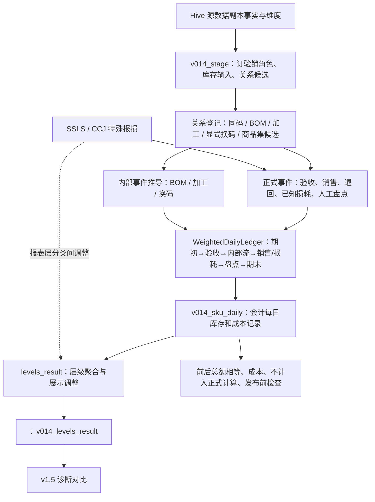
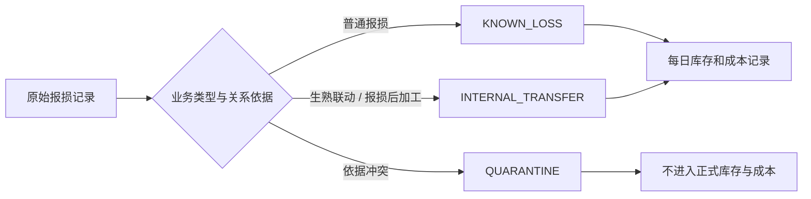
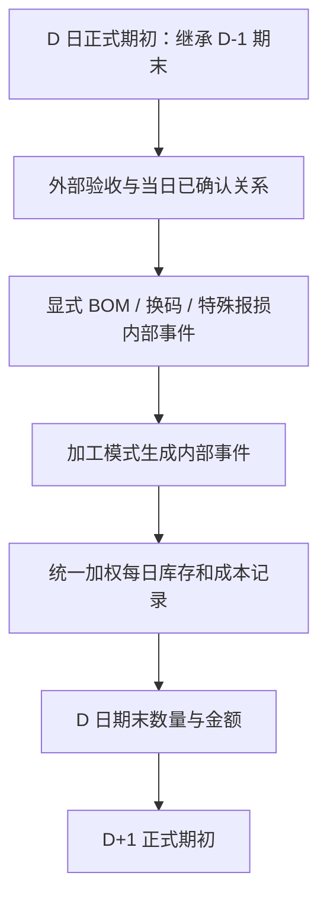

# v0.14 之后代码改动审查与下一版本计划

> 审查对象：`v0.14`、`codex/v0.15-evidence-led`、`codex/v0.16-invariant-led` 及当前完整代码。
> 数据范围：本地复制的源数据和本地 DuckDB；本次未读取或写入服务器生产库。
> 审查日期：2026-08-10。

## 一、结论

1. **FIX-021、v0.15 和 v0.16 的大部分改动应保留。** 它们解决了源数据副本重复、负数验收修正丢失、系统生成的期末数量被误认为人工盘点、零数量关系仍生成转换、缺成本结果仍被发布，以及分类规则缺少来源等问题。
2. **当前主要缺陷来自 v0.14 的加工数量计算，v0.15 收紧盘点来源后影响扩大。** 所有加工都要求先有成品人工盘点；8 月 3—4 日 108 个加工候选因没有成品人工盘点而全部未计算。
3. **加工推导使用独立的简化跨日状态，未读取正式每日库存和成本记录。** 无盘点日会清空 `previous_end`；后续日期可能重新使用源期初。原料可用量也未完整扣除销售、报损和既有内部转出。
4. **生熟联动、报损后加工与普通报损缺少“同一源记录只能计算一次”的归属规则。** 当前特殊报损先计入已知损耗，报表层再调整分类毛利；未来若直接根据成品消耗计算加工，同一原料可能同时被记为报损和加工转出。
5. **v0.16 的分类来源处理方向正确，但当前仍不能正式发布。** 当前分类配置只记录到 2026-07-20，缺少 8 月业务日的 Foodmart 分类管理历史记录。
6. **现有 v0.16 对比文件不能证明 v0.16 的实际计算结果。** 当前代码的 159 项单元测试通过；重新计算 8 月 3—4 日时，D-1 准备日期因销售退回缺成本而停止。已有对比库读取的是旧 v0.14 本地试算结果，比较程序没有强制核对结果由哪个版本生成。

下一版本应先解决三件事：**事件唯一归属、加工模式分流、加工与正式每日库存和成本记录共用跨日状态**。完成后再处理分类历史依据和公开展示计算规则。

## 二、Git 分支与提交时间线

| 阶段 | 分支 / 提交 | 时间 | 定位 |
|---|---|---:|---|
| v0.14 修改前版本 | `origin/v0.14` / `56c88bb` | 2026-07-31 15:56 | 商品关系、内部转换记录、加权库存和成本计算、123 字段本地试算输出 |
| v0.14 修复 | `v0.14` / `417182f` | 2026-07-31 16:53 | FIX-021：源数据副本完全重复行去重 |
| v0.15 | `codex/v0.15-evidence-led` / `99deb89` | 2026-08-05 21:09 | 事实保真、人工盘点依据、关系候选收紧、发布前检查 |
| v0.16 | `codex/v0.16-invariant-led` / `961b628` | 2026-08-05 22:33 | 版本身份、分类来源、分类依据检查、双计算规则对比 |

补充说明：

- v0.14、v0.15、v0.16 当前均为分支或提交，没有对应 Git tag。
- v0.15 未修改包版本号，运行身份仍显示 v0.14；v0.16 已修复该追溯问题。
- 当前 v0.16 继续保留 `v014-*` 命令、`v014_*` 内部表名，属于兼容命名，容易造成产物版本误判。

## 三、当前完整处理流程



主要计算流程中逻辑清晰的部分：

- 验收事实进入外部用于计算单位成本的数量和金额；订购关系只作校验。
- 已确认关系按“来源码→目标码→业务日”登记，冲突和缺依据不计入正式计算。
- 每日库存和成本记录采用加权成本；销售、损耗、内部转出和期末使用同一当日单位成本。
- D+1 正式期初继承 D 日期末数量和金额。
- 内部转出金额必须等于内部转入金额。
- 人工盘点仅覆盖数量，期末金额由当日单位成本重算。

当前计算中断或仍使用旧规则的部分：

- 加工推导在每日库存和成本记录外维护 `previous_end` 和原料可用量，形成第二套库存状态。
- 加工只支持“有成品人工盘点后，根据库存变化计算产出”一种模式。
- 特殊报损的物理事件归属在每日库存和成本记录后处理，缺少源记录级唯一领取。
- 对比入口可以读取缺少 `engine_version` 的旧本地试算库。

## 四、每次改动明细

### 4.1 FIX-021：源数据副本完全重复行去重

#### 改动文件

| 文件 | 改动 |
|---|---|
| `fmetl/mirror/extract.py` | 投影完成后删除完全相同的重复行；保留同一业务粒度但字段不同的冲突行，继续由粒度断言报错 |
| `fmetl/tests/test_mirror_extractor.py` | 增加“完全重复可去重”和“冲突重复必须失败”测试 |
| `fmetl/docs/fixes/FIX-021-mirror-exact-duplicate-dedup.md` | 记录原因、处理边界和验证结果 |
| `fmetl/docs/fixes/README.md` | 增加修复索引 |

#### 过程影响

```text
Hive 源数据副本 JOIN 扇出
→ 完全相同的重复行删除
→ 同粒度不同值仍失败
→ 下游金额和数量不重复聚合
```

#### 判断

**必要，逻辑正确，建议保留。** 该修复只消除无业务差异的完全重复行。事件表仍使用 `source_row_hash + duplicate_ordinal` 保留真实重复事件；同粒度冲突仍会失败，没有掩盖源数据冲突。

### 4.2 v0.15：依据驱动与发布前检查

#### 改动文件与过程

| 过程 | 主要文件 | 具体改动 | 判断 |
|---|---|---|---|
| 外部验收 | `calculations/daily_cost_stock.py`、`calculations/ledger.py`、`facts/store_receipts.py` | 保留负向验收退回/修正；校验数量金额同号；退回不能透支用于计算单位成本的数量和金额 | 必要，正确 |
| 盘点 | `facts/sku_day.py`、`mirror/registry.py` | 仅显式操作人且非负数量构成正式人工盘点；系统记录的库存数量只作审计 | 必要，正确 |
| 加工数量 | `facts/processing_inference.py` | 成品只要存在正向或负向外部验收，整条加工关系就不计算 | 处理范围过大；外部验收应作为库存方程的一项 |
| 关系候选 | `mirror/v014_stage.py` | 采购候选要求非零数量/金额；换码候选要求实际事件或固定规则 | 必要，正确 |
| 日期范围 | `cli.py`、`validation/run_v014.py`、`mirror/v014_source.py` | 支持明确起止日，并先读取前一天数据作为期初；某天没有数据时，不再把错误的 DOUBLE 字段类型保存下来 | 必要，正确 |
| 指标计算 | `outputs/levels_result.py` | 安全除法；特殊损耗仅在大分类做分类间借贷；CCJ 继续作为展示加回 | 必要但只完成展示层修正 |
| 发布前检查 | `validation/v014.py`、`validation/run_v014.py` | 分别检查缺成本、账目是否平衡和未计算记录；区分运行失败与结果不可发布 | 必要，正确 |
| 对比诊断 | `validation/compare_v014_v15.py` | 增加事实、单价和分类差异拆解 | 必要，正确 |
| 性能 | `mirror/registry.py` | `inventory_pool` 分片从 8 调整为 64 | 必要，运行优化 |

#### 每项改动具体保护什么

**1. 外部验收：保留退货和修正的负号**

原始验收事实同时包含正向到货、采购退货和金额修正。负向数量与负向金额代表从用于计算单位成本的数量和金额撤回的货和金额。

```text
原始事实：到货 10 件 / 100 元，后续退回 2 件 / 20 元
正式外部验收：10 / 100 + (-2) / (-20) = 8 件 / 80 元
当日用于计算单位成本的数量和金额：期初 + 8 件 / 80 元 + 其他已确认的转入转出
```

旧过程若将负数钉为 0，会保留 10 件 / 100 元，库存和成本同时偏高。v0.15 的处理保留原符号，并做三层校验：数量和金额必须同向；金额不能脱离数量单独进入单位成本计算；退回后用于计算单位成本的数量和金额不能被扣成负数。`receive_sale` 只能补同码验收缺口，跨码仍须走已确认关系，避免把子品拆分金额再次当作外部进货。

这项改动保护：**期初 + 验收 + 内部流 - 销售 - 损耗 = 期末** 中的“验收”入口。它已进入正式每日库存和成本记录，属于完整修复。

**2. 盘点：区分人工盘点和系统快照**

库存明细中既有门店人员提交的实际盘点，也有系统生成的库存快照。两者都会提供 `actual_stock_qty`，业务含义不同。

```text
人工盘点：有明确 created_by 或 updated_by，数量 ≥ 0
→ 用该数量覆盖理论期末
→ 期末金额 = 实盘数量 × 当日单位成本

系统快照：操作人是系统或缺少人工依据
→ 保留源值供审计和差异检查
→ 不覆盖正式期末
```

这样处理后，系统自动写出的 0 库存不会把仍有成本和真实库存的 SKU 直接清零。人工盘点与理论库存的数量差额进入未知损耗或盘盈；金额仍统一用当日单位成本计算，避免源表库存金额和本日成本计算规则混用。

这项改动保护：**期末库存覆盖权、未知损耗来源、D+1 期初**。判断规则正确；加工目前把“人工盘点依据”作为唯一推导条件，属于加工模块尚未完成的边界，详见下文。

**3. 加工推导：外部验收应参与加工量计算**

成品库存变化可能同时来自外部验收和门店加工。只要外部验收数量已作为独立事实进入每日库存和成本记录，库存方程可以把两种来源拆开：先扣除外部验收，再计算仍需由加工解释的增量。

```text
根据成品库存变化计算的加工量
= 期末 - 期初 - 外部验收 + 净销售 + 已知报损 + 其他转出 - 其他转入
```

例：成品期初 2 份、外部验收 5 份、销售 4 份、报损 1 份、期末 6 份：

```text
加工量 = 6 - 2 - 5 + 4 + 1 = 4 份
```

当天共有 5 份外部成品和 4 份门店加工成品。外部验收已从公式中扣除，不会重复转成原料消耗。负向验收退回或修正也可以按原始符号进入同一公式，前提是数量、金额、单位和业务日期均通过验收事实校验。

当前代码先执行：

```text
abs(external_receive_qty) > 容差 → PROCESSING_FINISHED_EXTERNAL_RECEIPT → 不计入正式计算
```

随后才计算包含 `- external_receive_qty` 的加工公式。因此只要外部验收非零，公式就不会执行；公式中的外部验收项只在值为 0 时参与计算。这个判断使本可计算的加工关系被跳过。

正确处理应为：

```text
INVENTORY_BALANCE（有可靠期初、期末）
→ 将带符号的外部验收量放入完整库存方程
→ 计算净加工量

EVENT_PRODUCTION（有明确加工事件）
→ 按事件记录加工量；外部验收作为另一条独立库存流

USAGE_BACKFLUSH（无盘点，按销售+报损倒推）
→ 成品无外部验收时，可按销售+普通报损推算
→ 成品同时有外部验收时，需业务规则说明销售如何在外购成品和加工成品间分配；缺规则时不计入正式计算

验收缺数量、单位冲突、重复入账或来源不明
→ 不计入正式计算该 SKU日期记录，不推算加工
```

这项改动原本用于区分成品来源和原料成本，实际却扩大了不计算的范围。下一版本应删除“外部验收非零就不计算加工”的条件，只保留验收记录质量检查；无盘点模式仍需按业务规则区分外购成品和门店加工成品。

**4. 关系候选：静态商品关系不能自动生成内部流**

商品集、订购码、可售码、单位换算能说明商品之间可能有关联，不能证明当天发生过拆分、换码或加工。

```text
存在商品关系 + 当日转换数量事实      → 可形成正式候选
存在商品关系 + 采购确认的固定全转规则 → 可形成正式候选
只有静态关系或零数量快照              → 只保留候选/审计，不生成成本流
```

v0.15 要求采购候选至少有非零数量或金额；显式换码要求实际转换事件或固定规则。这个约束阻止“西红柿、阳光玫瑰、牛奶等双码关系”因商品资料长期存在而每天自动转库存。

这项改动保护：**内部流的发生日期、数量和转换前后成本总额相等**。逻辑正确；固定全转规则的业务确认和单位比例仍需采购维护。

**5. 时间窗口与 D-1 预热：让连续每日库存和成本记录从唯一成本种子开始**

第 D 日的期初数量和金额依赖 D-1 日期末。若只运行 D 至 D+6，首日直接读取源表期初，后续日期却继承本地计算期末，首日和后续日期就使用了两套期初来源，无法核对连续性。

```text
D-1：读取一次经校验的启动期初，完整计算期末
D：期初 = D-1 期末
D+1：期初 = D 期末
……
```

v0.15 增加明确的 `--start`、`--end` 和 D-1 准备日期。它还处理空分区 DataFrame 的类型判断问题：空数据写入 DuckDB 时若所有字段都被设为 DOUBLE，下一次写入字符串或日期会失败，并把源数据副本的字段类型改错。

这项改动保证成本可以连续重算。当前 8 月 3—4 日重算在 D-1 遇到销售退回缺成本后停止，这是正确行为；下一版本需补充退回成本来源的优先顺序，或扩大重算前的准备日期范围。

**6. 指标计算：防止比率异常，并暂时兼容特殊损耗展示**

安全除法将接近 0 的分母和非有限值转为 0，避免报表出现 `Infinity`、`NaN` 或极大比率。它只解决展示稳定性，不补造分子或分母。

特殊损耗（SSLS）和 CCJ 的 v1.5 展示规则存在分类间毛利调整。v0.15 只在大分类层做 SSLS 的来源分类贷记、目标分类借记；CCJ 继续保留展示加回。内部会计每日库存和成本记录中的库存、成本和已知损耗没有随该展示调整重新路由。

```text
当前：原始特殊报损 → 已知损耗进入每日库存和成本记录 → 输出层做分类间毛利调整
下一版：原始特殊报损 → 唯一归属为普通损耗或内部转移 → 每日库存和成本记录完成计入每日库存和成本 → 输出层仅映射展示字段
```

这项改动避免大分类利润汇总失衡，未解决特殊报损的物理归属。它属于必要的临时兼容处理，不能作为最终会计过程。

**7. 发布前检查：区分“运算不成立”和“结果可诊断但不可发布”**

必须通过的检查包括库存数量、库存金额、SKU 转换前后数量比例、转换前后金额、前一天期末到次日期初的连续性，以及内部转移前后金额。任一项失败，运行直接失败。

发布前检查确认两件事：每个发生销售、报损或内部转出的 SKU 是否有正数单位成本；本次使用的分类副本是否记录了业务日期和来源。任一项失败时仍保留诊断表和问题记录，但结果标记为不可发布。

```text
必须通过的检查失败        → 每日库存和成本记录不成立，停止
发布前检查失败      → 每日库存和成本记录可用于定位，禁止对外发布
```

这项改动保护：**错误不静默进入门店毛利**。当前 D-1 销售退回缺成本导致无法跑出新的 8 月 3—4 日完整本地试算结果，属于该检查发挥作用。

**8. 对比诊断：用 v1.5 查找差异，不把 v1.5 结果写入新计算**

对比模块按销售额、销售量、验收额、客数、单价、分类和毛利逐层拆解差异。v1.5 数据只作为参照对象，不能成为 v0.16 的期初、期末、成本或损耗输入。

对比的正确顺序是：门店合计 → 日期 × 大分类 → 日期 × SPU → 日期 × SKU → 源事实和关系事件。比率在每一层都从已聚合的分子、分母重新计算。

当前缺陷在于对比读取器没有先检查源本地试算库的 `engine_version`、日期范围和 manifest。因此旧 v0.14 产物可进入 v0.16 对比。下一版本需要把这些检查列为对比入口的硬前置条件。

**9. 源数据副本分片：解决大表拉取的时间和内存风险**

`inventory_pool` 数据量和门店/日期分布存在明显倾斜。分片从 8 提升到 64，单次读取和写入的数据块更小，失败重试的范围更可控。分片只改变提取执行方式，聚合粒度和每日库存和成本记录公式保持不变。

这项改动不改变业务计算，属于运行稳定性改造。仍需通过源数据副本行数、主键唯一性和分区完整性检查确认提取结果一致。

#### v0.15 的局限

1. **正式盘点依据收紧正确，加工仍统一要求成品盘点。** 两个规则组合后，熟食和烘焙的日常加工大量不计入正式计算。
2. **成品存在外部验收时，整条加工关系不计算。** 外部验收本应作为公式中的独立减项参与净加工量计算；当前实现会漏掉同日既有外部验收又有门店加工的情况。
3. **特殊报损只修正公开毛利展示。** 原始报损仍先进入已知损耗，未形成有唯一来源记录的内部转移事件。
4. **同日销售退回缺成本时允许建立 0 成本诊断行。** 发布前检查会阻止正式发布；该行只能用于保留事实和定位缺口，不能作为正式成本结果。
5. **包版本号仍是 v0.14。** v0.15 产物缺少独立运行身份，属于追溯缺陷，v0.16 已修复。

### 4.3 v0.16：分类来源与对比治理

#### 改动文件与过程

| 过程 | 主要文件 | 具体改动 | 判断 |
|---|---|---|---|
| 版本身份 | `fmetl/__init__.py`、`cli.py` | 包版本升级到 0.16；运行状态明确为诊断产物 | 必要，正确 |
| 分类规则 | `config/v1_5_category_rules.json`、`master_data/category.py` | 保存来源、校验和、依据状态、快照截止日和覆盖率 | 必要，正确 |
| 运行清单 | `validation/run_v014.py` | 写入引擎版本、run id、分类来源、校验和、覆盖率和发布状态 | 必要，正确 |
| 分类检查 | `validation/v014.py` | 历史分类来源不足时，结果不得发布 | 必要，正确 |
| 双计算规则对比 | `validation/compare_v014_v15.py` | 同时输出双方各自分类和 v0.16 归一分类；大分类退为诊断，门店合计保留硬对比 | 必要，正确 |
| 文档与测试 | `docs/designs/DESIGN-007-*`、`docs/fixes/FIX-025-*`、`docs/reviews/V0.16_RELEASE_REVIEW.md` 及 4 个测试文件 | 固化治理原则和回归验证 | 必要 |

#### v0.16 的局限

1. **分类配置仍是静态历史快照。** 8 月业务日缺少 Foodmart 分类管理平台的按日依据，发布前检查正常生效。
2. **对比读取器未强制校验源产物版本。** 旧 v0.14 本地试算库仍可被包装成 v0.16 对比结果，属于已确认的追溯 bug。
3. **命令和内部表仍使用 `v014` 命名。** 逻辑不受影响，运维和审计容易误读。
4. **v0.16 没有调整每日库存和成本、加工算法、BOM 或特殊报损的计算顺序。** 它解决了发布所需的分类来源问题，没有解决加工数量计算问题。

## 五、必要改动与现存 bug 分类

### 5.1 必须保留的改动

| 能力 | 原因 |
|---|---|
| 源数据副本完全重复去重、冲突重复失败 | 防止 JOIN 扇出，又不吞掉源冲突 |
| 负向验收和退回按原符号保留 | 修正和退回是正式事实；丢符号会改变库存和成本 |
| 人工盘点依据检查 | 系统快照不能覆盖计算期末 |
| 关系候选需要数量事实或固定规则 | 商品相同不能证明当天发生转换 |
| 加权库存成本和次日连续计算 | 前一天期末数量、金额原样成为当天期初数量、金额 |
| 账目平衡、缺成本和未计算记录的发布前检查 | 错误记录不会在没有提示的情况下进入公开毛利 |
| 分类来源、校验和及双计算规则对比 | 分类差异和计算差异可以分开解释 |
| v1.5 只作诊断 | 避免旧结果反向写入新成本链 |

### 5.2 已确认 bug

| 优先级 | 问题 | 代码位置 | 影响 |
|---|---|---|---|
| P0 | 加工统一要求成品人工盘点 | `facts/processing_inference.py` | 8 月 3—4 日 108 个加工候选全部被不计入正式计算；“销售+普通报损驱动消耗”的加工无法计入每日库存和成本 |
| P0 | 成品外部验收非零就不计算库存平衡加工 | `facts/processing_inference.py` | 有可靠期初、期末时，库存方程可以分别计算外部验收和加工；当前代码直接跳过整条关系，导致加工量和原料转出缺失。无盘点模式仍需业务归属规则 |
| P0 | 加工成品跨日状态在无盘点日断开 | `mirror/v014_stage.py` | `previous_end` 被置空；后续日期可能重新使用源期初，违背 D+1 继承 |
| P0 | 加工原料可用量使用简化状态 | `mirror/v014_stage.py` | 原料可用量未完整扣除销售、报损和先前内部转出，可能产生虚假可用或虚假不足 |
| P0 | 特殊报损与加工缺少源事件唯一归属 | `facts/sku_day.py`、`calculations/special_wastage.py`、`outputs/levels_result.py` | 8 个加工原料 SKU日期记录同时存在 SSLS 与已知损耗；放开加工后可能重复扣减原料 |
| P0 | 对比工具可读取旧引擎本地试算结果 | `validation/compare_v014_v15.py` | 当前所谓 v0.16 对比库实际来自旧 v0.14 本地试算产物，结论无法证明当前引擎结果 |
| P1 | 公开层沿用 `accounting_profit` 名称后再叠加展示调整 | `outputs/levels_result.py` | 内部会计每日库存和成本记录仍清晰，公开构建过程容易发生二次调整或被误认为会计毛利 |

### 5.3 当前停止计算是正确的，但仍需补齐来源

| 问题 | 当前行为 | 判断 |
|---|---|---|
| 8 月 2 日销售退回无成本依据 | D-1 准备计算失败，整段 8 月 3—4 日不生成新本地试算结果 | 停止运行正确；需补成本来源优先顺序，或扩大有成本依据的准备日期范围 |
| 8 月分类历史依据缺失 | 分类发布前检查失败 | 不允许发布正确；需接入 Foodmart 分类管理平台的历史分类记录 |
| 缺关系、缺比例、缺单位 | 该关系不计算 | 处理正确；需由采购或已确认关系源补齐依据 |

## 六、下一版本改造计划

建议版本：**v0.17，事件归属与加工每日库存和成本记录统一版**。

### 6.1 先建立源事件唯一归属

新增统一事件路由层，每条报损源记录产生稳定 `source_record_id`，并且只能由一个计入每日库存和成本类型领取。



改动文件：

- 新增 `fmetl/facts/special_loss_events.py`。
- 修改 `fmetl/facts/sku_day.py`：已被内部事件领取的数量不再进入普通已知损耗。
- 修改 `fmetl/calculations/special_wastage.py`：从报表调整器改为事件分类和溯源组件。
- 修改 `fmetl/validation/run_v014.py`、`fmetl/validation/v014.py`：增加源事件唯一领取和转换前后数量按比例一致检查。

硬规则：

```text
普通损耗数量 + 内部转移领取数量 = 原始报损数量
每个 source_record_id 的正式 posting_owner 数量 = 1
领取数量不得超过源记录数量
```

### 6.2 加工关系增加处理模式

采购维护加工关系时同步维护处理模式：

| 模式 | 适用场景 | 加工量 |
|---|---|---|
| `USAGE_BACKFLUSH` | 熟食等成品不留库存，销售和普通报损即代表产出消耗 | 成品无外部验收时取 `成品净销售 + 成品普通报损`；存在外购成品时按确认的分配规则处理，缺规则则不计入正式计算 |
| `EVENT_PRODUCTION` | 生熟联动、报损后加工、有明确转换事件 | 读取唯一归属后的实际事件数量 |
| `INVENTORY_BALANCE` | 成品存在期初和期末库存，且盘点可靠 | 按完整库存方程计算加工产出，外部验收作为独立减项 |

同日同时有明确加工记录且符合库存计算条件时，先使用明确记录；只有未覆盖的剩余数量才按库存变化计算。关系缺少处理模式时不计算。

改动文件：

- `fmetl/relations/registry.py`：增加 `processing_mode`、依据来源和生效日期。
- `fmetl/facts/processing_inference.py`：按模式拆分算法，移除统一人工盘点门槛。
- 加工关系连接器和缓存结构：同步处理模式。

### 6.3 加工和正式每日库存和成本记录共用一个跨日状态

删除 `v014_stage.py` 中加工专用的 `previous_end` 和简化原料可用量。按日期顺序运行事件规划和正式每日库存和成本记录：



原料可用量按当天正式库存数量计算，先扣除销售、报损和其他内部转出。剩余原料不足以完成加工时，该次加工不计算；不能改用源表期初数量或另一套库存结果补足。

主要改动：

- `fmetl/mirror/v014_stage.py`：只负责事实和关系候选，不再计算加工跨日状态。
- `fmetl/calculations/ledger.py`：增加按日事件规划入口，或新增日级 orchestrator。
- `fmetl/validation/run_v014.py`：按日驱动“事件规划→每日库存和成本记录→次日期初”。

### 6.4 补齐退回成本依据链

销售退回成本依次取：

1. 当日已有用于计算单位成本的数量和金额；
2. 上一日正式期末单位成本；
3. 可追溯的原销售记录成本或正式退回来源成本。

三项均缺失时继续不计入正式计算。可以扩大预热窗口直到找到正式成本种子；不能取 v1.5 结果、分类均价或静默填 0。

### 6.5 分离会计结果和展示结果

- 内部表固定保存 `accounting_*`。
- 公开兼容字段先生成明确的 `display_*` 中间列。
- 特殊报损已形成正式内部事件后，不再通过展示层重复调整库存或成本。
- 输出 123 字段时只映射 `display_*`，并保留会计值到展示值的调节表。

### 6.6 加强产物版本与分类依据

- 对比入口必须检查 `v014_run_manifest.engine_version == 当前包版本`、日期窗口和 run id。
- 缺 manifest 或版本不一致时直接拒绝比较。
- 接入 Foodmart 分类管理平台按业务日保存的分类记录；无法取得历史记录时，结果继续不得发布。
- v0.17 可保留旧表别名，正式产物和 run id 必须使用 `v017` 身份。

## 七、实施顺序与验收

### 实施顺序

1. 固定保存 8 月 3—4 日源数据副本和当前 159 项测试结果，供修改后对比。
2. 先实现源事件唯一归属，并验证 8 个 SSLS 重叠 SKU日期记录只扣一次。
3. 增加三种加工模式，用小样本分别验证。
4. 移除加工专用跨日状态，接入正式每日库存和成本记录。
5. 补销售退回成本依据链，完成 D-1 预热。
6. 分离会计和展示结果。
7. 加入产物版本校验和 Foodmart 分类历史依据。
8. 重新生成 8 月 3—4 日本地试算库和 v1.5 诊断对比。

### 硬性验收

- 每个源报损记录只有一个正式转换记录归属。
- 无人工盘点时，`USAGE_BACKFLUSH` 加工可按销售和普通报损生成原料消耗。
- 有库存的加工品只能使用 `INVENTORY_BALANCE`，并完整继承上一日期末。
- 加工原料可用量与正式每日库存和成本记录用于计算单位成本的数量和金额完全一致。
- BOM、加工、换码和特殊报损内部转出金额等于转入金额。
- D+1 期初数量、金额精确等于 D 日期末；连续两天的数量差和金额差均为 0。
- 缺成本、缺关系、缺比例、缺单位和事件冲突全部不计入正式计算。
- 对比工具拒绝旧引擎产物。
- v0.17 完整本地试算成功，manifest 记录引擎版本、分类依据和发布状态。
- 159 项现有测试继续通过，并增加加工断日、原料可用量、事件唯一领取和产物版本测试。

## 附录 A：v0.15 全部代码改动文件

```text
fmetl/calculations/daily_cost_stock.py
fmetl/calculations/ledger.py
fmetl/cli.py
fmetl/facts/processing_inference.py
fmetl/facts/sku_day.py
fmetl/facts/store_receipts.py
fmetl/mirror/registry.py
fmetl/mirror/v014_source.py
fmetl/mirror/v014_stage.py
fmetl/outputs/levels_result.py
fmetl/validation/compare_v014_v15.py
fmetl/validation/run_v014.py
fmetl/validation/v014.py
fmetl/tests/test_compare_v014_v15.py
fmetl/tests/test_daily_state_and_wastage.py
fmetl/tests/test_shadow_ledger.py
fmetl/tests/test_sku_day_facts.py
fmetl/tests/test_store_receipts.py
fmetl/tests/test_v014.py
```

相关设计、修复、架构和审查文档共 14 个，主要包括 `DESIGN-006`、`FIX-022`、`FIX-023`、`FIX-024` 和 `V0.14_IMPLEMENTED_ARCHITECTURE.md`。

## 附录 B：v0.16 全部代码改动文件

```text
fmetl/__init__.py
fmetl/cli.py
fmetl/config/v1_5_category_rules.json
fmetl/master_data/category.py
fmetl/validation/compare_v014_v15.py
fmetl/validation/run_v014.py
fmetl/validation/v014.py
fmetl/tests/test_category_and_mirror.py
fmetl/tests/test_compare_v014_v15.py
fmetl/tests/test_shadow_ledger.py
fmetl/tests/test_v014.py
```

相关设计、修复和审查文档包括 `DESIGN-007`、`FIX-025` 和 `V0.16_RELEASE_REVIEW.md`。

## 附录 C：本地验证依据

| 项目 | 结果 |
|---|---|
| 当前分支 | `codex/v0.16-invariant-led` / `961b628` |
| 单元测试 | 159 项通过 |
| 当前 stage 覆盖 | 2026-07-26 至 2026-08-04 |
| 8 月 3—4 日加工候选 | 54 / 日，共 108 个 |
| 加工成品有效人工盘点 | 0 / 日 |
| 正式加工事件 | 0；108 个候选全部因缺盘点不计入正式计算 |
| SSLS 与加工原料重叠 | 8 个 SKU日期记录，SSLS 数量已包含在 `known_lost_qty` |
| 当前代码完整重算 | 失败；D-1（2026-08-02）SKU `20000158` 销售退回缺成本依据 |
| 现有本地试算库 | manifest 为旧 `v014-*`，缺少 v0.16 引擎和分类依据字段 |

这些结果只说明当前本地代码和本地复制的源数据状态，不代表服务器生产结果。
