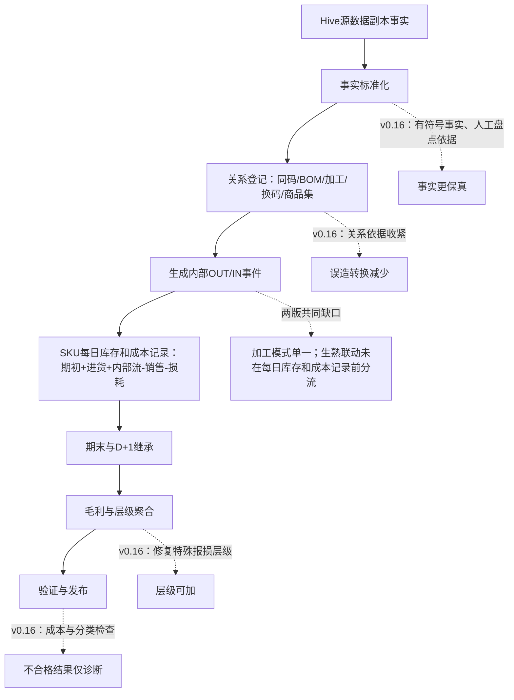
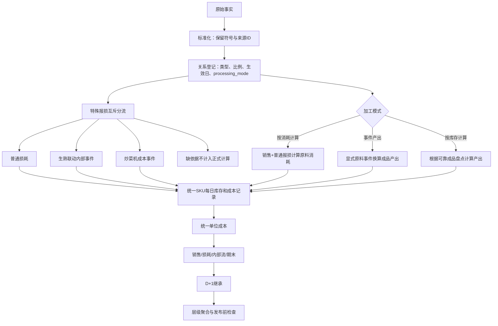

# v0.14 与 v0.16 处理流程合理性对比

> 对比版本：v0.14 标签提交 `417182f`；v0.16 当前提交 `961b628`。数据依据来自本地 A3XV 2026-08-03 至 2026-08-04 源数据副本与本地试算库。评价标准为业务语义、依据充分性、数量与转出金额等于转入金额、跨日连续、层级可加和发布安全。

## 一、总体判断

**v0.16整体更合理，适合作为继续迭代的技术主干。**

原因：

1. v0.16保留采购退回等有符号事实，减少源数据失真。
2. v0.16只让有明确操作人的盘点覆盖期末，系统快照仅作审计。
3. v0.16收紧关系依据，零快照和静态兼容关系不能自动生成转换。
4. v0.16增加零成本、分类依据和窗口完整性检查，错误结果不会被标记为可发布。
5. v0.16修复生熟联动在不同聚合层级间不可加的问题。

**v0.16 的核心缺口仍在加工和特殊报损。** 两个版本都要求先有成品人工盘点，才根据库存变化计算加工产出；两个版本都没有在每日库存和成本计算前规定生熟联动报损与加工只能选择一种处理。v0.16 减少了错误内部转换，但也降低了加工成本覆盖率。

简要评价：

| 维度 | v0.14 | v0.16 | 更合理 |
|---|---|---|---|
| 原始事实保真 | 采购退回等负数处理不足 | 支持有符号进货与退回 | v0.16 |
| 盘点可信度 | 系统快照可覆盖每日库存和成本记录 | 仅明确人工盘点覆盖 | v0.16 |
| 关系依据 | 零快照、静态关系可能进入候选 | 只接受当日事实或固定规则 | v0.16 |
| 加工覆盖 | 覆盖较多，部分依赖系统快照 | 大量不计入正式计算，避免弱依据计入每日库存和成本 | v0.16更安全；两版均不完整 |
| 生熟联动 | 下层级毛利不可加，存在重复风险 | 层级可加已修复，重复风险仍在 | v0.16 |
| 每日库存和成本记录成本 | 基础加权每日库存和成本记录成立 | 增加退回与异常保护 | v0.16 |
| 跨日与运行窗口 | 自动七日窗口，诊断边界较弱 | 支持明确区间与D-1预热 | v0.16 |
| 分类 | 静态映射缺来源证明 | 记录来源、版本、校验和及覆盖日期 | v0.16 |
| 发布安全 | 前后总额相等通过即可形成结果 | 零成本和分类依据可阻止发布 | v0.16 |
| 结果可解释性 | 异常可能进入正式结果 | 异常显式不计入正式计算并标记诊断状态 | v0.16 |

## 二、完整过程对比



### 2.1 源数据副本提取与运行窗口

#### v0.14

- 默认选择最近完整七日。
- 空表首次建表可能固化不正确字段类型。
- 盘点明细使用8个分片，大分区存在请求压力。
- 结果运行身份固定写为 v0.14。

#### v0.16

- 支持明确 `start/end`，并强制包含D-1预热日。
- 写源数据副本时按分区替换；空表遇到首批真实数据时重建正确类型。
- 盘点明细由8个分片扩到64个，降低单次数据量。
- 运行清单记录引擎版本、数据窗口、关系版本、分类依据和源校验和。

#### 判断

v0.16更合理。固定日期范围并提前计算前一天数据后，同一批数据可以重复计算；运行清单可以回答“哪份代码、哪组关系、哪份分类计算了这批结果”。这些能力减少了补数据和版本不一致问题。

### 2.2 外部进货与采购退回

#### v0.14

- `sale_article_qty` 和进货金额按非负值校验。
- 负数量、负金额的采购退回或冲正不能完整进入用于计算单位成本的数量和金额。

#### v0.16

- 允许进货数量和金额为负。
- 数量与金额必须同号。
- 有金额但数量为 0 时停止运行并报告该记录。
- 采购退回后库存数量或金额不能低于允许范围。

#### 判断

v0.16 更合理。采购退回是源表业务记录，保留原始正负号才能正确减少库存和成本。检查数量与金额符号一致，并确认退回不超过可用库存，可以防止错误冲销。

### 2.3 盘点与期末库存

#### v0.14

- 任意合法非负 `actual_stock_qty` 都可作为正式期末。
- `created_by/updated_by` 只表示依据强弱。
- 系统生成的库存快照也可能覆盖理论期末。

#### v0.16

- 只有明确操作人且数量非负时，盘点才覆盖每日库存和成本记录期末。
- 系统快照保留源值，但不参与正式期末计算。
- 无人工盘点时，期末由库存方程计算并滚入次日期初。

#### 两日样本

| 日期 | 加工成品关系数 | 有库存快照 | v0.14规则可接受的非负系统快照 | v0.16有效人工盘点 |
|---|---:|---:|---:|---:|
| 08-03 | 54 | 12 | 11 | 0 |
| 08-04 | 54 | 12 | 12 | 0 |

#### 判断

对普通 SKU 每日库存和成本记录，v0.16 更合理。系统期末数量可能由程序自动写入，无法证明门店完成了实物盘点。用这类数量覆盖期末，会把上游计算结果再次写回新的每日库存和成本记录，从而隐藏错误库存。

加工模块需要分别评价覆盖率和依据可靠性。v0.14 可能把 23 条系统生成的期末数量当作盘点，因此计算了更多加工，但这些加工量缺少人工盘点依据。v0.16 将 108 个加工成品日全部跳过，避免错误商品转换，同时留下较大的加工成本缺口。正确方向是增加不同的加工计算模式，不能恢复“系统期末数量等同人工盘点”的规则。

### 2.4 关系候选与正式转换

#### v0.14

- `purchase_di` 稠密日快照中的来源码、销售码均可形成关系候选。
- 静态 `article_convert` 兼容关系也可能参与当日关系登记。
- 零数量、零金额行可能制造没有业务流的关系。

#### v0.16

- 只有当日进货数量或金额非零的行才形成验收关系候选。
- 显式换码需要当日事件或采购确认的固定规则。
- 商品集和物料码只证明身份接近，不单独生成数量流。
- 同一来源码、目标码、日期符合多个正式类型时直接不计入正式计算。

#### 判断

v0.16更合理。静态关系说明“可以转换”；正式转换记录还需要证明“当天确实转换了多少”。v0.16降低了虚构内部流的风险。

仍有边界需要业务确认：西红柿全转、牛奶包装比例、阳光玫瑰、唯一盘点承接码和部分同物料双码关系。这些关系继续不计入正式计算符合当前依据状态。

### 2.5 BOM

#### 两版共同逻辑

- 仅正式猪肉、牛肉BOM进入自动拆分。
- 父品OUT、子品IN。
- 来源金额按当日单位成本转出，目标金额完整承接。
- 关系比例和单位缺失时不计入正式计算。

#### 版本差异

v0.14到v0.16没有改变核心BOM算法。v0.16通过关系候选收紧、运行窗口固定和发布前检查提高了外围可靠性。

#### 判断

两版的BOM主逻辑相同。v0.16更容易证明输入关系和运行版本，整体审计性更好。BOM正确性仍取决于已确认关系、转换比例和单位换算是否完整。

### 2.6 加工

#### 两版共同逻辑

加工产出采用成品库存方程：

```text
加工产出
= 成品期末 - 成品期初 - 成品外部进货
+ 成品净销售 + 成品已知损耗
+ 其他内部转出 - 其他内部转入
```

随后按加工比例计算原料转出：

```text
原料转出量 = 加工产出 × raw_qty ÷ yield_qty
```

两版都要求成品具有有效盘点。

#### v0.14

- 系统快照可被视为有效盘点，部分加工可能进入正式转换记录。
- 负成品外部进货没有纳入“是否停止加工计算”的完整判断。

#### v0.16

- 仅人工盘点有效，当前两日全部54个成品/日均无有效盘点。
- 正、负成品外部进货都会使库存平衡加工停止计算。
- 原料不足、关系缺失和配方冲突继续不计入正式计算。

#### 判断

两版都没有完整解决加工：

- v0.14覆盖较多，可能根据系统快照推导错误加工量。
- v0.16依据更严格，正式原料转出、成品转入记录为0，熟食和烘焙成本无法完整转入成品。

v0.16更适合作为修复起点。下一步应在关系上维护三种模式：

1. `USAGE_BACKFLUSH`：按成品净销售加普通报损计算已消耗原料，适合按需生产且成品不跨日留存。
2. `EVENT_PRODUCTION`：按明确加工或生熟联动事件计算实际产出，适合整包加工。
3. `INVENTORY_BALANCE`：根据可靠的成品盘点和库存方程计算产出，适合库存型加工品。

人工盘点只应约束第三种模式。

### 2.7 生熟联动和炒菜机报损

#### v0.14

- 生熟联动数量先进入原料 `known_lost_qty`。
- 报表层对 `ccj_amt + ssls_amt` 统一加回各层级毛利。
- 门店层再扣回全店生熟联动，熟食大分类再扣回全店生熟联动。
- SKU和SPU有来源加回但无目标扣减，层级加总无法稳定回到门店。

#### v0.16

- 原料仍先按已知损耗进入每日库存和成本记录。
- 炒菜机金额在各层级做展示加回。
- 生熟联动只在大分类执行“来源类加回、熟食类扣减”。
- SKU、SPU和门店不再增加生熟联动毛利，层级可加问题得到修复。

#### 判断

报表聚合层面，v0.16更合理。生熟联动是大分类间成本转移，SKU和SPU缺乏明确目标映射时不应生成虚假下层转移。

会计过程层面，两版都存在同一缺口：生熟联动在每日库存和成本记录之后处理。8月3—4日有8条生熟联动原料同时符合加工关系，且报损数量已进入 `known_lost_qty`。当前v0.16因加工门槛而没有重复；放开加工后，同一原料可能同时形成报损出库和加工转出。

正确结构应在每日库存和成本记录前完成互斥分流：

```text
普通损耗 → known_lost
生熟联动且关系唯一 → 原料OUT / 熟食成品IN
炒菜机且目标可确定 → 原料OUT / 目标用于计算单位成本的数量和金额IN
缺关系或目标冲突 → 不计入正式计算
```

已计入内部转换的数量必须从普通损耗中扣除，并增加一项必须通过的检查：同一来源记录只能用于一种处理。

### 2.8 SKU每日库存和成本记录与单位成本

#### 两版共同主干

```text
可用数量 = 期初 + 外部进货 + 内部转入 + 销售退回 + 盘盈
可用金额 = 对应金额合计
当日单位成本 = 可用金额 ÷ 可用数量

销售、损耗、内部转出、期末
均使用同一当日单位成本
```

D+1期初数量和金额精确继承D日期末。

#### v0.16增强

- 支持采购退回减少可用库存数量和金额。
- 销售退回优先使用当日用于计算单位成本的数量和金额或上次有效成本。
- 无成本依据的出库显式不计入正式计算和发布前检查。
- 普通系统记录的库存数量不能覆盖计算期末。

#### 判断

v0.16更合理。核心加权成本公式没有根本变化，外围事实和异常处理更完整。其主要成本缺口来自上游加工未计入每日库存和成本，并非每日库存和成本记录公式本身。

### 2.9 毛利与层级输出

#### v0.14

- 比率分母只判断是否等于0，浮点平衡差可能产生极端比率。
- 生熟联动在SKU、SPU、大分类和门店的处理不具备统一可加性。
- 零成本出库仍可能进入公开结果。

#### v0.16

- 近零分母按会计精度视为0，非有限结果归零。
- 生熟联动只在大分类转移，层级加总更稳定。
- 零成本出库继续保留诊断，但整次运行不可发布。
- 报表字段读取正式每日库存和成本记录结果，源期初和源期末只作为审计观察值。

#### 判断

v0.16更合理。它减少了“结果看起来完整但成本没有依据”的情况。当前输出表名仍为 `t_v014_levels_result`，属于接口兼容命名，运行清单中的实际引擎版本为v0.16。

### 2.10 分类与v1.5对比

#### v0.14

- 使用静态分类配置。
- 分类来源、快照覆盖日期和校验和未进入运行清单。
- 对比时容易把分类变化与成本差异混在一起。

#### v0.16

- 记录分类规则来源、覆盖来源、版本、快照日期和SHA-256。
- 当前分类依据截止2026-07-20，运行8月数据时主动阻止发布。
- 同时提供两种对比：各版本原分类、按v0.16分类归一。
- 分类来源未完整确认前，大分类差异只用于查问题；门店合计继续用于检查毛利。

#### 判断

v0.16更合理。两种对比视图可以区分“分类不同”和“库存、成本计算不同”。当前分类来源不足仍会阻止发布，需要取得覆盖业务日期的分类平台记录。

### 2.11 校验与发布

#### v0.14

- 校验重点为负库存、数量转出金额等于转入金额和跨日连续。
- 必须通过的账目检查全部通过后，才能标记为“已验证本地试算结果”。
- 零成本出库和分类依据不足没有独立发布状态。

#### v0.16

- 保留数量、金额、内部转换和跨日连续性检查。
- 增加 `ISSUE_COST_EVIDENCE` 发布前检查。
- 增加 `CATEGORY_SNAPSHOT_EVIDENCE` 发布前检查。
- 运行可以产出诊断数据，但状态明确为 `DIAGNOSTIC_ONLY_PUBLISH_BLOCKED`。

#### 判断

v0.16更合理。它区分“计算程序成功运行”和“结果具备发布条件”。这项区分对库存和毛利ETL很重要。

## 三、为什么不建议恢复使用v0.14

恢复使用v0.14可能让部分加工关系重新产生结果，但代价包括：

- 系统快照重新覆盖正式期末；
- 零进货快照重新制造关系候选；
- 采购退回事实无法完整保真；
- 零成本出库仍能进入公开结果，发布检查未禁止这种情况；
- 生熟联动的SKU、SPU和大分类加总重新失去一致性；
- 分类来源和历史覆盖无法审计。

这些变化会提高表面覆盖率，同时降低结果可信度。更稳妥的路径是在v0.16上补加工模式和特殊报损事件分流。

## 四、推荐的目标过程



## 五、最终结论

1. **v0.16的事实、关系、每日库存和成本记录、聚合和发布框架优于v0.14。**
2. **v0.14在加工覆盖上看似更充分，主要来源是系统快照被当作正式盘点；该依据不够可靠。**
3. **v0.16当前适合诊断和继续开发，尚不具备完整发布条件。** 阻塞项包括加工模式缺失、生熟联动未进入每日库存和成本记录前分流、零成本出库和带日期且不可修改的分类副本依据不足。
4. **下一版应从 v0.16 继续迭代。** 核心改动集中在加工模式、特殊报损只能处理一次，以及对应的重复计算检查；无需重写加权成本和每日库存计算。

## 附录A：关键代码差异

| 节点 | v0.14→v0.16代码位置 |
|---|---|
| 有符号进货与采购退回 | `fmetl/facts/store_receipts.py`、`fmetl/calculations/daily_cost_stock.py` |
| 销售退回成本 | `fmetl/calculations/ledger.py` |
| 人工盘点依据 | `fmetl/facts/sku_day.py`、`fmetl/mirror/registry.py` |
| 关系候选收紧 | `fmetl/mirror/v014_stage.py` |
| 成品有外部进货时停止加工计算 | `fmetl/facts/processing_inference.py` |
| 特殊报损层级 | `fmetl/outputs/levels_result.py` |
| 近零分母保护 | `fmetl/outputs/levels_result.py` |
| 明确窗口和D-1预热 | `fmetl/cli.py`、`fmetl/validation/run_v014.py` |
| 零成本发布前检查 | `fmetl/validation/v014.py`、`fmetl/validation/run_v014.py` |
| 分类依据 | `fmetl/master_data/category.py`、`fmetl/config/v1_5_category_rules.json` |
| 双分类对比视图 | `fmetl/validation/compare_v014_v15.py` |

## 附录B：本次判断的边界

- 以上为代码和本地两日快照审查结论。
- v1.5只用于差异定位，没有参与v0.16成本或库存补值。
- 西红柿、牛奶、阳光玫瑰和部分同物料双码关系仍缺正式业务确认。
- 熟食、烘焙等关系采用哪种 `processing_mode`，需要采购或业务按关系确认。
