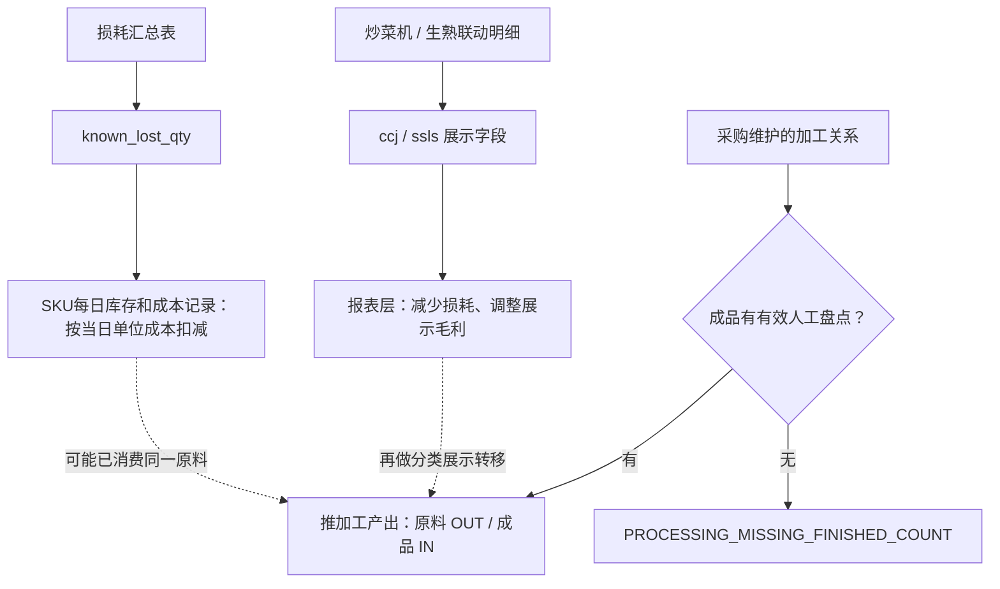
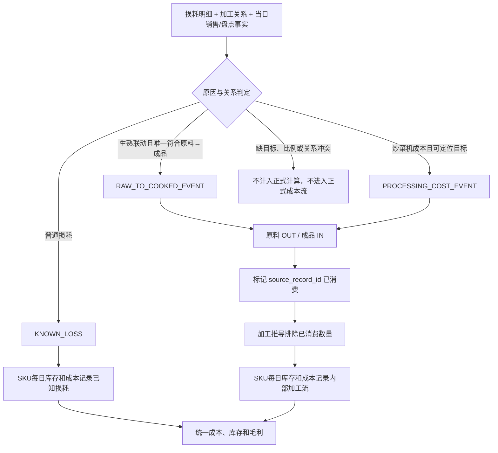

# v0.16 加工、生熟联动与版本迭代过程审查

> 审查范围：当前分支 `codex/v0.16-invariant-led`（提交 `961b628`）、本地 A3XV 2026-08-03 至 2026-08-04 本地试算数据，以及 [mermaid-diagram2.svg](/Users/zhukate/Downloads/mermaid-diagram2.svg)。本报告不以 v1.5 结果补成本或库存。

> **状态更新（2026-08-13）**：本文第 1—7 节记录改动前的检查结果。之后代码按已确认规则调整：成品当天的净销售量和普通报损量决定成品消耗量，再按配方计算原料扣减量，不再要求成品盘点；同一原料的同日记录若存在生熟联动报损，则只保留生熟联动，整组加工不再扣原料或增加成品。`PROCESSING_RAW_LOSS_PRIORITY` 检查两种处理没有同时发生。最新完整运行和备用成本结果见 [FIX-026](../fixes/FIX-026-empty-pool-issue-cost-fallback.md)。

## 一、结论

1. **当前主流程与 SVG 大体一致。** 已实现源表业务记录、关系判断、内部转换、SKU 每日库存和成本、毛利汇总和必须通过的账目检查。关键偏差在特殊报损：SVG 要求先把生熟联动转换为原料转出和成品转入，再计算每日库存；当前代码先把它记为已知损耗，最后才在报表层调整损耗和大分类毛利。
2. **“没有人工盘点”不能推导为“没有加工”。** 当前代码把成品人工盘点设为所有加工的必备条件，8 月 3—4 日共 108 个加工成品日全部因此不计入正式计算，正式原料转出、成品转入记录为 0。这个门槛过严。
3. **销售加报损可以计算当日成品消耗及其原料成本。** 该方法适用于按需生产、成品不保留跨日库存的加工关系。它计算的是已消耗成品对应的原料用量，不能单独还原实际生产量和未售成品库存。
4. **生熟联动与加工存在重复处理风险。** 两日样本中有 8 条生熟联动报损同时符合加工原料关系，报损数量也已进入 `known_lost_qty`。旧规则要求先有成品盘点，因此当时没有计算加工；若直接改为“销售加报损计算加工”，同一原料会同时记为报损和加工转出。
5. **解决原则：一个物理事件只允许一个正式转换记录路径。** 生熟联动应在进入每日库存和成本记录前完成原因分流；已转为内部加工事件的数量必须从普通已知损耗中扣除，并阻止加工推导再次领取同一数量。
6. **v0.15 和 v0.16 均未解决上述两个核心问题。** v0.15主要修正事实保真、人工盘点依据、关系依据、特殊报损展示层级和发布前检查；v0.16主要补版本身份、分类依据与对比计算规则。加工盘点门槛和生熟联动的报表层处理仍沿用现状。

## 二、当前流程与 SVG 的一致性

| SVG 节点 | 当前实现 | 结论 |
|---|---|---|
| 完整原始事实 | 销售、验收、损耗、盘点、BOM、加工、换码、商品集均进入 stage | 基本一致 |
| 关系登记与校验 | 同码、猪牛 BOM、加工、显式换码、商品集候选和冲突不计入正式计算 | 一致 |
| 内部转换记录 | BOM、加工、换码统一生成来源 OUT / 目标 IN，并在每日库存和成本记录中定价 | 一致 |
| 报损原因分流 | `known_lost_qty` 先进入每日库存和成本记录；炒菜机和生熟联动在报表层再调整 | **顺序不一致** |
| SKU每日库存和成本记录 | 期初、进货、内部流、销售、损耗、期末、D+1 继承 | 一致 |
| 毛利与输出 | 毛利读取每日库存和成本记录金额；比率按聚合后分子分母重算 | 基本一致 |
| 必须通过的检查 | 数量、金额、跨日、零成本和分类来源 | 现有检查一致；仍缺“同一数量不得被两种处理重复使用”检查 |

### 当前特殊报损的真实路径



这条过程有三套相互独立的动作：原料报损、加工内部转移、报表层生熟联动转移。代码目前没有事件 ID、数量占用或互斥判断。

## 三、加工品无人工盘点时怎样计算

### 3.1 当前代码为什么停算

当前加工产出公式为：

```text
加工产出
= 成品期末 - 成品期初 - 成品外部验收
+ 成品净销售 + 成品已知损耗
+ 其他内部转出 - 其他内部转入
```

公式中的成品期末来自有效人工盘点。代码在计算公式前检查 `has_valid_count`；缺少人工盘点时直接不计入正式计算。8 月 3—4 日每天有 54 个加工成品，两个业务日均无有效人工盘点，因此 108 条全部不计入正式计算。

### 3.2 销售加报损可以解决什么

对于“按需生产、成品不留跨日库存”的关系：

```text
当日成品消耗量 = 成品净销售量 + 成品普通报损量

原料消耗量
= 当日成品消耗量 × raw_qty ÷ yield_qty
```

这个公式足以计算销售成本和报损成本，无需人工盘点。每日库存和成本记录可生成等量的成品加工转入，并由销售和报损在同日转出，成品理论期末为 0。

### 3.3 销售加报损不能解决什么

存在以下任一情况时，销售加报损无法还原实际生产量：

- 成品有期初库存；
- 成品加工后留到期末；
- 成品有外部验收；
- 一次开整包加工，剩余成品尚未销售或报损；
- 同日还有其他内部转入或转出。

例如“1 包原料产 10 个成品，当天销售 3 个”：销售法只能确认 3 个成品已消耗，对应 0.3 包原料成本；实际可能已经开了 1 包并留下 7 个成品。后 7 个的库存需要加工事件或成品盘点证明。

### 3.4 建议按关系维护三种计算模式

| 模式 | 数量依据 | 计算方式 | 适用场景 |
|---|---|---|---|
| `USAGE_BACKFLUSH` 按消耗计算 | 成品净销售 + 成品普通报损 | 按配方计算已消耗原料；不要求成品盘点 | 熟食等按需生产、成品不跨日留存 |
| `EVENT_PRODUCTION` 事件产出 | 明确加工事件或可确认的生熟联动原料数量 | 原料数量按比例换算成品产出；再由销售、报损和期末承接 | 整包加工、报损后加工 |
| `INVENTORY_BALANCE` 按库存计算 | 可靠成品期末盘点 | 使用完整库存方程计算加工产出 | 成品会跨日留存且持续盘点 |

当前 54 条关系跨熟食、烘焙、饮料和冷藏预制，统一使用人工盘点模式会持续漏算。建议在加工关系上增加 `processing_mode`，由采购确认后随关系和生效日一并维护。

## 四、生熟联动和加工怎样避免重复

### 4.1 两日样本依据

2026-08-03 至 2026-08-04：

- 8 条生熟联动报损同时符合加工原料关系；
- 8 条报损数量均已进入同 SKU 的 `known_lost_qty`；
- 8 条加工关系均因成品无人工盘点而未计入每日库存和成本；
- 正式 `RECIPE_COMPOSE` 内部转换记录为 0。

因此，当前两天表现为“原料已按损耗扣成本，报表层再转移大分类毛利”；加工成本仍未进入成品。若只删除盘点门槛，原料还会增加一次 `compose_out`。

### 4.2 正确的单一路径



正式规则：

1. 普通报损保留在 `known_lost_qty`。
2. 生熟联动符合唯一有效加工关系时，生成一个带 `source_record_id` 的内部转换事件。
3. 已转成内部事件的数量从普通已知损耗中扣除。
4. 同一 `source_record_id` 或同一来源数量只能由一个正式事件占用。
5. 明确的生熟联动报损优先于加工；已经按生熟联动处理的数量不再进入加工计算。
6. 会计毛利直接读取内部转换记录；报表层不再对同一金额重复做生熟联动转移。
7. 如需兼容 v1.5 展示，单独输出兼容字段，不能改变库存和毛利的基础计算值。

### 4.3 必须增加的重复计算检查

```text
同一来源事件已占用数量 ≤ 原始事件数量
同一 source_record_id 的正式 posting_group 数量 = 1
生熟联动转出金额 = 对应成品转入金额
普通已知损耗数量 + 特殊事件占用数量 = 原始损耗数量
按销售计算的加工数量不得包含已由明确生熟联动记录处理的数量
```

## 五、v0.14 → v0.15 的 ETL 改动

对照提交：`417182f` → `99deb89`。

| 模块 | 具体代码改动 | 原因 |
|---|---|---|
| 进货记录与每日库存和成本 | 允许负进货数量和金额；要求数量、金额符号一致；采购退回不能超过当前可用库存 | 保留采购退回和冲销，避免把合法负数误判为错误数据 |
| 销售退回成本 | 优先使用当日用于计算单位成本的数量和金额或上次有效单位成本；同日销售覆盖退回且无成本依据时显式记 0，并进入成本检查 | 避免凭空制造退回成本，同时让可诊断样本继续运行 |
| 人工盘点 | 只有明确操作人且数量非负才覆盖期末；系统快照仅审计 | 防止系统快照被误当成人工实盘 |
| 关系候选 | `purchase_di` 只有非零数量或金额才形成当日关系候选；显式换码只有实际事件或固定规则才进入正式登记 | 防止稠密零快照和静态兼容关系制造虚假转换 |
| 加工入口 | 成品外部进货由“正数时停止计算”改为“任何非零数量都停止计算” | 负数冲销同样会使原加工产出公式失效 |
| 特殊报损展示 | 炒菜机在各层级加回；生熟联动只在大分类做来源类加回、熟食类扣减 | 修复 SKU、SPU、大分类和门店毛利不可加问题 |
| 指标计算 | 分母小于持久化精度时按 0 处理，屏蔽浮点平衡差和无限比率 | 避免近零分母产生异常比率 |
| 运行窗口与源数据副本 | 支持明确起止日和 D-1 预热；源数据副本按分区去重并扩大盘点分片 | 固定两日审核样本，降低源数据副本重复与大分片失败风险 |
| 发布前检查 | 增加零成本出库检查；结果可保留诊断，但不可标记可发布 | 阻止销售、损耗或内部转出以 0 成本进入正式结果 |
| v1.5 对比 | 固定两日样本，按事实、每日库存和成本记录、单价、层级逐级查看明细 | v1.5只用于定位差异，不提供成本补值 |

**未改部分：** 加工仍要求成品人工盘点；生熟联动仍在报表层调整，没有进入每日库存和成本记录前的事件分流。

## 六、v0.15 → v0.16 的 ETL 改动

对照提交：`99deb89` → `961b628`。

| 模块 | 具体代码改动 | 原因 |
|---|---|---|
| 版本身份 | 包版本、运行 ID、日志和状态统一标记 v0.16；物理表名继续兼容 `v014` | 消除代码版本与运行产物身份不一致 |
| 分类配置 | 分类规则增加来源、覆盖来源、依据状态、快照起止日和 SHA-256 校验和 | 证明本次分类来自哪份规则，避免当前分类覆盖历史 |
| 发布前检查 | 增加带日期且不可修改的分类副本依据校验；快照未覆盖运行日期时结果只用于诊断 | 当前静态规则截止 2026-07-20，不能证明 8 月历史分类 |
| 对比计算规则 | 同时输出“各版本原分类”和“统一使用 v0.16 分类”两种大分类结果 | 区分分类不同与成本、商品关系不同 |
| 验收范围 | 门店合计继续检查毛利；分类来源未完整确认前，大分类只用于查问题 | 避免把分类来源问题误判为每日库存和成本计算错误 |

**未改部分：** v0.16 没有修改每日库存和成本记录成本公式、加工产出公式、加工盘点门槛和生熟联动计入每日库存和成本方式。

## 七、建议实施顺序

1. **先改特殊报损分流。** 在每日库存和成本记录前把普通损耗、生熟联动和炒菜机拆成互斥事件，并增加事件唯一性校验。
2. **再区分加工计算模式。** 为关系增加 `processing_mode`；熟食按业务确认选择“按消耗计算”，整包加工选择“按明确记录计算”，库存型成品选择“按库存变化计算”。
3. **取消所有加工统一要求人工盘点。** 只有 `INVENTORY_BALANCE` 必须有盘点；其他两类加工不因缺盘点而停止。
4. **用 8 月 3—4 日回放。** 逐条验证 8 个重叠样本，确认原料数量只扣一次、每次内部转换的转出金额等于转入金额、成品销售和报损成本完整。
5. **最后处理兼容展示。** 库存和毛利基础计算通过后再生成 v1.5 兼容字段；兼容字段不得改变库存数量、库存金额或商品转换。

## 附录 A：代码依据

| 结论 | 代码位置 |
|---|---|
| 加工强制要求人工盘点 | `fmetl/facts/processing_inference.py:130-135` |
| 加工完整库存方程 | `fmetl/facts/processing_inference.py:142-150` |
| 加工生成原料 OUT / 成品 IN | `fmetl/facts/processing_inference.py:185-200` |
| 已知损耗直接进入每日库存和成本记录 | `fmetl/facts/sku_day.py:120-147`、`fmetl/calculations/ledger.py:383-388` |
| 每日库存和成本记录按统一单位成本计销售、损耗和内部转出 | `fmetl/calculations/daily_cost_stock.py:131-183` |
| 特殊报损独立读取并合入报表指标 | `fmetl/calculations/special_wastage.py:8-49`、`fmetl/mirror/v014_stage.py:801-815` |
| 生熟联动在输出层调整大分类毛利 | `fmetl/outputs/levels_result.py:270-309` |
| 当前流水顺序为关系→加工推导→每日库存和成本记录→报表 | `fmetl/validation/run_v014.py:379-493`、`fmetl/validation/run_v014.py:541-577` |

## 附录 B：8 月 3—4 日重叠样本

| 日期 | 生熟联动原料 | 成品 | 生熟联动数量 | 成品净销售+报损 | 关系比例（原料:成品） | 若两条路径同时执行的原料总扣减 |
|---|---|---|---:|---:|---:|---:|
| 08-03 | 蒜蓉小龙虾500g | 同码 | 3 | 3 | 1:1 | 6.00 |
| 08-03 | 手撕红糖馒头850g(C) | 手撕红糖馒头 | 1 | 3 | 1:10 | 1.30 |
| 08-03 | 牛肉风味馅饼700g(C) | 牛肉风味馅饼 | 1 | 2 | 1:5 | 1.40 |
| 08-03 | 糯米烧麦1kg(C) | 糯米烧麦 | 1 | 7 | 1:20 | 1.35 |
| 08-04 | 奥尔良手枪腿1kg(C) | 奥尔良手枪腿 | 1 | 3 | 1:5 | 1.60 |
| 08-04 | 土豆饼800g(C) | 土豆饼 | 1 | 2 | 1:10 | 1.20 |
| 08-04 | 虾仁烧卖360g(C) | 虾仁烧卖 | 1 | 1 | 1:3 | 1.33 |
| 08-04 | 豉汁排骨2.5kg(C) | 豉汁排骨 | 1 | 0 | 1:15 | 1.00 |

“若两条路径同时执行”按 `生熟联动报损数量 +（成品净销售+报损）× raw_qty/yield_qty` 计算，仅用于说明重复风险。蒜蓉小龙虾的同码加工关系还需单独核实；同码原料与成品无法形成有意义的跨 SKU 成本转移。

## 附录 C：仍需业务确认的边界

1. 哪些加工关系明确执行“成品不留跨日库存”，可使用 `USAGE_BACKFLUSH`。
2. 生熟联动明细中的原料数量是否代表整包实际加工事件；若成立，可直接使用 `EVENT_PRODUCTION`。
3. 炒菜机成本是否能稳定关联目标成品或目标用于计算单位成本的数量和金额。
4. 蒜蓉小龙虾同码关系应归为普通报损、同码成本重分类，还是错误关系。

这些确认只决定关系的计算模式，不影响“同一物理数量只计入每日库存和成本一次”的硬规则。
